# T2A-ESS Relationship Traceability Report

This report is generated from T2A-ESS JSON files. It checks relationship endpoints, source traceability, graph connectivity, and selected semantic completeness indicators.

| File | Source Units | Slots | Slot Relations | Graph Edges |
| --- | --- | --- | --- | --- |
| mumt.exhaustive.json | 21 | 193 | 62 | 252 |

## mumt.exhaustive.json

- Model: MUM-T attack maneuver unstructured test text T2A-ESS exhaustive extraction result

| Slot Type | Count |
| --- | --- |
| Scenario | 1 |
| Episode | 8 |
| Situation | 9 |
| StateValue | 15 |
| Observation | 12 |
| Event | 14 |
| Transition | 11 |
| Performer | 14 |
| Action | 55 |
| Item | 12 |
| Flow | 15 |
| Control | 5 |
| Constraint | 7 |
| Goal | 5 |
| Reason | 5 |
| DomainExtensionRule | 2 |
| SemanticBinding | 3 |

| Relation Type | Count |
| --- | --- |
| has_episode | 8 |
| contains_performer | 6 |
| has_state_value | 5 |
| from_situation | 4 |
| to_situation | 4 |
| triggers | 4 |
| observes | 4 |
| produces_item | 4 |
| flow_source | 4 |
| flow_target | 4 |
| temporal_before | 4 |
| controls_flow | 3 |
| has_reason | 3 |
| has_goal | 2 |
| uses_item | 1 |
| carries_item | 1 |
| binds_to | 1 |

### Mermaid Relationship Graph

- Mode: `slot_relations`. Rendered edges: `62`. Omitted edges: `0`.

```mermaid
flowchart LR
  N0001["Action<br/>MUMT_A_EX_ACTIVATE_SURVIVAL_LOOP<br/>Activate local sensor-based survival loop"]
  N0002["Action<br/>MUMT_A_EX_ATTACK_REMAINING<br/>Suppress remaining enemy positions"]
  N0003["Action<br/>MUMT_A_EX_BROADCAST_THREAT<br/>Direct broadcast of threat detection data"]
  N0004["Action<br/>MUMT_A_EX_COMMAND_DISPERSE<br/>Order dispersed maneuver and air-defense watch"]
  N0005["Action<br/>MUMT_A_EX_COMMAND_EDGE_MODE<br/>Command to stop video transmission and switch to Edg..."]
  N0006["Action<br/>MUMT_A_EX_DECIDE_DETOUR<br/>Decide right bypass maneuver"]
  N0007["Action<br/>MUMT_A_EX_DECIDE_REDUCED_SURVEIL<br/>Decide on reduced surveillance toward the objective ..."]
  N0008["Action<br/>MUMT_A_EX_DECLARE_DISCONNECTED<br/>Declare communication blackout mode transition"]
  N0009["Action<br/>MUMT_A_EX_DISPLAY_FPV<br/>Display FPV threat direction, speed, ETA"]
  N0010["Action<br/>MUMT_A_EX_FUSE_ISR<br/>Fuse drone ISR and tank sensor cues"]
  N0011["Action<br/>MUMT_A_EX_INDEPENDENT_SURVIVAL<br/>Perform individual survival actions"]
  N0012["Action<br/>MUMT_A_EX_SEND_SA_SUMMARY<br/>Initial transmission of company SA summary information"]
  N0013["Action<br/>MUMT_A_EX_SEND_TRACK_SUMMARY<br/>Transmit summary track data"]
  N0014["Action<br/>MUMT_A_EX_START_JAMMING<br/>Electronic warfare jamming begins"]
  N0015["Action<br/>MUMT_A_EX_SWITCH_EMERGENCY_BROADCAST<br/>Drone switch to emergency broadcast mode"]
  N0016["Action<br/>MUMT_A_EX_UPDATE_MIN_SA<br/>Update minimum SA"]
  N0017["Control<br/>MUMT_CTRL_EX_COMM_MODE<br/>Communication mode transition decision"]
  N0018["Control<br/>MUMT_CTRL_EX_LOCAL_SURVIVAL_LOOP<br/>Local survival loop during blackout"]
  N0019["Control<br/>MUMT_CTRL_EX_STAGED_RECOVERY<br/>Staged communication recovery sequence"]
  N0020["Episode<br/>MUMT_EP_EX_CONTEXT<br/>Operation environment and MUM-T system activation"]
  N0021["Episode<br/>MUMT_EP_EX_DISCONNECTED<br/>Communication blackout and local survival"]
  N0022["Episode<br/>MUMT_EP_EX_FPV<br/>FPV threat detection and dispersed response"]
  N0023["Episode<br/>MUMT_EP_EX_LIMITED<br/>Electronic warfare jamming and limited communication..."]
  N0024["Episode<br/>MUMT_EP_EX_NORMAL_ATTACK<br/>Normal communication attack maneuver"]
  N0025["Episode<br/>MUMT_EP_EX_OBS_DETOUR<br/>Enemy observation post detection and bypass maneuver"]
  N0026["Episode<br/>MUMT_EP_EX_PREP<br/>TDSS diagnostics, drone launch, SA sharing"]
  N0027["Episode<br/>MUMT_EP_EX_RECOVERY<br/>Communication recovery and mission resumption"]
  N0028["Event<br/>MUMT_EVT_EX_BANDWIDTH_RECOVERED<br/>Bandwidth recovery"]
  N0029["Event<br/>MUMT_EVT_EX_HEARTBEAT_LOSS_PERSISTED<br/>Persistent heartbeat loss"]
  N0030["Event<br/>MUMT_EVT_EX_LINK_STABLE<br/>Drone 2 link kept stable"]
  N0031["Event<br/>MUMT_EVT_EX_PACKET_LOSS_PERSISTED<br/>Packet loss rate persistently exceeds the threshold"]
  N0032["Flow<br/>MUMT_F_EX_DISCONNECT_TO_SURVIVAL<br/>Heartbeat loss -&gt; blackout declaration -&gt; survival l..."]
  N0033["Flow<br/>MUMT_F_EX_EMERGENCY_BROADCAST<br/>Drone heartbeat dropout -&gt; emergency broadcast -&gt; in..."]
  N0034["Flow<br/>MUMT_F_EX_EW_TO_EDGE<br/>Jamming -&gt; packet loss -&gt; limited transition -&gt; Edge..."]
  N0035["Flow<br/>MUMT_F_EX_FPV_TO_DISPERSE<br/>FPV detection -&gt; HMI alert -&gt; dispersal order -&gt; pla..."]
  N0036["Flow<br/>MUMT_F_EX_LINK_TO_RESYNC<br/>Link recovery -&gt; limited transition -&gt; SA resynchron..."]
  N0037["Flow<br/>MUMT_F_EX_TRACK_TO_MIN_SA<br/>Summary track data -&gt; minimum SA update"]
  N0038["Goal<br/>MUMT_G_EX_MAINTAIN_MIN_SA<br/>Maintain minimum SA during limited/blackout"]
  N0039["Goal<br/>MUMT_G_EX_SECURE_TARGET<br/>Secure objective"]
  N0040["Item<br/>MUMT_I_EX_EMERGENCY_BROADCAST<br/>Emergency broadcast threat data"]
  N0041["Item<br/>MUMT_I_EX_FPV_ALERT<br/>FPV threat alert"]
  N0042["Item<br/>MUMT_I_EX_SA<br/>Integrated SA"]
  N0043["Item<br/>MUMT_I_EX_SA_SUMMARY<br/>Company SA summary information"]
  N0044["Item<br/>MUMT_I_EX_TRACK_SUMMARY<br/>Summary track data"]
  N0045["Observation<br/>MUMT_OBS_EX_BANDWIDTH_RECOVERY<br/>Bandwidth recovery detected"]
  N0046["Observation<br/>MUMT_OBS_EX_HEARTBEAT_LOSS<br/>Heartbeat loss detected"]
  N0047["Observation<br/>MUMT_OBS_EX_LINK_RECOVERY<br/>Drone 2 link recovery detected"]
  N0048["Observation<br/>MUMT_OBS_EX_PACKET_LOSS<br/>Packet loss rate surge detected"]
  N0049["Performer<br/>MUMT_P_EX_DRONE1<br/>Drone 1"]
  N0050["Performer<br/>MUMT_P_EX_DRONE2<br/>Drone 2"]
  N0051["Performer<br/>MUMT_P_EX_DRONE3<br/>Drone 3"]
  N0052["Performer<br/>MUMT_P_EX_DRONES<br/>Three reconnaissance drones"]
  N0053["Performer<br/>MUMT_P_EX_PLATOON1<br/>1st Platoon"]
  N0054["Performer<br/>MUMT_P_EX_PLATOON2<br/>2nd Platoon"]
  N0055["Performer<br/>MUMT_P_EX_PLATOON3<br/>3rd Platoon"]
  N0056["Performer<br/>MUMT_P_EX_PLATOONS<br/>Subordinate platoons"]
  N0057["Reason<br/>MUMT_R_EX_DETOUR<br/>Bypass because of the possibility of anti-tank posit..."]
  N0058["Reason<br/>MUMT_R_EX_GRACEFUL<br/>Graceful degradation because of communication qualit..."]
  N0059["Reason<br/>MUMT_R_EX_REDUCED_SURVEIL<br/>Decision on reduced surveillance due to Drone 1 loss"]
  N0060["SemanticBinding<br/>MUMT_SB_EX_COMM_TRANSITIONS<br/>Communication mode transition to StateTransitionAction"]
  N0061["Scenario<br/>MUMT_SCN_EX_ATTACK_EW<br/>MUM-T attack maneuver and electronic warfare respons..."]
  N0062["Situation<br/>MUMT_SIT_EX_DISCONNECTED_COMM<br/>Communication blackout state"]
  N0063["Situation<br/>MUMT_SIT_EX_FPV_THREAT<br/>FPV threat approach state"]
  N0064["Situation<br/>MUMT_SIT_EX_LIMITED_COMM<br/>Limited communication state"]
  N0065["Situation<br/>MUMT_SIT_EX_NORMAL_COMM<br/>Normal communication state"]
  N0066["StateValue<br/>MUMT_SV_EX_COMM_DISCONNECTED<br/>disconnected"]
  N0067["StateValue<br/>MUMT_SV_EX_COMM_LIMITED<br/>limited"]
  N0068["StateValue<br/>MUMT_SV_EX_COMM_NORMAL<br/>normal"]
  N0069["StateValue<br/>MUMT_SV_EX_FPV_ETA<br/>43"]
  N0070["StateValue<br/>MUMT_SV_EX_FPV_SPEED<br/>35"]
  N0071["Transition<br/>MUMT_TR_EX_DISCONNECTED_TO_LIMITED<br/>Transition from communication blackout to limited co..."]
  N0072["Transition<br/>MUMT_TR_EX_LIMITED_TO_DISCONNECTED<br/>Transition from limited communication to communicati..."]
  N0073["Transition<br/>MUMT_TR_EX_LIMITED_TO_NORMAL<br/>Transition from limited communication to normal comm..."]
  N0074["Transition<br/>MUMT_TR_EX_NORMAL_TO_LIMITED<br/>Transition from normal communication to limited comm..."]
  N0075["Transition<br/>MUMT_TR_EX_NORMAL_TO_TARGET_SECURED<br/>Transition from maneuver resumption to objective sec..."]
  N0061 -->|has_episode| N0020
  N0061 -->|has_episode| N0026
  N0061 -->|has_episode| N0024
  N0061 -->|has_episode| N0025
  N0061 -->|has_episode| N0022
  N0061 -->|has_episode| N0023
  N0061 -->|has_episode| N0021
  N0061 -->|has_episode| N0027
  N0052 -->|contains_performer| N0049
  N0052 -->|contains_performer| N0050
  N0052 -->|contains_performer| N0051
  N0056 -->|contains_performer| N0053
  N0056 -->|contains_performer| N0054
  N0056 -->|contains_performer| N0055
  N0065 -->|has_state_value| N0068
  N0064 -->|has_state_value| N0067
  N0062 -->|has_state_value| N0066
  N0063 -->|has_state_value| N0070
  N0063 -->|has_state_value| N0069
  N0074 -->|from_situation| N0065
  N0074 -->|to_situation| N0064
  N0031 -->|triggers| N0074
  N0072 -->|from_situation| N0064
  N0072 -->|to_situation| N0062
  N0029 -->|triggers| N0072
  N0071 -->|from_situation| N0062
  N0071 -->|to_situation| N0064
  N0030 -->|triggers| N0071
  N0073 -->|from_situation| N0064
  N0073 -->|to_situation| N0065
  N0028 -->|triggers| N0073
  N0048 -->|observes| N0031
  N0046 -->|observes| N0029
  N0047 -->|observes| N0030
  N0045 -->|observes| N0028
  N0010 -->|produces_item| N0042
  N0012 -->|uses_item| N0043
  N0009 -->|produces_item| N0041
  N0013 -->|produces_item| N0044
  N0003 -->|produces_item| N0040
  N0035 -->|flow_source| N0009
  N0035 -->|flow_target| N0004
  N0034 -->|flow_source| N0014
  N0034 -->|flow_target| N0005
  N0037 -->|carries_item| N0044
  N0032 -->|flow_source| N0008
  N0032 -->|flow_target| N0001
  N0033 -->|flow_source| N0015
  N0033 -->|flow_target| N0011
  N0017 -->|controls_flow| N0034
  N0018 -->|controls_flow| N0033
  N0019 -->|controls_flow| N0036
  N0016 -->|has_goal| N0038
  N0002 -->|has_goal| N0039
  N0006 -->|has_reason| N0057
  N0005 -->|has_reason| N0058
  N0007 -->|has_reason| N0059
  N0060 -->|binds_to| N0074
  N0074 -->|temporal_before| N0072
  N0072 -->|temporal_before| N0071
  N0071 -->|temporal_before| N0073
  N0073 -->|temporal_before| N0075
  classDef SourceUnit fill:#F6F8FA,stroke:#8A8A8A,stroke-width:1px,color:#111;
  classDef Scenario fill:#DDEBFF,stroke:#5A78B8,stroke-width:1px,color:#111;
  classDef Episode fill:#E7F0FF,stroke:#5A78B8,stroke-width:1px,color:#111;
  classDef Action fill:#E8F5E9,stroke:#4C8A4C,stroke-width:1px,color:#111;
  classDef Performer fill:#FFF4D6,stroke:#9A7A2F,stroke-width:1px,color:#111;
  classDef Event fill:#FFE3E3,stroke:#B45A5A,stroke-width:1px,color:#111;
  classDef Transition fill:#FFD6D6,stroke:#B45A5A,stroke-width:1px,color:#111;
  classDef Situation fill:#EFE6FF,stroke:#7B5AB8,stroke-width:1px,color:#111;
  classDef StateValue fill:#F5ECFF,stroke:#7B5AB8,stroke-width:1px,color:#111;
  classDef Flow fill:#E0F7FA,stroke:#438A91,stroke-width:1px,color:#111;
  classDef Control fill:#E0F2F1,stroke:#438A75,stroke-width:1px,color:#111;
  classDef Constraint fill:#FCE4EC,stroke:#A35272,stroke-width:1px,color:#111;
  classDef Goal fill:#E8EAF6,stroke:#5A62A8,stroke-width:1px,color:#111;
  classDef Reason fill:#FFF8E1,stroke:#9A7A2F,stroke-width:1px,color:#111;
  classDef Item fill:#F1F8E9,stroke:#6B8A3A,stroke-width:1px,color:#111;
  classDef DomainExtensionRule fill:#ECEFF1,stroke:#607D8B,stroke-width:1px,color:#111;
  classDef SemanticBinding fill:#ECEFF1,stroke:#607D8B,stroke-width:1px,color:#111;
  class N0001,N0002,N0003,N0004,N0005,N0006,N0007,N0008,N0009,N0010,N0011,N0012,N0013,N0014,N0015,N0016 Action;
  class N0017,N0018,N0019 Control;
  class N0020,N0021,N0022,N0023,N0024,N0025,N0026,N0027 Episode;
  class N0028,N0029,N0030,N0031 Event;
  class N0032,N0033,N0034,N0035,N0036,N0037 Flow;
  class N0038,N0039 Goal;
  class N0040,N0041,N0042,N0043,N0044 Item;
  class N0049,N0050,N0051,N0052,N0053,N0054,N0055,N0056 Performer;
  class N0057,N0058,N0059 Reason;
  class N0061 Scenario;
  class N0060 SemanticBinding;
  class N0062,N0063,N0064,N0065 Situation;
  class N0066,N0067,N0068,N0069,N0070 StateValue;
  class N0071,N0072,N0073,N0074,N0075 Transition;
```

| Check | Count | Examples |
| --- | --- | --- |
| Duplicate IDs | 0 | - |
| Missing IDs | 0 | - |
| Dangling Slot Relations | 0 | - |
| Dangling Source Refs | 0 | - |
| Source Units Without Slots | 0 | - |
| Slots Without Source Ref | 3 | MUMT_SB_EX_COMM_TRANSITIONS, MUMT_SB_EX_PERFORMERS, MUMT_SB_EX_TRACK_ITEM |
| Isolated Slots | 118 | MUMT_A_EX_ACTIVATE_SYSTEM, MUMT_A_EX_ALERT_OP, MUMT_A_EX_ASSEMBLE_DAMAGE_CHECK, MUMT_A_EX_ASSIGN_DRONE_AREAS, MUMT_A_EX_AVOID_FPV_P1, MUMT_A_EX_BLOCK_EXTERNAL_EXCHANGE, MUMT_A_EX_DETECT_FPV, MUMT_A_EX_DETECT_OP, MUMT_A_EX_DETECT_RESIDUAL, MUMT_A_EX_DISPERSE_P2, MUMT_A_EX_DISPLAY_SA, MUMT_A_EX_DRONE1_LAND, MUMT_A_EX_DRONE2_BROADCAST_FPV, MUMT_A_EX_DRONE3_BROADCAST_ATGM, MUMT_A_EX_FORM_DEFENSE, MUMT_A_EX_LAUNCH_DRONES, MUMT_A_EX_LINK_TARGET_INFO, MUMT_A_EX_MAINTAIN_MIN_SA, MUMT_A_EX_ORDER_RESUME, MUMT_A_EX_P2_SMOKE_EVADE ... (+98) |
| Actions With Actor Text But No Performer Relation | 55 | MUMT_A_EX_ACTIVATE_SURVIVAL_LOOP, MUMT_A_EX_ACTIVATE_SYSTEM, MUMT_A_EX_ALERT_OP, MUMT_A_EX_ASSEMBLE_DAMAGE_CHECK, MUMT_A_EX_ASSIGN_DRONE_AREAS, MUMT_A_EX_ATTACK_REMAINING, MUMT_A_EX_AVOID_FPV_P1, MUMT_A_EX_BLOCK_EXTERNAL_EXCHANGE, MUMT_A_EX_BROADCAST_THREAT, MUMT_A_EX_COMMAND_DISPERSE, MUMT_A_EX_COMMAND_EDGE_MODE, MUMT_A_EX_DECIDE_DETOUR, MUMT_A_EX_DECIDE_REDUCED_SURVEIL, MUMT_A_EX_DECLARE_DISCONNECTED, MUMT_A_EX_DETECT_FPV, MUMT_A_EX_DETECT_OP, MUMT_A_EX_DETECT_RESIDUAL, MUMT_A_EX_DISPERSE_P2, MUMT_A_EX_DISPLAY_FPV, MUMT_A_EX_DISPLAY_SA ... (+35) |
| Transitions Missing from_situation | 7 | MUMT_TR_EX_DETOUR_TO_FPV_THREAT, MUMT_TR_EX_DRONE_COUNT_REDUCED, MUMT_TR_EX_NORMAL_TO_DETOUR, MUMT_TR_EX_NORMAL_TO_TARGET_SECURED, MUMT_TR_EX_PREP_TO_NORMAL, MUMT_TR_EX_TO_EMERGENCY_BROADCAST, MUMT_TR_EX_VIDEO_TO_TRACK |
| Transitions Missing to_situation | 7 | MUMT_TR_EX_DETOUR_TO_FPV_THREAT, MUMT_TR_EX_DRONE_COUNT_REDUCED, MUMT_TR_EX_NORMAL_TO_DETOUR, MUMT_TR_EX_NORMAL_TO_TARGET_SECURED, MUMT_TR_EX_PREP_TO_NORMAL, MUMT_TR_EX_TO_EMERGENCY_BROADCAST, MUMT_TR_EX_VIDEO_TO_TRACK |
| Transitions Missing trigger | 7 | MUMT_TR_EX_DETOUR_TO_FPV_THREAT, MUMT_TR_EX_DRONE_COUNT_REDUCED, MUMT_TR_EX_NORMAL_TO_DETOUR, MUMT_TR_EX_NORMAL_TO_TARGET_SECURED, MUMT_TR_EX_PREP_TO_NORMAL, MUMT_TR_EX_TO_EMERGENCY_BROADCAST, MUMT_TR_EX_VIDEO_TO_TRACK |
| Flows Missing source | 11 | MUMT_F_EX_ATGM_RESPONSE, MUMT_F_EX_DETOUR_SURVEIL, MUMT_F_EX_FPV_LIMITED_RESPONSE, MUMT_F_EX_LINK_TO_RESYNC, MUMT_F_EX_NORMAL_REOPEN, MUMT_F_EX_OP_TO_DETOUR, MUMT_F_EX_PREP_FLOW, MUMT_F_EX_RESUME_ATTACK, MUMT_F_EX_SA_TO_BATTALION, MUMT_F_EX_SURVEIL_TO_PRIORITY, MUMT_F_EX_TRACK_TO_MIN_SA |
| Flows Missing target | 11 | MUMT_F_EX_ATGM_RESPONSE, MUMT_F_EX_DETOUR_SURVEIL, MUMT_F_EX_FPV_LIMITED_RESPONSE, MUMT_F_EX_LINK_TO_RESYNC, MUMT_F_EX_NORMAL_REOPEN, MUMT_F_EX_OP_TO_DETOUR, MUMT_F_EX_PREP_FLOW, MUMT_F_EX_RESUME_ATTACK, MUMT_F_EX_SA_TO_BATTALION, MUMT_F_EX_SURVEIL_TO_PRIORITY, MUMT_F_EX_TRACK_TO_MIN_SA |

### Example Source Trace: `MUMT_L03`
| Depth | Dir | Relation | Node | Type | Label |
| --- | --- | --- | --- | --- | --- |
| 1 | out | source_ref | MUMT_A_EX_ACTIVATE_SYSTEM | Action | MUM-T system activation |
| 1 | out | source_ref | MUMT_A_EX_FUSE_ISR | Action | Fuse drone ISR and tank sensor cues |
| 1 | out | source_ref | MUMT_EP_EX_CONTEXT | Episode | Operation environment and MUM-T system activation |
| 1 | out | source_ref | MUMT_EVT_EX_MUMT_START | Event | MUM-T system activation |
| 1 | out | source_ref | MUMT_G_EX_UNIFIED_SA | Goal | Create integrated situational awareness |
| 1 | out | source_ref | MUMT_I_EX_ISR_DATA | Item | Drone ISR information |
| 1 | out | source_ref | MUMT_I_EX_TANK_SENSOR_CUES | Item | Tank sensor cues |
| 1 | out | source_ref | MUMT_P_EX_COMMANDER | Performer | Company commander |
| 1 | out | source_ref | MUMT_P_EX_COMPANY | Performer | Tank company |
| 1 | out | source_ref | MUMT_R_EX_TERRAIN_LIMITATION | Reason | Drone ISR needed because of limited line of sight in hilly terrain |
| 1 | out | source_ref | MUMT_SCN_EX_ATTACK_EW | Scenario | MUM-T attack maneuver and electronic warfare response full scenario |
| 1 | out | source_ref | MUMT_SIT_EX_PRE_OPERATION | Situation | Attack maneuver preparation state |
| 1 | out | source_ref | MUMT_SV_EX_DRONE_COUNT_TOTAL | StateValue | 3 |
| 1 | out | source_ref | MUMT_SV_EX_VISIBILITY_LIMIT | StateValue | 1-2 |

