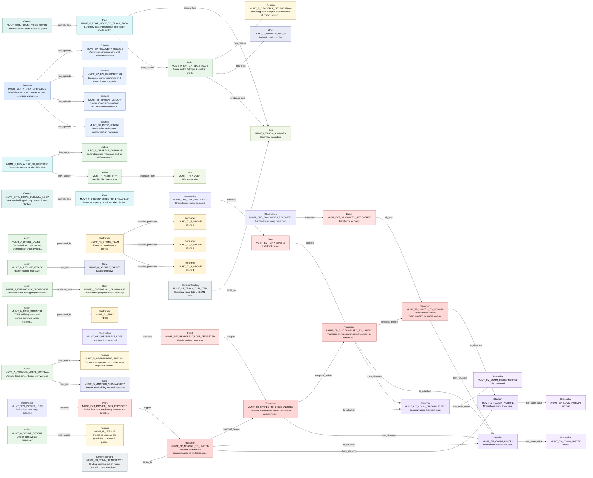

# T2A-ESS Relationship Traceability Report

This report is generated from T2A-ESS JSON files. It checks relationship endpoints, source traceability, graph connectivity, and selected semantic completeness indicators.

| File | Source Units | Slots | Slot Relations | Graph Edges |
| --- | --- | --- | --- | --- |
| mumt.nongold.json | 11 | 90 | 48 | 116 |

## mumt.nongold.json

- Model: MUM-T attack maneuver unstructured test text T2A-ESS extraction result

| Slot Type | Count |
| --- | --- |
| Scenario | 1 |
| Episode | 4 |
| Situation | 4 |
| StateValue | 7 |
| Observation | 6 |
| Event | 7 |
| Transition | 5 |
| Performer | 9 |
| Action | 14 |
| Item | 6 |
| Flow | 8 |
| Control | 3 |
| Constraint | 5 |
| Goal | 3 |
| Reason | 3 |
| DomainExtensionRule | 2 |
| SemanticBinding | 3 |

| Relation Type | Count |
| --- | --- |
| has_episode | 4 |
| from_situation | 4 |
| to_situation | 4 |
| triggers | 4 |
| observes | 4 |
| contains_performer | 3 |
| has_state_value | 3 |
| produces_item | 3 |
| has_goal | 3 |
| has_reason | 3 |
| temporal_before | 3 |
| performed_by | 2 |
| flow_source | 2 |
| controls_flow | 2 |
| binds_to | 2 |
| flow_target | 1 |
| carries_item | 1 |

### Mermaid Relationship Graph

- Mode: `slot_relations`. Rendered edges: `48`. Omitted edges: `0`.

| Check | Count | Examples |
| --- | --- | --- |
| Duplicate IDs | 0 | - |
| Missing IDs | 0 | - |
| Dangling Slot Relations | 0 | - |
| Dangling Source Refs | 0 | - |
| Source Units Without Slots | 0 | - |
| Slots Without Source Ref | 22 | MUMT_A_AVOID_FPV, MUMT_A_EMERGENCY_BROADCAST, MUMT_A_REPORT_BATTALION, MUMT_A_RESUME_ATTACK, MUMT_A_SMOKE_EVASION, MUMT_CTRL_RECOVERY_STAGED, MUMT_DER_THREAT_TYPES, MUMT_EVT_ATGM_LAUNCH, MUMT_F_ATGM_ALERT_TO_EVASION, MUMT_F_DISCONNECTED_TO_BROADCAST, MUMT_F_NORMAL_RESTORED_TO_ATTACK, MUMT_G_SECURE_TARGET, MUMT_I_BATTLE_REPORT, MUMT_I_EMERGENCY_BROADCAST, MUMT_R_INDEPENDENT_SURVIVAL, MUMT_SB_COMM_TRANSITIONS, MUMT_SB_TDSS_PART, MUMT_SB_TRACK_DATA_ITEM, MUMT_SIT_MISSION_SECURED, MUMT_SV_AVAILABLE_DRONES_2 ... (+2) |
| Isolated Slots | 37 | MUMT_A_AVOID_FPV, MUMT_A_DETECT_OBSERVATION_POST, MUMT_A_REPORT_BATTALION, MUMT_A_RESYNC_SA, MUMT_A_SMOKE_EVASION, MUMT_CTRL_RECOVERY_STAGED, MUMT_C_FPV_ETA, MUMT_C_HEARTBEAT_TIMEOUT, MUMT_C_LINK_STABILITY, MUMT_C_PACKET_LOSS_THRESHOLD, MUMT_C_SURVIVABILITY_PRIORITY, MUMT_DER_COMM_DEGRADATION, MUMT_DER_THREAT_TYPES, MUMT_EVT_ATGM_LAUNCH, MUMT_EVT_EW_JAMMING_START, MUMT_EVT_FPV_APPROACH, MUMT_F_ATGM_ALERT_TO_EVASION, MUMT_F_LINK_RECOVERY_TO_RESYNC, MUMT_F_NORMAL_RESTORED_TO_ATTACK, MUMT_F_OP_DETECT_TO_DETOUR ... (+17) |
| Actions With Actor Text But No Performer Relation | 12 | MUMT_A_ACTIVATE_LOCAL_SURVIVAL, MUMT_A_ALERT_FPV, MUMT_A_AVOID_FPV, MUMT_A_DECIDE_DETOUR, MUMT_A_DETECT_OBSERVATION_POST, MUMT_A_DISPERSE_COMMAND, MUMT_A_EMERGENCY_BROADCAST, MUMT_A_REPORT_BATTALION, MUMT_A_RESUME_ATTACK, MUMT_A_RESYNC_SA, MUMT_A_SMOKE_EVASION, MUMT_A_SWITCH_EDGE_MODE |
| Transitions Missing from_situation | 1 | MUMT_TR_DRONE_COUNT_REDUCED |
| Transitions Missing to_situation | 1 | MUMT_TR_DRONE_COUNT_REDUCED |
| Transitions Missing trigger | 1 | MUMT_TR_DRONE_COUNT_REDUCED |
| Flows Missing source | 6 | MUMT_F_ATGM_ALERT_TO_EVASION, MUMT_F_DISCONNECTED_TO_BROADCAST, MUMT_F_LINK_RECOVERY_TO_RESYNC, MUMT_F_NORMAL_RESTORED_TO_ATTACK, MUMT_F_OP_DETECT_TO_DETOUR, MUMT_F_PREP_TO_DRONE_LAUNCH |
| Flows Missing target | 7 | MUMT_F_ATGM_ALERT_TO_EVASION, MUMT_F_DISCONNECTED_TO_BROADCAST, MUMT_F_EDGE_MODE_TO_TRACK_FLOW, MUMT_F_LINK_RECOVERY_TO_RESYNC, MUMT_F_NORMAL_RESTORED_TO_ATTACK, MUMT_F_OP_DETECT_TO_DETOUR, MUMT_F_PREP_TO_DRONE_LAUNCH |

### Example Source Trace: `MUMT_L03`
| Depth | Dir | Relation | Node | Type | Label |
| --- | --- | --- | --- | --- | --- |
| 1 | out | source_ref | MUMT_P1_COMMANDER | Performer | Company commander |
| 1 | out | source_ref | MUMT_SCN_ATTACK_OPERATION | Scenario | MUM-T-based attack maneuver and electronic warfare response |

