# T2A-ESS Relationship Traceability Report

This report is generated from T2A-ESS JSON files. It checks relationship endpoints, source traceability, graph connectivity, and selected semantic completeness indicators.

| File | Source Units | Slots | Slot Relations | Graph Edges |
| --- | --- | --- | --- | --- |
| nghe.exhaustive.json | 21 | 224 | 68 | 289 |

## nghe.exhaustive.json

- Model: NGHE autonomous construction unstructured test text T2A-ESS exhaustive extraction result

| Slot Type | Count |
| --- | --- |
| Scenario | 1 |
| Episode | 8 |
| Situation | 10 |
| StateValue | 22 |
| Observation | 13 |
| Event | 17 |
| Transition | 13 |
| Performer | 19 |
| Action | 51 |
| Item | 14 |
| Flow | 16 |
| Control | 8 |
| Constraint | 15 |
| Goal | 5 |
| Reason | 6 |
| DomainExtensionRule | 3 |
| SemanticBinding | 3 |

| Relation Type | Count |
| --- | --- |
| has_episode | 8 |
| temporal_before | 7 |
| to_situation | 6 |
| triggers | 6 |
| produces_item | 5 |
| contains_performer | 4 |
| observes | 4 |
| uses_item | 4 |
| controls_flow | 4 |
| has_state_value | 3 |
| from_situation | 3 |
| flow_source | 3 |
| flow_target | 3 |
| has_goal | 3 |
| has_reason | 3 |
| binds_to | 2 |

### Mermaid Relationship Graph

- Mode: `slot_relations`. Rendered edges: `68`. Omitted edges: `0`.

```mermaid
flowchart LR
  N0001["Action<br/>NGHE_A_EX_APPLY_OTA<br/>OTA route optimization patch application"]
  N0002["Action<br/>NGHE_A_EX_ASSIGN_WORK<br/>Allocate excavation points, quotas, optimal routes"]
  N0003["Action<br/>NGHE_A_EX_BLOCK_NETWORK<br/>Block external public network"]
  N0004["Action<br/>NGHE_A_EX_COMMAND_STOP<br/>Issue forced work stop command"]
  N0005["Action<br/>NGHE_A_EX_DETECT_FORGED_PACKET<br/>Detect forged command packet"]
  N0006["Action<br/>NGHE_A_EX_ENTER_ECO_MODE<br/>Enter Eco Mode"]
  N0007["Action<br/>NGHE_A_EX_GENERATE_FINAL_REPORT<br/>Generate final performance report"]
  N0008["Action<br/>NGHE_A_EX_GENERATE_PROGRESS_REPORT<br/>Generate automatic performance report"]
  N0009["Action<br/>NGHE_A_EX_MOVE_SAFE_AREA<br/>Move to and wait at safe evacuation positions"]
  N0010["Action<br/>NGHE_A_EX_PROPOSE_LEVEL3<br/>Level 3 downgrade proposal due to fog"]
  N0011["Action<br/>NGHE_A_EX_REPLACE_HYDRAULIC<br/>Hydraulic module replacement"]
  N0012["Action<br/>NGHE_A_EX_SCAN_TERRAIN<br/>3D point cloud terrain scan"]
  N0013["Action<br/>NGHE_A_EX_STOCK_BATTERY<br/>Stockpile fully charged battery packs"]
  N0014["Action<br/>NGHE_A_EX_SWAP_BATTERY<br/>Battery pack replacement"]
  N0015["Action<br/>NGHE_A_EX_SWITCH_SECURE_NETWORK<br/>Switch to internal closed security network"]
  N0016["Action<br/>NGHE_A_EX_UPDATE_DIGITAL_TWIN<br/>Reflect in BIM/digital twin initial model"]
  N0017["Control<br/>NGHE_CTRL_EX_CYBER_ISOLATION<br/>Security network isolation upon forged command packe..."]
  N0018["Control<br/>NGHE_CTRL_EX_RAIN_STOP<br/>Forced work stop during heavy rain"]
  N0019["Control<br/>NGHE_CTRL_EX_RECOVERY_GUARD<br/>Staged recovery guard after heavy rain"]
  N0020["Control<br/>NGHE_CTRL_EX_SWAP_SCHEDULING<br/>Battery swap sequence optimization"]
  N0021["Episode<br/>NGHE_EP_EX_AUTONOMOUS_PRODUCTION<br/>Level 4 autonomous construction and production opera..."]
  N0022["Episode<br/>NGHE_EP_EX_CALIBRATION<br/>Equipment offloading, authentication, calibration"]
  N0023["Episode<br/>NGHE_EP_EX_ENERGY_MAINTENANCE<br/>Energy management, maintenance, OTA update"]
  N0024["Episode<br/>NGHE_EP_EX_FOG_CYBER<br/>Fog and cyber threat response"]
  N0025["Episode<br/>NGHE_EP_EX_MISSION_CONTEXT<br/>Mission goals and operating conditions"]
  N0026["Episode<br/>NGHE_EP_EX_RAIN_STOP<br/>Heavy rain, sensor contamination, work stop"]
  N0027["Episode<br/>NGHE_EP_EX_RECOVERY_COMPLETE<br/>Recovery after heavy rain and mission completion"]
  N0028["Episode<br/>NGHE_EP_EX_SETUP<br/>Infrastructure installation and terrain model constr..."]
  N0029["Event<br/>NGHE_EVT_EX_FOG<br/>Dense fog occurs"]
  N0030["Event<br/>NGHE_EVT_EX_FORGED_COMMAND<br/>Forged command packet injection attempt"]
  N0031["Event<br/>NGHE_EVT_EX_HEAVY_RAIN<br/>Heavy rain intensifies"]
  N0032["Event<br/>NGHE_EVT_EX_LEVEL4_APPROVED<br/>Level 4 transition approval"]
  N0033["Event<br/>NGHE_EVT_EX_MISSION_COMPLETE<br/>72 h mission completion"]
  N0034["Event<br/>NGHE_EVT_EX_PEDESTRIAN_APPROACH<br/>Maintenance worker approach"]
  N0035["Event<br/>NGHE_EVT_EX_RAIN_END<br/>Heavy rain end confirmed"]
  N0036["Event<br/>NGHE_EVT_EX_SENSOR_OCCLUDED<br/>Sensor lens covering occurs"]
  N0037["Flow<br/>NGHE_F_EX_BATTERY_SWAP<br/>SoC 15% -&gt; Eco Mode -&gt; return to BSS_T -&gt; battery re..."]
  N0038["Flow<br/>NGHE_F_EX_CYBER<br/>Forged packet detection -&gt; external network blocking..."]
  N0039["Flow<br/>NGHE_F_EX_RAIN_RECOVERY<br/>Heavy rain ends -&gt; rescan -&gt; reference point re-corr..."]
  N0040["Flow<br/>NGHE_F_EX_RAIN_STOP<br/>Heavy rain intensifies -&gt; forced work stop -&gt; Level ..."]
  N0041["Goal<br/>NGHE_G_EX_CYBER_INTEGRITY<br/>Ensure control authority integrity"]
  N0042["Goal<br/>NGHE_G_EX_SAFE_NET_ZERO<br/>Achieve zero accidents and net-zero"]
  N0043["Goal<br/>NGHE_G_EX_TARGET_VOLUME<br/>Achieve 72 h target earthwork volume"]
  N0044["Item<br/>NGHE_I_EX_BATTERY_PACK<br/>Fully charged battery packs"]
  N0045["Item<br/>NGHE_I_EX_BIM_MODEL<br/>BIM/digital twin model"]
  N0046["Item<br/>NGHE_I_EX_COMMAND_PACKET<br/>Command packet"]
  N0047["Item<br/>NGHE_I_EX_FINAL_REPORT<br/>Final performance report"]
  N0048["Item<br/>NGHE_I_EX_HYDRAULIC_MODULE<br/>Hydraulic module"]
  N0049["Item<br/>NGHE_I_EX_OTA_PATCH<br/>Route optimization algorithm patch"]
  N0050["Item<br/>NGHE_I_EX_POINT_CLOUD<br/>3D point cloud terrain data"]
  N0051["Item<br/>NGHE_I_EX_PROGRESS_REPORT<br/>Automatic performance report"]
  N0052["Item<br/>NGHE_I_EX_ROUTE_PLAN<br/>Work routes and bypass routes"]
  N0053["Observation<br/>NGHE_OBS_EX_FOG_CONF<br/>Detect sensor confidence drop due to fog"]
  N0054["Observation<br/>NGHE_OBS_EX_FORGED_PACKET<br/>Detect forged command packet"]
  N0055["Observation<br/>NGHE_OBS_EX_PEDESTRIAN<br/>Maintenance worker approach detected"]
  N0056["Observation<br/>NGHE_OBS_EX_SENSOR_OCCLUSION<br/>Detect lens covered 50% or more"]
  N0057["Performer<br/>NGHE_P_EX_EQUIPMENT_FLEET<br/>Unmanned equipment fleet"]
  N0058["Performer<br/>NGHE_P_EX_U_EDB<br/>U-EDB bulldozer"]
  N0059["Performer<br/>NGHE_P_EX_U_EDT<br/>U-EDT dump truck"]
  N0060["Performer<br/>NGHE_P_EX_U_EEX<br/>U-EEX excavator"]
  N0061["Performer<br/>NGHE_P_EX_U_ERC<br/>U-ERC roller"]
  N0062["Reason<br/>NGHE_R_EX_CYBER<br/>Security network switch because of the forged comman..."]
  N0063["Reason<br/>NGHE_R_EX_FOG_DOWNGRADE<br/>Level 3 downgrade because of fog and degraded sensor..."]
  N0064["Reason<br/>NGHE_R_EX_RAIN_STOP<br/>Work stop because of heavy rain, sensor contaminatio..."]
  N0065["SemanticBinding<br/>NGHE_SB_EX_LEVEL_TRANSITIONS<br/>Autonomous operation mode transition to StateTransit..."]
  N0066["Scenario<br/>NGHE_SCN_EX_72H_AUTONOMOUS_CONSTRUCTION<br/>NGHE 72 h autonomous construction full scenario"]
  N0067["Situation<br/>NGHE_SIT_EX_CYBER_ISOLATED<br/>Internal closed security network operation state"]
  N0068["Situation<br/>NGHE_SIT_EX_LEVEL1_STOP<br/>Level 1 emergency stop and safe evacuation state"]
  N0069["Situation<br/>NGHE_SIT_EX_LEVEL3<br/>Level 3 supervised autonomy mode"]
  N0070["Situation<br/>NGHE_SIT_EX_LEVEL4<br/>Level 4 full autonomy mode"]
  N0071["Situation<br/>NGHE_SIT_EX_MISSION_COMPLETE<br/>72 h mission completion state"]
  N0072["Situation<br/>NGHE_SIT_EX_RECOVERY<br/>Recovery after heavy rain state"]
  N0073["StateValue<br/>NGHE_SV_EX_LEVEL1<br/>Level 1"]
  N0074["StateValue<br/>NGHE_SV_EX_LEVEL3<br/>Level 3"]
  N0075["StateValue<br/>NGHE_SV_EX_LEVEL4<br/>Level 4"]
  N0076["Transition<br/>NGHE_TR_EX_LEVEL1_TO_RECOVERY<br/>Transition from Level 1 waiting to recovery after he..."]
  N0077["Transition<br/>NGHE_TR_EX_LEVEL3_TO_LEVEL4<br/>Transition from Level 3 to Level 4"]
  N0078["Transition<br/>NGHE_TR_EX_LEVEL3_TO_LEVEL4_FOG_CLEAR<br/>Return to Level 4 after fog clears"]
  N0079["Transition<br/>NGHE_TR_EX_LEVEL4_TO_LEVEL1_RAIN<br/>Transition to Level 1 emergency stop due to heavy rain"]
  N0080["Transition<br/>NGHE_TR_EX_LEVEL4_TO_LEVEL3_FOG<br/>Downgrade from Level 4 to Level 3 due to fog"]
  N0081["Transition<br/>NGHE_TR_EX_RECOVERY_LEVEL3_TO_LEVEL4<br/>Re-transition from Level 3 to Level 4 after recovery"]
  N0082["Transition<br/>NGHE_TR_EX_RECOVERY_TO_LEVEL3<br/>Transition from recovery after heavy rain to Level 3..."]
  N0083["Transition<br/>NGHE_TR_EX_TO_COMPLETE<br/>Transition from construction in progress to mission ..."]
  N0084["Transition<br/>NGHE_TR_EX_TO_CYBER_ISOLATED<br/>Switch from external network to internal closed secu..."]
  N0066 -->|has_episode| N0025
  N0066 -->|has_episode| N0028
  N0066 -->|has_episode| N0022
  N0066 -->|has_episode| N0021
  N0066 -->|has_episode| N0023
  N0066 -->|has_episode| N0024
  N0066 -->|has_episode| N0026
  N0066 -->|has_episode| N0027
  N0057 -->|contains_performer| N0060
  N0057 -->|contains_performer| N0059
  N0057 -->|contains_performer| N0058
  N0057 -->|contains_performer| N0061
  N0069 -->|has_state_value| N0074
  N0070 -->|has_state_value| N0075
  N0068 -->|has_state_value| N0073
  N0077 -->|from_situation| N0069
  N0077 -->|to_situation| N0070
  N0032 -->|triggers| N0077
  N0080 -->|from_situation| N0070
  N0080 -->|to_situation| N0069
  N0029 -->|triggers| N0080
  N0084 -->|to_situation| N0067
  N0030 -->|triggers| N0084
  N0079 -->|to_situation| N0068
  N0031 -->|triggers| N0079
  N0076 -->|from_situation| N0068
  N0076 -->|to_situation| N0072
  N0035 -->|triggers| N0076
  N0083 -->|to_situation| N0071
  N0033 -->|triggers| N0083
  N0053 -->|observes| N0029
  N0054 -->|observes| N0030
  N0056 -->|observes| N0036
  N0055 -->|observes| N0034
  N0013 -->|uses_item| N0044
  N0012 -->|produces_item| N0050
  N0016 -->|produces_item| N0045
  N0002 -->|produces_item| N0052
  N0008 -->|produces_item| N0051
  N0011 -->|uses_item| N0048
  N0001 -->|uses_item| N0049
  N0005 -->|uses_item| N0046
  N0007 -->|produces_item| N0047
  N0037 -->|flow_source| N0006
  N0037 -->|flow_target| N0014
  N0038 -->|flow_source| N0005
  N0038 -->|flow_target| N0015
  N0040 -->|flow_source| N0004
  N0040 -->|flow_target| N0009
  N0020 -->|controls_flow| N0037
  N0017 -->|controls_flow| N0038
  N0018 -->|controls_flow| N0040
  N0019 -->|controls_flow| N0039
  N0007 -->|has_goal| N0043
  N0004 -->|has_goal| N0042
  N0005 -->|has_goal| N0041
  N0010 -->|has_reason| N0063
  N0003 -->|has_reason| N0062
  N0004 -->|has_reason| N0064
  N0065 -->|binds_to| N0077
  N0065 -->|binds_to| N0079
  N0077 -->|temporal_before| N0080
  N0080 -->|temporal_before| N0078
  N0078 -->|temporal_before| N0079
  N0079 -->|temporal_before| N0076
  N0076 -->|temporal_before| N0082
  N0082 -->|temporal_before| N0081
  N0081 -->|temporal_before| N0083
  classDef SourceUnit fill:#F6F8FA,stroke:#8A8A8A,stroke-width:1px,color:#111;
  classDef Scenario fill:#DDEBFF,stroke:#5A78B8,stroke-width:1px,color:#111;
  classDef Episode fill:#E7F0FF,stroke:#5A78B8,stroke-width:1px,color:#111;
  classDef Action fill:#E8F5E9,stroke:#4C8A4C,stroke-width:1px,color:#111;
  classDef Performer fill:#FFF4D6,stroke:#9A7A2F,stroke-width:1px,color:#111;
  classDef Event fill:#FFE3E3,stroke:#B45A5A,stroke-width:1px,color:#111;
  classDef Transition fill:#FFD6D6,stroke:#B45A5A,stroke-width:1px,color:#111;
  classDef Situation fill:#EFE6FF,stroke:#7B5AB8,stroke-width:1px,color:#111;
  classDef StateValue fill:#F5ECFF,stroke:#7B5AB8,stroke-width:1px,color:#111;
  classDef Flow fill:#E0F7FA,stroke:#438A91,stroke-width:1px,color:#111;
  classDef Control fill:#E0F2F1,stroke:#438A75,stroke-width:1px,color:#111;
  classDef Constraint fill:#FCE4EC,stroke:#A35272,stroke-width:1px,color:#111;
  classDef Goal fill:#E8EAF6,stroke:#5A62A8,stroke-width:1px,color:#111;
  classDef Reason fill:#FFF8E1,stroke:#9A7A2F,stroke-width:1px,color:#111;
  classDef Item fill:#F1F8E9,stroke:#6B8A3A,stroke-width:1px,color:#111;
  classDef DomainExtensionRule fill:#ECEFF1,stroke:#607D8B,stroke-width:1px,color:#111;
  classDef SemanticBinding fill:#ECEFF1,stroke:#607D8B,stroke-width:1px,color:#111;
  class N0001,N0002,N0003,N0004,N0005,N0006,N0007,N0008,N0009,N0010,N0011,N0012,N0013,N0014,N0015,N0016 Action;
  class N0017,N0018,N0019,N0020 Control;
  class N0021,N0022,N0023,N0024,N0025,N0026,N0027,N0028 Episode;
  class N0029,N0030,N0031,N0032,N0033,N0034,N0035,N0036 Event;
  class N0037,N0038,N0039,N0040 Flow;
  class N0041,N0042,N0043 Goal;
  class N0044,N0045,N0046,N0047,N0048,N0049,N0050,N0051,N0052 Item;
  class N0057,N0058,N0059,N0060,N0061 Performer;
  class N0062,N0063,N0064 Reason;
  class N0066 Scenario;
  class N0065 SemanticBinding;
  class N0067,N0068,N0069,N0070,N0071,N0072 Situation;
  class N0073,N0074,N0075 StateValue;
  class N0076,N0077,N0078,N0079,N0080,N0081,N0082,N0083,N0084 Transition;
```

| Check | Count | Examples |
| --- | --- | --- |
| Duplicate IDs | 0 | - |
| Missing IDs | 0 | - |
| Dangling Slot Relations | 0 | - |
| Dangling Source Refs | 0 | - |
| Source Units Without Slots | 0 | - |
| Slots Without Source Ref | 3 | NGHE_SB_EX_EQUIPMENT_PARTS, NGHE_SB_EX_LEVEL_TRANSITIONS, NGHE_SB_EX_ROUTE_ITEM |
| Isolated Slots | 140 | NGHE_A_EX_ADJUST_COMPACTION, NGHE_A_EX_APPROVE_LEVEL3, NGHE_A_EX_APPROVE_LEVEL3_START, NGHE_A_EX_APPROVE_LEVEL4, NGHE_A_EX_APPROVE_LEVEL4_RETURN, NGHE_A_EX_APPROVE_RECOVERY_LEVEL4, NGHE_A_EX_APPROVE_RESUME_LEVEL3, NGHE_A_EX_AUTONOMOUS_CONTROL, NGHE_A_EX_CALIBRATE_EQUIPMENT, NGHE_A_EX_CALIBRATE_GPS, NGHE_A_EX_CHANGE_SENSOR_PRIORITY, NGHE_A_EX_CLEAN_SENSOR_AUTO, NGHE_A_EX_COMPACT, NGHE_A_EX_CONFIRM_KEEP_OUT, NGHE_A_EX_EXCAVATE_LOAD, NGHE_A_EX_GRADING, NGHE_A_EX_HAUL, NGHE_A_EX_INSTALL_ENERGY_INFRA, NGHE_A_EX_MONITOR_FATIGUE, NGHE_A_EX_MONITOR_LEVEL4_METRICS ... (+120) |
| Actions With Actor Text But No Performer Relation | 51 | NGHE_A_EX_ADJUST_COMPACTION, NGHE_A_EX_APPLY_OTA, NGHE_A_EX_APPROVE_LEVEL3, NGHE_A_EX_APPROVE_LEVEL3_START, NGHE_A_EX_APPROVE_LEVEL4, NGHE_A_EX_APPROVE_LEVEL4_RETURN, NGHE_A_EX_APPROVE_RECOVERY_LEVEL4, NGHE_A_EX_APPROVE_RESUME_LEVEL3, NGHE_A_EX_ASSIGN_WORK, NGHE_A_EX_AUTONOMOUS_CONTROL, NGHE_A_EX_BLOCK_NETWORK, NGHE_A_EX_CALIBRATE_EQUIPMENT, NGHE_A_EX_CALIBRATE_GPS, NGHE_A_EX_CHANGE_SENSOR_PRIORITY, NGHE_A_EX_CLEAN_SENSOR_AUTO, NGHE_A_EX_COMMAND_STOP, NGHE_A_EX_COMPACT, NGHE_A_EX_CONFIRM_KEEP_OUT, NGHE_A_EX_DETECT_FORGED_PACKET, NGHE_A_EX_ENTER_ECO_MODE ... (+31) |
| Transitions Missing from_situation | 10 | NGHE_TR_EX_LEVEL3_TO_LEVEL4_FOG_CLEAR, NGHE_TR_EX_LEVEL4_TO_LEVEL1_RAIN, NGHE_TR_EX_READY_TO_LEVEL3, NGHE_TR_EX_RECOVERY_LEVEL3_TO_LEVEL4, NGHE_TR_EX_RECOVERY_TO_LEVEL3, NGHE_TR_EX_SETUP_TO_READY, NGHE_TR_EX_TO_COMPLETE, NGHE_TR_EX_TO_CYBER_ISOLATED, NGHE_TR_EX_TO_ECO_SWAP, NGHE_TR_EX_TO_SENSOR_STOP |
| Transitions Missing to_situation | 7 | NGHE_TR_EX_LEVEL3_TO_LEVEL4_FOG_CLEAR, NGHE_TR_EX_READY_TO_LEVEL3, NGHE_TR_EX_RECOVERY_LEVEL3_TO_LEVEL4, NGHE_TR_EX_RECOVERY_TO_LEVEL3, NGHE_TR_EX_SETUP_TO_READY, NGHE_TR_EX_TO_ECO_SWAP, NGHE_TR_EX_TO_SENSOR_STOP |
| Transitions Missing trigger | 7 | NGHE_TR_EX_LEVEL3_TO_LEVEL4_FOG_CLEAR, NGHE_TR_EX_READY_TO_LEVEL3, NGHE_TR_EX_RECOVERY_LEVEL3_TO_LEVEL4, NGHE_TR_EX_RECOVERY_TO_LEVEL3, NGHE_TR_EX_SETUP_TO_READY, NGHE_TR_EX_TO_ECO_SWAP, NGHE_TR_EX_TO_SENSOR_STOP |
| Flows Missing source | 13 | NGHE_F_EX_CALIBRATION, NGHE_F_EX_COMPLETE, NGHE_F_EX_FOG, NGHE_F_EX_FOG_RECOVERY, NGHE_F_EX_LEVEL4_APPROVAL, NGHE_F_EX_MAINTENANCE, NGHE_F_EX_OTA, NGHE_F_EX_PRODUCTION, NGHE_F_EX_RAIN_PREP, NGHE_F_EX_RAIN_RECOVERY, NGHE_F_EX_RESUME, NGHE_F_EX_SENSOR_SAFETY, NGHE_F_EX_SETUP |
| Flows Missing target | 13 | NGHE_F_EX_CALIBRATION, NGHE_F_EX_COMPLETE, NGHE_F_EX_FOG, NGHE_F_EX_FOG_RECOVERY, NGHE_F_EX_LEVEL4_APPROVAL, NGHE_F_EX_MAINTENANCE, NGHE_F_EX_OTA, NGHE_F_EX_PRODUCTION, NGHE_F_EX_RAIN_PREP, NGHE_F_EX_RAIN_RECOVERY, NGHE_F_EX_RESUME, NGHE_F_EX_SENSOR_SAFETY, NGHE_F_EX_SETUP |

### Example Source Trace: `NGHE_L03`
| Depth | Dir | Relation | Node | Type | Label |
| --- | --- | --- | --- | --- | --- |
| 1 | out | source_ref | NGHE_A_EX_SET_MISSION_GOALS | Action | Set 72 h mission goals |
| 1 | out | source_ref | NGHE_C_EX_COST_REDUCTION | Constraint | Cost reduced by 25% |
| 1 | out | source_ref | NGHE_C_EX_SCHEDULE_REDUCTION | Constraint | Schedule shortened by 30% |
| 1 | out | source_ref | NGHE_C_EX_TARGET_VOLUME | Constraint | 72 h target earthwork volume of at least 38,000 m3 |
| 1 | out | source_ref | NGHE_EP_EX_MISSION_CONTEXT | Episode | Mission goals and operating conditions |
| 1 | out | source_ref | NGHE_EVT_EX_MISSION_START | Event | NGHE site deployment start |
| 1 | out | source_ref | NGHE_G_EX_SAFE_NET_ZERO | Goal | Achieve zero accidents and net-zero |
| 1 | out | source_ref | NGHE_G_EX_TARGET_VOLUME | Goal | Achieve 72 h target earthwork volume |
| 1 | out | source_ref | NGHE_P_EX_A_COMPANY | Performer | Company A |
| 1 | out | source_ref | NGHE_P_EX_ICCC | Performer | ICCC |
| 1 | out | source_ref | NGHE_SCN_EX_72H_AUTONOMOUS_CONSTRUCTION | Scenario | NGHE 72 h autonomous construction full scenario |
| 1 | out | source_ref | NGHE_SV_EX_COST_REDUCTION | StateValue | 25 |
| 1 | out | source_ref | NGHE_SV_EX_SCHEDULE_REDUCTION | StateValue | 30 |
| 1 | out | source_ref | NGHE_SV_EX_TARGET_VOLUME | StateValue | 38000 |
| 1 | out | source_ref | NGHE_SV_EX_TOTAL_VOLUME | StateValue | 100000 |

