# T2A-ESS Relationship Traceability Report

This report is generated from T2A-ESS JSON files. It checks relationship endpoints, source traceability, graph connectivity, and selected semantic completeness indicators.

| File | Source Units | Slots | Slot Relations | Graph Edges |
| --- | --- | --- | --- | --- |
| nghe.nongold.json | 10 | 117 | 63 | 142 |

## nghe.nongold.json

- Model: NGHE autonomous construction unstructured test text T2A-ESS extraction result

| Slot Type | Count |
| --- | --- |
| Scenario | 1 |
| Episode | 5 |
| Situation | 6 |
| StateValue | 10 |
| Observation | 7 |
| Event | 8 |
| Transition | 7 |
| Performer | 14 |
| Action | 16 |
| Item | 7 |
| Flow | 6 |
| Control | 6 |
| Constraint | 10 |
| Goal | 4 |
| Reason | 4 |
| DomainExtensionRule | 3 |
| SemanticBinding | 3 |

| Relation Type | Count |
| --- | --- |
| to_situation | 7 |
| triggers | 6 |
| has_episode | 5 |
| performed_by | 5 |
| temporal_before | 5 |
| contains_performer | 4 |
| from_situation | 4 |
| controls_flow | 4 |
| has_goal | 4 |
| has_state_value | 3 |
| observes | 3 |
| produces_item | 3 |
| has_reason | 3 |
| flow_source | 2 |
| flow_target | 2 |
| binds_to | 2 |
| uses_item | 1 |

### Mermaid Relationship Graph

- Mode: `slot_relations`. Rendered edges: `63`. Omitted edges: `0`.

```mermaid
flowchart LR
  N0001["Action<br/>NGHE_A_BATTERY_SWAP<br/>Battery pack replacement"]
  N0002["Action<br/>NGHE_A_CALIBRATE_EQUIPMENT<br/>Authentication and calibration of 19 units of equipment"]
  N0003["Action<br/>NGHE_A_DOWNGRADE_LEVEL3<br/>Level 3 downgrade proposal and approval due to fog"]
  N0004["Action<br/>NGHE_A_GENERATE_FINAL_REPORT<br/>Automatic generation of 72 h mission final report"]
  N0005["Action<br/>NGHE_A_INSTALL_INFRA<br/>Energy infrastructure installation and battery pack ..."]
  N0006["Action<br/>NGHE_A_ISOLATE_NETWORK<br/>External public network blocking and switch to inter..."]
  N0007["Action<br/>NGHE_A_OPTIMIZE_SWAP<br/>Battery swap sequence optimization"]
  N0008["Action<br/>NGHE_A_RECALC_ROUTE<br/>Subsidence zone bypass route recalculation"]
  N0009["Action<br/>NGHE_A_RESCAN_TERRAIN<br/>Terrain rescan and reference point re-correction aft..."]
  N0010["Action<br/>NGHE_A_SCAN_TERRAIN<br/>3D point cloud scan and reference point correction"]
  N0011["Action<br/>NGHE_A_STOP_WORK<br/>Forced work stop and safe evacuation"]
  N0012["Action<br/>NGHE_A_VERIFY_RTDD<br/>RTDD latency and HSM authentication confirmation"]
  N0013["Control<br/>NGHE_CTRL_FOG_DOWNGRADE<br/>Level 3 downgrade guard in fog"]
  N0014["Control<br/>NGHE_CTRL_RAIN_STOP<br/>Forced work stop during heavy rain"]
  N0015["Control<br/>NGHE_CTRL_RECOVERY_GUARD<br/>Staged recovery guard after heavy rain"]
  N0016["Control<br/>NGHE_CTRL_SWAP_SCHEDULING<br/>Swap scheduling preventing 2 or more units leaving w..."]
  N0017["Episode<br/>NGHE_EP_AUTONOMOUS_PRODUCTION<br/>Level 4 autonomous construction and productivity mai..."]
  N0018["Episode<br/>NGHE_EP_FOG_CYBER<br/>Fog and cyber threat response"]
  N0019["Episode<br/>NGHE_EP_RAIN_STOP<br/>Heavy rain and work stop"]
  N0020["Episode<br/>NGHE_EP_RECOVERY_COMPLETE<br/>Recovery after heavy rain and mission completion"]
  N0021["Episode<br/>NGHE_EP_SETUP<br/>Site setup and Level 3 start"]
  N0022["Event<br/>NGHE_EVT_BATTERY_LOW<br/>Battery SoC reaches 15%"]
  N0023["Event<br/>NGHE_EVT_FOG_OCCURS<br/>Dense fog occurs"]
  N0024["Event<br/>NGHE_EVT_FORGED_COMMAND<br/>Forged command packet injection attempt"]
  N0025["Event<br/>NGHE_EVT_HEAVY_RAIN<br/>Heavy rain intensifies"]
  N0026["Event<br/>NGHE_EVT_LEVEL4_APPROVED<br/>Level 4 transition approval"]
  N0027["Event<br/>NGHE_EVT_MISSION_COMPLETE<br/>72 h mission completion"]
  N0028["Event<br/>NGHE_EVT_RAIN_END<br/>Heavy rain end confirmed"]
  N0029["Flow<br/>NGHE_F_BATTERY_SWAP<br/>Return to BSS_T and battery replacement after SoC drop"]
  N0030["Flow<br/>NGHE_F_CYBER_RESPONSE<br/>Switch to security network after forged packet detec..."]
  N0031["Flow<br/>NGHE_F_RAIN_RECOVERY<br/>Rescan, route recalculation, and construction resump..."]
  N0032["Flow<br/>NGHE_F_RAIN_STOP<br/>Forced work stop after heavy rain intensifies"]
  N0033["Goal<br/>NGHE_G_COMPLETE_VOLUME<br/>Achieve 72 h target earthwork volume"]
  N0034["Goal<br/>NGHE_G_CYBER_INTEGRITY<br/>Ensure control authority integrity"]
  N0035["Goal<br/>NGHE_G_KEEP_SAFE<br/>Maintain zero-accident and safety conditions"]
  N0036["Goal<br/>NGHE_G_MAINTAIN_PRODUCTIVITY<br/>Minimize work stops and maintain productivity"]
  N0037["Item<br/>NGHE_I_BATTERY_PACK<br/>Battery pack"]
  N0038["Item<br/>NGHE_I_FINAL_REPORT<br/>Comprehensive performance report"]
  N0039["Item<br/>NGHE_I_ROUTE_PLAN<br/>Work routes and bypass routes"]
  N0040["Item<br/>NGHE_I_TERRAIN_POINT_CLOUD<br/>3D point cloud terrain data"]
  N0041["Observation<br/>NGHE_OBS_FORGED_PACKET<br/>Detect forged command packet"]
  N0042["Observation<br/>NGHE_OBS_SENSOR_CONF_DROP<br/>Detect sensor confidence score drop"]
  N0043["Observation<br/>NGHE_OBS_SOC_LOW<br/>Detect battery SoC reaching 15%"]
  N0044["Performer<br/>NGHE_P5_SITE_SUPERVISOR<br/>Site supervisor"]
  N0045["Performer<br/>NGHE_P6_MAINT_TEAM<br/>Site maintenance team"]
  N0046["Performer<br/>NGHE_P7_1_EEX<br/>U-EEX excavator"]
  N0047["Performer<br/>NGHE_P7_2_EDT<br/>U-EDT dump truck"]
  N0048["Performer<br/>NGHE_P7_3_EDB<br/>U-EDB bulldozer"]
  N0049["Performer<br/>NGHE_P7_4_ERC<br/>U-ERC roller"]
  N0050["Performer<br/>NGHE_P7_EQUIPMENT_FLEET<br/>Unmanned equipment fleet"]
  N0051["Performer<br/>NGHE_P8_BSS_T<br/>BSS_T"]
  N0052["Performer<br/>NGHE_P8_DMSS<br/>DMSS"]
  N0053["Reason<br/>NGHE_R_CYBER_ISOLATION<br/>Network isolation because of the forged command packet"]
  N0054["Reason<br/>NGHE_R_FOG_DOWNGRADE<br/>Level 3 downgrade because of degraded sensor confidence"]
  N0055["Reason<br/>NGHE_R_RAIN_STOP<br/>Work stop because of heavy rain and sensor contamina..."]
  N0056["SemanticBinding<br/>NGHE_SB_LEVEL_TRANSITIONS<br/>Autonomous operation mode transition to StateTransit..."]
  N0057["Scenario<br/>NGHE_SCN_72H_AUTONOMOUS_CONSTRUCTION<br/>NGHE 72 h autonomous construction and contingency re..."]
  N0058["Situation<br/>NGHE_SIT_CYBER_ISOLATED<br/>Internal closed security network operation state"]
  N0059["Situation<br/>NGHE_SIT_LEVEL1_STOP<br/>Level 1 emergency stop and safe evacuation state"]
  N0060["Situation<br/>NGHE_SIT_LEVEL3<br/>Level 3 supervised autonomy mode"]
  N0061["Situation<br/>NGHE_SIT_LEVEL4<br/>Level 4 full autonomy mode"]
  N0062["Situation<br/>NGHE_SIT_MISSION_COMPLETE<br/>72 h mission completion state"]
  N0063["StateValue<br/>NGHE_SV_AUTONOMY_LEVEL1<br/>Level 1"]
  N0064["StateValue<br/>NGHE_SV_AUTONOMY_LEVEL3<br/>Level 3"]
  N0065["StateValue<br/>NGHE_SV_AUTONOMY_LEVEL4<br/>Level 4"]
  N0066["Transition<br/>NGHE_TR_LEVEL1_TO_LEVEL3_RECOVERY<br/>Resume construction in Level 3 after heavy rain"]
  N0067["Transition<br/>NGHE_TR_LEVEL3_TO_LEVEL4<br/>Transition from Level 3 to Level 4"]
  N0068["Transition<br/>NGHE_TR_LEVEL4_TO_LEVEL1_RAIN<br/>Transition to Level 1 emergency stop due to heavy rain"]
  N0069["Transition<br/>NGHE_TR_LEVEL4_TO_LEVEL3_FOG<br/>Downgrade from Level 4 to Level 3 due to fog"]
  N0070["Transition<br/>NGHE_TR_MISSION_TO_COMPLETE<br/>Transition from mission in progress to mission compl..."]
  N0071["Transition<br/>NGHE_TR_NETWORK_TO_ISOLATED<br/>Switch from external network to internal closed secu..."]
  N0072["Transition<br/>NGHE_TR_RECOVERY_LEVEL3_TO_LEVEL4<br/>Re-transition from Level 3 to Level 4 after recovery"]
  N0057 -->|has_episode| N0021
  N0057 -->|has_episode| N0017
  N0057 -->|has_episode| N0018
  N0057 -->|has_episode| N0019
  N0057 -->|has_episode| N0020
  N0050 -->|contains_performer| N0046
  N0050 -->|contains_performer| N0047
  N0050 -->|contains_performer| N0048
  N0050 -->|contains_performer| N0049
  N0060 -->|has_state_value| N0064
  N0061 -->|has_state_value| N0065
  N0059 -->|has_state_value| N0063
  N0067 -->|from_situation| N0060
  N0067 -->|to_situation| N0061
  N0026 -->|triggers| N0067
  N0069 -->|from_situation| N0061
  N0069 -->|to_situation| N0060
  N0023 -->|triggers| N0069
  N0071 -->|to_situation| N0058
  N0024 -->|triggers| N0071
  N0068 -->|to_situation| N0059
  N0025 -->|triggers| N0068
  N0066 -->|from_situation| N0059
  N0066 -->|to_situation| N0060
  N0028 -->|triggers| N0066
  N0072 -->|from_situation| N0060
  N0072 -->|to_situation| N0061
  N0070 -->|to_situation| N0062
  N0027 -->|triggers| N0070
  N0042 -->|observes| N0023
  N0041 -->|observes| N0024
  N0043 -->|observes| N0022
  N0005 -->|performed_by| N0045
  N0012 -->|performed_by| N0044
  N0010 -->|performed_by| N0052
  N0002 -->|performed_by| N0050
  N0001 -->|performed_by| N0051
  N0001 -->|uses_item| N0037
  N0009 -->|produces_item| N0040
  N0008 -->|produces_item| N0039
  N0004 -->|produces_item| N0038
  N0029 -->|flow_source| N0022
  N0029 -->|flow_target| N0001
  N0030 -->|flow_source| N0024
  N0030 -->|flow_target| N0006
  N0016 -->|controls_flow| N0029
  N0013 -->|controls_flow| N0030
  N0014 -->|controls_flow| N0032
  N0015 -->|controls_flow| N0031
  N0004 -->|has_goal| N0033
  N0011 -->|has_goal| N0035
  N0007 -->|has_goal| N0036
  N0006 -->|has_goal| N0034
  N0003 -->|has_reason| N0054
  N0006 -->|has_reason| N0053
  N0011 -->|has_reason| N0055
  N0056 -->|binds_to| N0067
  N0056 -->|binds_to| N0068
  N0067 -->|temporal_before| N0069
  N0069 -->|temporal_before| N0068
  N0068 -->|temporal_before| N0066
  N0066 -->|temporal_before| N0072
  N0072 -->|temporal_before| N0070
  classDef SourceUnit fill:#F6F8FA,stroke:#8A8A8A,stroke-width:1px,color:#111;
  classDef Scenario fill:#DDEBFF,stroke:#5A78B8,stroke-width:1px,color:#111;
  classDef Episode fill:#E7F0FF,stroke:#5A78B8,stroke-width:1px,color:#111;
  classDef Action fill:#E8F5E9,stroke:#4C8A4C,stroke-width:1px,color:#111;
  classDef Performer fill:#FFF4D6,stroke:#9A7A2F,stroke-width:1px,color:#111;
  classDef Event fill:#FFE3E3,stroke:#B45A5A,stroke-width:1px,color:#111;
  classDef Transition fill:#FFD6D6,stroke:#B45A5A,stroke-width:1px,color:#111;
  classDef Situation fill:#EFE6FF,stroke:#7B5AB8,stroke-width:1px,color:#111;
  classDef StateValue fill:#F5ECFF,stroke:#7B5AB8,stroke-width:1px,color:#111;
  classDef Flow fill:#E0F7FA,stroke:#438A91,stroke-width:1px,color:#111;
  classDef Control fill:#E0F2F1,stroke:#438A75,stroke-width:1px,color:#111;
  classDef Constraint fill:#FCE4EC,stroke:#A35272,stroke-width:1px,color:#111;
  classDef Goal fill:#E8EAF6,stroke:#5A62A8,stroke-width:1px,color:#111;
  classDef Reason fill:#FFF8E1,stroke:#9A7A2F,stroke-width:1px,color:#111;
  classDef Item fill:#F1F8E9,stroke:#6B8A3A,stroke-width:1px,color:#111;
  classDef DomainExtensionRule fill:#ECEFF1,stroke:#607D8B,stroke-width:1px,color:#111;
  classDef SemanticBinding fill:#ECEFF1,stroke:#607D8B,stroke-width:1px,color:#111;
  class N0001,N0002,N0003,N0004,N0005,N0006,N0007,N0008,N0009,N0010,N0011,N0012 Action;
  class N0013,N0014,N0015,N0016 Control;
  class N0017,N0018,N0019,N0020,N0021 Episode;
  class N0022,N0023,N0024,N0025,N0026,N0027,N0028 Event;
  class N0029,N0030,N0031,N0032 Flow;
  class N0033,N0034,N0035,N0036 Goal;
  class N0037,N0038,N0039,N0040 Item;
  class N0044,N0045,N0046,N0047,N0048,N0049,N0050,N0051,N0052 Performer;
  class N0053,N0054,N0055 Reason;
  class N0057 Scenario;
  class N0056 SemanticBinding;
  class N0058,N0059,N0060,N0061,N0062 Situation;
  class N0063,N0064,N0065 StateValue;
  class N0066,N0067,N0068,N0069,N0070,N0071,N0072 Transition;
```

| Check | Count | Examples |
| --- | --- | --- |
| Duplicate IDs | 0 | - |
| Missing IDs | 0 | - |
| Dangling Slot Relations | 0 | - |
| Dangling Source Refs | 0 | - |
| Source Units Without Slots | 0 | - |
| Slots Without Source Ref | 38 | NGHE_A_APPLY_OTA, NGHE_A_CALIBRATE_EQUIPMENT, NGHE_A_PERFORM_MAINTENANCE, NGHE_A_RECALC_ROUTE, NGHE_A_RESCAN_TERRAIN, NGHE_A_START_CONSTRUCTION, NGHE_CTRL_PARALLEL_CALIBRATION, NGHE_CTRL_RECOVERY_GUARD, NGHE_C_MTTR_1H, NGHE_C_NOISE_65DB, NGHE_C_ZERO_ACCIDENT, NGHE_DER_AUTONOMY, NGHE_DER_CYBER_SAFETY, NGHE_DER_EQUIPMENT, NGHE_EVT_HEAVY_RAIN, NGHE_EVT_PEDESTRIAN_DETECTED, NGHE_EVT_RAIN_END, NGHE_F_CONSTRUCTION_PRODUCTION, NGHE_F_RAIN_RECOVERY, NGHE_F_SETUP_SEQUENCE ... (+18) |
| Isolated Slots | 45 | NGHE_A_APPLY_OTA, NGHE_A_PERFORM_MAINTENANCE, NGHE_A_RESUME_CONSTRUCTION, NGHE_A_START_CONSTRUCTION, NGHE_CTRL_CYBER_ISOLATION, NGHE_CTRL_PARALLEL_CALIBRATION, NGHE_C_ENCRYPTION_DELAY, NGHE_C_MTTR_1H, NGHE_C_NOISE_65DB, NGHE_C_NO_TWO_EQUIPMENT_OUT, NGHE_C_RTDD_LATENCY, NGHE_C_SAFETY_DISTANCE_X2, NGHE_C_SPEED_LIMIT_FOG, NGHE_C_SWAP_TIME, NGHE_C_TARGET_VOLUME, NGHE_C_ZERO_ACCIDENT, NGHE_DER_AUTONOMY, NGHE_DER_CYBER_SAFETY, NGHE_DER_EQUIPMENT, NGHE_EVT_PEDESTRIAN_DETECTED ... (+25) |
| Actions With Actor Text But No Performer Relation | 11 | NGHE_A_APPLY_OTA, NGHE_A_DOWNGRADE_LEVEL3, NGHE_A_GENERATE_FINAL_REPORT, NGHE_A_ISOLATE_NETWORK, NGHE_A_OPTIMIZE_SWAP, NGHE_A_PERFORM_MAINTENANCE, NGHE_A_RECALC_ROUTE, NGHE_A_RESCAN_TERRAIN, NGHE_A_RESUME_CONSTRUCTION, NGHE_A_START_CONSTRUCTION, NGHE_A_STOP_WORK |
| Transitions Missing from_situation | 3 | NGHE_TR_LEVEL4_TO_LEVEL1_RAIN, NGHE_TR_MISSION_TO_COMPLETE, NGHE_TR_NETWORK_TO_ISOLATED |
| Transitions Missing to_situation | 0 | - |
| Transitions Missing trigger | 1 | NGHE_TR_RECOVERY_LEVEL3_TO_LEVEL4 |
| Flows Missing source | 4 | NGHE_F_CONSTRUCTION_PRODUCTION, NGHE_F_RAIN_RECOVERY, NGHE_F_RAIN_STOP, NGHE_F_SETUP_SEQUENCE |
| Flows Missing target | 4 | NGHE_F_CONSTRUCTION_PRODUCTION, NGHE_F_RAIN_RECOVERY, NGHE_F_RAIN_STOP, NGHE_F_SETUP_SEQUENCE |

### Example Source Trace: `NGHE_L03`
| Depth | Dir | Relation | Node | Type | Label |
| --- | --- | --- | --- | --- | --- |
| 1 | out | source_ref | NGHE_C_TARGET_VOLUME | Constraint | 72 h target earthwork volume of at least 38,000 m3 |
| 1 | out | source_ref | NGHE_G_COMPLETE_VOLUME | Goal | Achieve 72 h target earthwork volume |
| 1 | out | source_ref | NGHE_P1_ICCC | Performer | ICCC |
| 1 | out | source_ref | NGHE_SCN_72H_AUTONOMOUS_CONSTRUCTION | Scenario | NGHE 72 h autonomous construction and contingency response |
| 1 | out | source_ref | NGHE_SV_TARGET_VOLUME | StateValue | 38000 |

