# T2A-ESS Relationship Traceability Report

This report is generated from T2A-ESS JSON files. It checks relationship endpoints, source traceability, graph connectivity, and selected semantic completeness indicators.

| File | Source Units | Slots | Slot Relations | Graph Edges |
| --- | --- | --- | --- | --- |
| av.gold.json | 14 | 91 | 132 | 223 |

## av.gold.json

- Model: Autonomous vehicle design ground truth scenario

| Slot Type | Count |
| --- | --- |
| Scenario | 1 |
| Episode | 5 |
| Situation | 5 |
| StateValue | 7 |
| Observation | 3 |
| Event | 4 |
| Transition | 3 |
| Performer | 14 |
| Action | 16 |
| Item | 7 |
| Flow | 9 |
| Control | 3 |
| Constraint | 4 |
| Goal | 3 |
| Reason | 3 |
| DomainExtensionRule | 1 |
| SemanticBinding | 3 |

| Relation Type | Count |
| --- | --- |
| performed_by | 16 |
| contains_action | 16 |
| has_part | 10 |
| flow_source | 9 |
| flow_target | 9 |
| has_state_value | 7 |
| produces_item | 7 |
| carries_item | 6 |
| has_episode | 5 |
| has_situation | 5 |
| observes | 4 |
| uses_item | 4 |
| constrained_by | 4 |
| from_situation | 3 |
| to_situation | 3 |
| triggers | 3 |
| controls_flow | 3 |
| has_goal | 3 |
| has_reason | 3 |
| binds_to | 3 |
| has_binding | 3 |
| provided_to | 2 |
| temporal_before | 2 |
| acts_on | 1 |
| originates_event | 1 |

### Mermaid Relationship Graph

- Mode: `slot_relations`. Rendered edges: `120`. Omitted edges: `12`.

```mermaid
flowchart LR
  N0001["Action<br/>AV_A_ACQUIRE_SENSOR<br/>Collect sensor data"]
  N0002["Action<br/>AV_A_ACTIVATE_AUTO<br/>Activate autonomous driving mode"]
  N0003["Action<br/>AV_A_ACTUATE<br/>Execute control commands"]
  N0004["Action<br/>AV_A_CHARGE<br/>Charge vehicle"]
  N0005["Action<br/>AV_A_DEGRADE_MODE<br/>Switch to degraded mode"]
  N0006["Action<br/>AV_A_DETECT_PEDESTRIAN<br/>Detect pedestrian ahead"]
  N0007["Action<br/>AV_A_EMERGENCY_BRAKE<br/>Emergency braking"]
  N0008["Action<br/>AV_A_FUSE_SENSOR<br/>Sensor fusion and environment perception"]
  N0009["Action<br/>AV_A_GENERATE_CONTROL<br/>Generate control commands"]
  N0010["Action<br/>AV_A_MEASURE_BATTERY<br/>Measure battery SoC"]
  N0011["Action<br/>AV_A_MONITOR_FLEET<br/>Monitor vehicle status"]
  N0012["Action<br/>AV_A_NOTIFY_MODE<br/>Display mode transition notification"]
  N0013["Action<br/>AV_A_PLAN_PATH<br/>Generate driving path"]
  N0014["Action<br/>AV_A_REPLAN_TO_STATION<br/>Replan route to charging station"]
  N0015["Action<br/>AV_A_REPORT_STATUS<br/>Transmit vehicle status report"]
  N0016["Action<br/>AV_A_REQUEST_CHARGE<br/>Transmit charging request"]
  N0017["Control<br/>AV_CTRL_DRIVING_LOOP<br/>Perception-planning-control driving loop"]
  N0018["Control<br/>AV_CTRL_MODE_GUARD<br/>Autonomous driving activation guard"]
  N0019["Control<br/>AV_CTRL_PED_DECISION<br/>Braking branch on pedestrian detection"]
  N0020["Constraint<br/>AV_C_BATTERY_THRESHOLD<br/>Battery charging threshold"]
  N0021["Constraint<br/>AV_C_BRAKE_LATENCY<br/>Emergency braking reaction time limit"]
  N0022["Constraint<br/>AV_C_PERCEPTION_RATE<br/>Perception cycle 10 Hz"]
  N0023["Constraint<br/>AV_C_SPEED_LIMIT_DEGRADED<br/>Degraded mode speed limit"]
  N0024["DomainExtensionRule<br/>AV_DER_AV_VOCAB<br/>Autonomous driving vocabulary"]
  N0025["Episode<br/>AV_EP_ACTIVATION<br/>Autonomous driving start"]
  N0026["Episode<br/>AV_EP_CHARGING<br/>Return to charging station"]
  N0027["Episode<br/>AV_EP_DEGRADED<br/>Sensor degradation response"]
  N0028["Episode<br/>AV_EP_NORMAL_DRIVING<br/>Normal autonomous driving"]
  N0029["Episode<br/>AV_EP_PEDESTRIAN<br/>Pedestrian detection and avoidance"]
  N0030["Event<br/>AV_EVT_ACTIVATION_REQUEST<br/>Autonomous driving activation request"]
  N0031["Event<br/>AV_EVT_LIDAR_FAULT<br/>LiDAR reliability degradation"]
  N0032["Event<br/>AV_EVT_LOW_BATTERY<br/>Battery SoC at or below threshold"]
  N0033["Event<br/>AV_EVT_PEDESTRIAN<br/>Pedestrian detection"]
  N0034["Flow<br/>AV_F_ACQUIRE_TO_FUSE<br/>Fusion after sensor collection"]
  N0035["Flow<br/>AV_F_ACTIVATE_TO_LOOP<br/>Start driving loop after activation"]
  N0036["Flow<br/>AV_F_CONTROL_TO_ACTUATE<br/>Drive execution after control commands"]
  N0037["Flow<br/>AV_F_DETECT_TO_BRAKE<br/>Emergency braking after pedestrian detection"]
  N0038["Flow<br/>AV_F_FUSE_TO_PLAN<br/>Path generation after environment perception"]
  N0039["Flow<br/>AV_F_PLAN_TO_CONTROL<br/>Control command generation after path generation"]
  N0040["Flow<br/>AV_F_REPLAN_TO_REQUEST<br/>Charging request after route replanning"]
  N0041["Flow<br/>AV_F_REQUEST_TO_CHARGE<br/>Charging performed after charging request"]
  N0042["Flow<br/>AV_F_STATUS_TO_SERVER<br/>Control center monitoring after status report"]
  N0043["Goal<br/>AV_G_COLLISION_AVOIDANCE<br/>Collision avoidance"]
  N0044["Goal<br/>AV_G_MAINTAIN_OPERATION<br/>Maintain operation when degraded"]
  N0045["Goal<br/>AV_G_SAFE_ARRIVAL<br/>Safe arrival at destination"]
  N0046["Item<br/>AV_I_CHARGE_REQUEST<br/>Charging request"]
  N0047["Item<br/>AV_I_CONTROL_CMD<br/>Control commands"]
  N0048["Item<br/>AV_I_PATH<br/>Driving path"]
  N0049["Item<br/>AV_I_PEDESTRIAN<br/>Pedestrian ahead"]
  N0050["Item<br/>AV_I_PERCEPTION_DATA<br/>Environment perception data"]
  N0051["Item<br/>AV_I_SENSOR_DATA<br/>Raw sensor data"]
  N0052["Item<br/>AV_I_STATUS_REPORT<br/>Vehicle status report"]
  N0053["Observation<br/>AV_OBS_BATTERY<br/>Measure battery SoC"]
  N0054["Observation<br/>AV_OBS_LIDAR_DEGRADED<br/>Detect LiDAR reliability degradation"]
  N0055["Observation<br/>AV_OBS_PEDESTRIAN<br/>Detect pedestrian ahead"]
  N0056["Performer<br/>AV_P1_1_1_LIDAR<br/>LiDAR sensor"]
  N0057["Performer<br/>AV_P1_1_2_CAMERA<br/>Camera sensor"]
  N0058["Performer<br/>AV_P1_1_3_RADAR<br/>Radar sensor"]
  N0059["Performer<br/>AV_P1_1_PERCEPTION<br/>Perception system"]
  N0060["Performer<br/>AV_P1_2_PLANNER<br/>Path planning module"]
  N0061["Performer<br/>AV_P1_3_CONTROLLER<br/>Vehicle control module"]
  N0062["Performer<br/>AV_P1_4_ACTUATOR<br/>Drive actuator"]
  N0063["Performer<br/>AV_P1_5_V2X<br/>V2X communication module"]
  N0064["Performer<br/>AV_P1_6_BMS<br/>Battery management system"]
  N0065["Performer<br/>AV_P1_7_HMI<br/>HMI"]
  N0066["Performer<br/>AV_P1_VEHICLE<br/>Autonomous vehicle"]
  N0067["Performer<br/>AV_P2_FLEET_SERVER<br/>Control center server"]
  N0068["Performer<br/>AV_P3_CHARGER<br/>Charging station"]
  N0069["Reason<br/>AV_R_CHARGE_FOR_RANGE<br/>Charging to secure driving range"]
  N0070["Reason<br/>AV_R_DEGRADE_FOR_SAFETY<br/>Degraded mode switch due to LiDAR reliability degrad..."]
  N0071["Reason<br/>AV_R_SAFETY_BRAKE<br/>Emergency braking for pedestrian safety"]
  N0072["SemanticBinding<br/>AV_SB_MODE_TRANSITIONS<br/>Binding mode transitions to StateTransitionAction"]
  N0073["SemanticBinding<br/>AV_SB_PATH_ITEM<br/>Driving path to SysML Item"]
  N0074["SemanticBinding<br/>AV_SB_VEHICLE_PART<br/>Autonomous vehicle to SysML Part"]
  N0075["Scenario<br/>AV_SCN_AUTONOMOUS_OP<br/>Autonomous vehicle autonomous operation scenario"]
  N0076["Situation<br/>AV_SIT_AUTO_NORMAL<br/>Normal autonomous driving state"]
  N0077["Situation<br/>AV_SIT_CHARGING<br/>Charging state"]
  N0078["Situation<br/>AV_SIT_DEGRADED<br/>Degraded autonomous driving state"]
  N0079["Situation<br/>AV_SIT_MANUAL<br/>Manual driving state"]
  N0080["StateValue<br/>AV_SV_MODE_AUTO<br/>Driving mode is autonomous"]
  N0081["StateValue<br/>AV_SV_MODE_MANUAL<br/>Driving mode is manual"]
  N0082["StateValue<br/>AV_SV_PERCEPTION_DEGRADED<br/>Perception status is degraded"]
  N0083["StateValue<br/>AV_SV_PERCEPTION_NORMAL<br/>Perception status is normal"]
  N0084["StateValue<br/>AV_SV_SPEED_LIMIT_30<br/>Speed limit is 30 km/h"]
  N0085["StateValue<br/>AV_SV_VEHICLE_CHARGING<br/>Vehicle status is charging"]
  N0086["Transition<br/>AV_TR_AUTO_TO_CHARGING<br/>Transition from autonomous driving to charging"]
  N0087["Transition<br/>AV_TR_MANUAL_TO_AUTO<br/>Transition from manual to autonomous driving"]
  N0088["Transition<br/>AV_TR_NORMAL_TO_DEGRADED<br/>Transition from normal to degraded autonomous driving"]
  N0066 -->|has_part| N0059
  N0066 -->|has_part| N0060
  N0066 -->|has_part| N0061
  N0066 -->|has_part| N0062
  N0066 -->|has_part| N0063
  N0066 -->|has_part| N0064
  N0066 -->|has_part| N0065
  N0059 -->|has_part| N0056
  N0059 -->|has_part| N0057
  N0059 -->|has_part| N0058
  N0075 -->|has_episode| N0025
  N0075 -->|has_episode| N0028
  N0075 -->|has_episode| N0029
  N0075 -->|has_episode| N0027
  N0075 -->|has_episode| N0026
  N0079 -->|has_state_value| N0081
  N0076 -->|has_state_value| N0080
  N0076 -->|has_state_value| N0083
  N0078 -->|has_state_value| N0082
  N0078 -->|has_state_value| N0084
  N0077 -->|has_state_value| N0085
  N0087 -->|from_situation| N0079
  N0087 -->|to_situation| N0076
  N0030 -->|triggers| N0087
  N0088 -->|from_situation| N0076
  N0088 -->|to_situation| N0078
  N0031 -->|triggers| N0088
  N0086 -->|from_situation| N0078
  N0086 -->|to_situation| N0077
  N0032 -->|triggers| N0086
  N0055 -->|observes| N0033
  N0054 -->|observes| N0031
  N0053 -->|observes| N0032
  N0002 -->|performed_by| N0061
  N0012 -->|performed_by| N0065
  N0001 -->|performed_by| N0059
  N0008 -->|performed_by| N0059
  N0013 -->|performed_by| N0060
  N0009 -->|performed_by| N0061
  N0003 -->|performed_by| N0062
  N0015 -->|performed_by| N0063
  N0011 -->|performed_by| N0067
  N0006 -->|performed_by| N0059
  N0007 -->|performed_by| N0061
  N0010 -->|performed_by| N0064
  N0005 -->|performed_by| N0061
  N0014 -->|performed_by| N0060
  N0016 -->|performed_by| N0063
  N0004 -->|performed_by| N0068
  N0001 -->|produces_item| N0051
  N0008 -->|uses_item| N0051
  N0008 -->|produces_item| N0050
  N0013 -->|uses_item| N0050
  N0013 -->|produces_item| N0048
  N0009 -->|uses_item| N0048
  N0009 -->|produces_item| N0047
  N0003 -->|uses_item| N0047
  N0015 -->|produces_item| N0052
  N0016 -->|produces_item| N0046
  N0014 -->|produces_item| N0048
  N0006 -->|acts_on| N0049
  N0015 -->|provided_to| N0067
  N0016 -->|provided_to| N0068
  N0035 -->|flow_source| N0002
  N0035 -->|flow_target| N0001
  N0034 -->|flow_source| N0001
  N0034 -->|flow_target| N0008
  N0034 -->|carries_item| N0051
  N0038 -->|flow_source| N0008
  N0038 -->|flow_target| N0013
  N0038 -->|carries_item| N0050
  N0039 -->|flow_source| N0013
  N0039 -->|flow_target| N0009
  N0039 -->|carries_item| N0048
  N0036 -->|flow_source| N0009
  N0036 -->|flow_target| N0003
  N0036 -->|carries_item| N0047
  N0037 -->|flow_source| N0006
  N0037 -->|flow_target| N0007
  N0042 -->|flow_source| N0015
  N0042 -->|flow_target| N0011
  N0042 -->|carries_item| N0052
  N0040 -->|flow_source| N0014
  N0040 -->|flow_target| N0016
  N0041 -->|flow_source| N0016
  N0041 -->|flow_target| N0004
  N0041 -->|carries_item| N0046
  N0017 -->|controls_flow| N0034
  N0019 -->|controls_flow| N0037
  N0018 -->|controls_flow| N0035
  N0007 -->|constrained_by| N0021
  N0008 -->|constrained_by| N0022
  N0086 -->|constrained_by| N0020
  N0088 -->|constrained_by| N0023
  N0075 -->|has_goal| N0045
  N0007 -->|has_goal| N0043
  N0005 -->|has_goal| N0044
  N0007 -->|has_reason| N0071
  N0005 -->|has_reason| N0070
  N0014 -->|has_reason| N0069
  N0074 -->|binds_to| N0066
  N0072 -->|binds_to| N0087
  N0073 -->|binds_to| N0048
  N0024 -->|has_binding| N0074
  N0024 -->|has_binding| N0072
  N0024 -->|has_binding| N0073
  N0087 -->|temporal_before| N0088
  N0088 -->|temporal_before| N0086
  N0025 -->|contains_action| N0002
  N0025 -->|contains_action| N0012
  N0028 -->|contains_action| N0001
  N0028 -->|contains_action| N0008
  N0028 -->|contains_action| N0013
  N0028 -->|contains_action| N0009
  N0028 -->|contains_action| N0003
  N0028 -->|contains_action| N0015
  N0028 -->|contains_action| N0011
  N0029 -->|contains_action| N0006
  N0029 -->|contains_action| N0007
  N0027 -->|contains_action| N0005
  classDef SourceUnit fill:#F6F8FA,stroke:#8A8A8A,stroke-width:1px,color:#111;
  classDef Scenario fill:#DDEBFF,stroke:#5A78B8,stroke-width:1px,color:#111;
  classDef Episode fill:#E7F0FF,stroke:#5A78B8,stroke-width:1px,color:#111;
  classDef Action fill:#E8F5E9,stroke:#4C8A4C,stroke-width:1px,color:#111;
  classDef Performer fill:#FFF4D6,stroke:#9A7A2F,stroke-width:1px,color:#111;
  classDef Event fill:#FFE3E3,stroke:#B45A5A,stroke-width:1px,color:#111;
  classDef Transition fill:#FFD6D6,stroke:#B45A5A,stroke-width:1px,color:#111;
  classDef Situation fill:#EFE6FF,stroke:#7B5AB8,stroke-width:1px,color:#111;
  classDef StateValue fill:#F5ECFF,stroke:#7B5AB8,stroke-width:1px,color:#111;
  classDef Flow fill:#E0F7FA,stroke:#438A91,stroke-width:1px,color:#111;
  classDef Control fill:#E0F2F1,stroke:#438A75,stroke-width:1px,color:#111;
  classDef Constraint fill:#FCE4EC,stroke:#A35272,stroke-width:1px,color:#111;
  classDef Goal fill:#E8EAF6,stroke:#5A62A8,stroke-width:1px,color:#111;
  classDef Reason fill:#FFF8E1,stroke:#9A7A2F,stroke-width:1px,color:#111;
  classDef Item fill:#F1F8E9,stroke:#6B8A3A,stroke-width:1px,color:#111;
  classDef DomainExtensionRule fill:#ECEFF1,stroke:#607D8B,stroke-width:1px,color:#111;
  classDef SemanticBinding fill:#ECEFF1,stroke:#607D8B,stroke-width:1px,color:#111;
  class N0001,N0002,N0003,N0004,N0005,N0006,N0007,N0008,N0009,N0010,N0011,N0012,N0013,N0014,N0015,N0016 Action;
  class N0020,N0021,N0022,N0023 Constraint;
  class N0017,N0018,N0019 Control;
  class N0024 DomainExtensionRule;
  class N0025,N0026,N0027,N0028,N0029 Episode;
  class N0030,N0031,N0032,N0033 Event;
  class N0034,N0035,N0036,N0037,N0038,N0039,N0040,N0041,N0042 Flow;
  class N0043,N0044,N0045 Goal;
  class N0046,N0047,N0048,N0049,N0050,N0051,N0052 Item;
  class N0056,N0057,N0058,N0059,N0060,N0061,N0062,N0063,N0064,N0065,N0066,N0067,N0068 Performer;
  class N0069,N0070,N0071 Reason;
  class N0075 Scenario;
  class N0072,N0073,N0074 SemanticBinding;
  class N0076,N0077,N0078,N0079 Situation;
  class N0080,N0081,N0082,N0083,N0084,N0085 StateValue;
  class N0086,N0087,N0088 Transition;
```

| Check | Count | Examples |
| --- | --- | --- |
| Duplicate IDs | 0 | - |
| Missing IDs | 0 | - |
| Dangling Slot Relations | 0 | - |
| Dangling Source Refs | 0 | - |
| Source Units Without Slots | 0 | - |
| Slots Without Source Ref | 0 | - |
| Isolated Slots | 0 | - |
| Actions With Actor Text But No Performer Relation | 0 | - |
| Transitions Missing from_situation | 0 | - |
| Transitions Missing to_situation | 0 | - |
| Transitions Missing trigger | 0 | - |
| Flows Missing source | 0 | - |
| Flows Missing target | 0 | - |

### Example Source Trace: `AV_L01`
| Depth | Dir | Relation | Node | Type | Label |
| --- | --- | --- | --- | --- | --- |
| 1 | out | source_ref | AV_DER_AV_VOCAB | DomainExtensionRule | Autonomous driving vocabulary |
| 1 | out | source_ref | AV_P1_1_1_LIDAR | Performer | LiDAR sensor |
| 1 | out | source_ref | AV_P1_1_2_CAMERA | Performer | Camera sensor |
| 1 | out | source_ref | AV_P1_1_3_RADAR | Performer | Radar sensor |
| 1 | out | source_ref | AV_P1_1_PERCEPTION | Performer | Perception system |
| 1 | out | source_ref | AV_P1_2_PLANNER | Performer | Path planning module |
| 1 | out | source_ref | AV_P1_3_CONTROLLER | Performer | Vehicle control module |
| 1 | out | source_ref | AV_P1_4_ACTUATOR | Performer | Drive actuator |
| 1 | out | source_ref | AV_P1_5_V2X | Performer | V2X communication module |
| 1 | out | source_ref | AV_P1_6_BMS | Performer | Battery management system |
| 1 | out | source_ref | AV_P1_7_HMI | Performer | HMI |
| 1 | out | source_ref | AV_P1_VEHICLE | Performer | Autonomous vehicle |
| 1 | out | source_ref | AV_SB_VEHICLE_PART | SemanticBinding | Autonomous vehicle to SysML Part |
| 1 | out | source_ref | AV_SCN_AUTONOMOUS_OP | Scenario | Autonomous vehicle autonomous operation scenario |

