# T2A-ESS Relationship Traceability Report

This report is generated from T2A-ESS JSON files. It checks relationship endpoints, source traceability, graph connectivity, and selected semantic completeness indicators.

| File | Source Units | Slots | Slot Relations | Graph Edges |
| --- | --- | --- | --- | --- |
| mumt.gold.json | 4 | 97 | 127 | 224 |

## mumt.gold.json

- Model: MUM-T attack maneuver ground truth (relation closure) scenario

| Slot Type | Count |
| --- | --- |
| Scenario | 1 |
| Episode | 4 |
| Situation | 6 |
| StateValue | 8 |
| Observation | 6 |
| Event | 9 |
| Transition | 5 |
| Performer | 10 |
| Action | 14 |
| Item | 6 |
| Flow | 8 |
| Control | 3 |
| Constraint | 5 |
| Goal | 3 |
| Reason | 3 |
| DomainExtensionRule | 2 |
| SemanticBinding | 4 |

| Relation Type | Count |
| --- | --- |
| performed_by | 14 |
| contains_action | 14 |
| has_state_value | 8 |
| flow_source | 8 |
| flow_target | 8 |
| triggers | 7 |
| observes | 6 |
| has_situation | 6 |
| from_situation | 5 |
| to_situation | 5 |
| produces_item | 5 |
| constrained_by | 5 |
| has_part | 4 |
| has_episode | 4 |
| has_goal | 4 |
| binds_to | 4 |
| has_binding | 4 |
| controls_flow | 3 |
| has_reason | 3 |
| temporal_before | 3 |
| carries_item | 2 |
| originates_event | 1 |
| provided_to | 1 |
| uses_item | 1 |
| causes_event | 1 |
| has_evidence | 1 |

### Mermaid Relationship Graph

- Mode: `slot_relations`. Rendered edges: `120`. Omitted edges: `7`.

```mermaid
flowchart LR
  N0001["Action<br/>MUMT_A_ACTIVATE_LOCAL_SURVIVAL<br/>Activate local sensor-based survival loop"]
  N0002["Action<br/>MUMT_A_ALERT_FPV<br/>Provide FPV threat alert"]
  N0003["Action<br/>MUMT_A_AVOID_FPV<br/>FPV evasive maneuver"]
  N0004["Action<br/>MUMT_A_DECIDE_DETOUR<br/>Decide right bypass maneuver"]
  N0005["Action<br/>MUMT_A_DETECT_OBSERVATION_POST<br/>Detect suspected enemy observation post heat source"]
  N0006["Action<br/>MUMT_A_DISPERSE_COMMAND<br/>Order dispersed maneuver and air-defense watch"]
  N0007["Action<br/>MUMT_A_DRONE_LAUNCH<br/>Sequential reconnaissance drone launch and surveilla..."]
  N0008["Action<br/>MUMT_A_EMERGENCY_BROADCAST<br/>Transmit drone emergency broadcast"]
  N0009["Action<br/>MUMT_A_REPORT_BATTALION<br/>Comprehensive report on the blackout period"]
  N0010["Action<br/>MUMT_A_RESUME_ATTACK<br/>Resume attack maneuver"]
  N0011["Action<br/>MUMT_A_RESYNC_SA<br/>SA resynchronization"]
  N0012["Action<br/>MUMT_A_SMOKE_EVASION<br/>Smoke screen deployment and evasive maneuver after A..."]
  N0013["Action<br/>MUMT_A_SWITCH_EDGE_MODE<br/>Drone switch to Edge AI analysis mode"]
  N0014["Action<br/>MUMT_A_TDSS_DIAGNOSE<br/>TDSS self-diagnosis and normal communication confirm..."]
  N0015["Control<br/>MUMT_CTRL_COMM_MODE_GUARD<br/>Communication mode transition guard"]
  N0016["Control<br/>MUMT_CTRL_LOCAL_SURVIVAL_LOOP<br/>Local survival loop during communication blackout"]
  N0017["Control<br/>MUMT_CTRL_RECOVERY_STAGED<br/>Staged recovery control"]
  N0018["Constraint<br/>MUMT_C_FPV_ETA<br/>FPV estimated time of arrival 43 s"]
  N0019["Constraint<br/>MUMT_C_HEARTBEAT_TIMEOUT<br/>Condition: persistent heartbeat loss"]
  N0020["Constraint<br/>MUMT_C_LINK_STABILITY<br/>Condition: link kept stable"]
  N0021["Constraint<br/>MUMT_C_PACKET_LOSS_THRESHOLD<br/>Condition: packet loss rate persistently exceeds the..."]
  N0022["Constraint<br/>MUMT_C_SURVIVABILITY_PRIORITY<br/>Maintain survivability-focused functions"]
  N0023["DomainExtensionRule<br/>MUMT_DER_COMM_DEGRADATION<br/>MUM-T communication degradation vocabulary"]
  N0024["DomainExtensionRule<br/>MUMT_DER_THREAT_TYPES<br/>MUM-T threat vocabulary"]
  N0025["Episode<br/>MUMT_EP_EW_DEGRADATION<br/>Electronic warfare jamming and communication degrada..."]
  N0026["Episode<br/>MUMT_EP_PREP_NORMAL<br/>Preparation and normal communication maneuver"]
  N0027["Episode<br/>MUMT_EP_RECOVERY_RESUME<br/>Communication recovery and attack resumption"]
  N0028["Episode<br/>MUMT_EP_THREAT_DETOUR<br/>Enemy observation post and FPV threat detection resp..."]
  N0029["Event<br/>MUMT_EVT_ATGM_LAUNCH<br/>Enemy ATGM launch"]
  N0030["Event<br/>MUMT_EVT_BANDWIDTH_RECOVERED<br/>Bandwidth recovery"]
  N0031["Event<br/>MUMT_EVT_DRONE_BATTERY_DEPLETED<br/>Drone 1 battery depletion and landing"]
  N0032["Event<br/>MUMT_EVT_EW_JAMMING_START<br/>Enemy electronic warfare jamming begins"]
  N0033["Event<br/>MUMT_EVT_FPV_APPROACH<br/>Enemy FPV drone approach"]
  N0034["Event<br/>MUMT_EVT_HEARTBEAT_LOSS_PERSISTED<br/>Persistent heartbeat loss"]
  N0035["Event<br/>MUMT_EVT_LINK_STABLE<br/>Link kept stable"]
  N0036["Event<br/>MUMT_EVT_PACKET_LOSS_PERSISTED<br/>Packet loss rate persistently exceeds the threshold"]
  N0037["Flow<br/>MUMT_F_ATGM_ALERT_TO_EVASION<br/>Smoke screen and evasion after ATGM broadcast alert"]
  N0038["Flow<br/>MUMT_F_DISCONNECTED_TO_BROADCAST<br/>Drone emergency broadcast after blackout"]
  N0039["Flow<br/>MUMT_F_EDGE_MODE_TO_TRACK_FLOW<br/>Summary track transmission after Edge mode switch"]
  N0040["Flow<br/>MUMT_F_FPV_ALERT_TO_DISPERSE<br/>Dispersed maneuver after FPV alert"]
  N0041["Flow<br/>MUMT_F_LINK_RECOVERY_TO_RESYNC<br/>SA resynchronization after link recovery"]
  N0042["Flow<br/>MUMT_F_NORMAL_RESTORED_TO_ATTACK<br/>Attack resumption after normal communication recovery"]
  N0043["Flow<br/>MUMT_F_OP_DETECT_TO_DETOUR<br/>Bypass decision after enemy observation post detection"]
  N0044["Flow<br/>MUMT_F_PREP_TO_DRONE_LAUNCH<br/>Drone launch after TDSS check"]
  N0045["Goal<br/>MUMT_G_MAINTAIN_MIN_SA<br/>Maintain minimum SA"]
  N0046["Goal<br/>MUMT_G_MAINTAIN_SURVIVABILITY<br/>Maintain survivability-focused functions"]
  N0047["Goal<br/>MUMT_G_SECURE_TARGET<br/>Secure objective"]
  N0048["Item<br/>MUMT_I_BATTLE_REPORT<br/>Comprehensive report on the blackout period"]
  N0049["Item<br/>MUMT_I_EMERGENCY_BROADCAST<br/>Drone emergency broadcast message"]
  N0050["Item<br/>MUMT_I_FPV_ALERT<br/>FPV threat alert"]
  N0051["Item<br/>MUMT_I_SA_SUMMARY<br/>Company SA summary information"]
  N0052["Item<br/>MUMT_I_TRACK_SUMMARY<br/>Summary track data"]
  N0053["Item<br/>MUMT_I_VIDEO_STREAM<br/>Drone video stream"]
  N0054["Observation<br/>MUMT_OBS_BANDWIDTH_RECOVERY<br/>Bandwidth recovery confirmed"]
  N0055["Observation<br/>MUMT_OBS_FPV_DETECTED<br/>Multiple FPV drones detected"]
  N0056["Observation<br/>MUMT_OBS_HEARTBEAT_LOSS<br/>Heartbeat loss detected"]
  N0057["Observation<br/>MUMT_OBS_LINK_RECOVERY<br/>Drone link recovery detected"]
  N0058["Observation<br/>MUMT_OBS_PACKET_LOSS<br/>Packet loss rate surge detected"]
  N0059["Performer<br/>MUMT_P1_COMMANDER<br/>Company commander"]
  N0060["Performer<br/>MUMT_P2_TDSS<br/>TDSS"]
  N0061["Performer<br/>MUMT_P3_1_DRONE<br/>Drone 1"]
  N0062["Performer<br/>MUMT_P3_2_DRONE<br/>Drone 2"]
  N0063["Performer<br/>MUMT_P3_3_DRONE<br/>Drone 3"]
  N0064["Performer<br/>MUMT_P3_DRONE_TEAM<br/>Three reconnaissance drones"]
  N0065["Performer<br/>MUMT_P4_2_PLATOON<br/>2nd Platoon"]
  N0066["Performer<br/>MUMT_P4_PLATOONS<br/>Subordinate platoons"]
  N0067["Performer<br/>MUMT_P5_BATTALION<br/>Battalion server"]
  N0068["Performer<br/>MUMT_P6_ENEMY<br/>Enemy"]
  N0069["Reason<br/>MUMT_R_DETOUR<br/>Bypass because of the possibility of anti-tank posit..."]
  N0070["Reason<br/>MUMT_R_GRACEFUL_DEGRADATION<br/>Perform graceful degradation because of communicatio..."]
  N0071["Reason<br/>MUMT_R_INDEPENDENT_SURVIVAL<br/>Continue independent action because integrated comma..."]
  N0072["SemanticBinding<br/>MUMT_SB_COMM_TRANSITIONS<br/>Binding communication mode transitions as StateTrans..."]
  N0073["SemanticBinding<br/>MUMT_SB_FPV_THREAT<br/>FPV threat event binding"]
  N0074["SemanticBinding<br/>MUMT_SB_TDSS_PART<br/>TDSS performer to SysML Part"]
  N0075["SemanticBinding<br/>MUMT_SB_TRACK_DATA_ITEM<br/>Summary track data to SysML Item"]
  N0076["Scenario<br/>MUMT_SCN_ATTACK_OPERATION<br/>MUM-T-based attack maneuver and electronic warfare r..."]
  N0077["Situation<br/>MUMT_SIT_COMM_DISCONNECTED<br/>Communication blackout state"]
  N0078["Situation<br/>MUMT_SIT_COMM_LIMITED<br/>Limited communication state"]
  N0079["Situation<br/>MUMT_SIT_COMM_NORMAL<br/>Normal communication state"]
  N0080["Situation<br/>MUMT_SIT_DRONE_2<br/>2 drones operable state"]
  N0081["Situation<br/>MUMT_SIT_DRONE_3<br/>3 drones operable state"]
  N0082["Situation<br/>MUMT_SIT_MISSION_SECURED<br/>Objective secured state"]
  N0083["StateValue<br/>MUMT_SV_AVAILABLE_DRONES_2<br/>2"]
  N0084["StateValue<br/>MUMT_SV_AVAILABLE_DRONES_3<br/>3 available drones"]
  N0085["StateValue<br/>MUMT_SV_COMBAT_POWER_MAINTAINED<br/>maintained"]
  N0086["StateValue<br/>MUMT_SV_COMM_DISCONNECTED<br/>disconnected"]
  N0087["StateValue<br/>MUMT_SV_COMM_LIMITED<br/>limited"]
  N0088["StateValue<br/>MUMT_SV_COMM_NORMAL<br/>normal"]
  N0089["StateValue<br/>MUMT_SV_DATA_TRACK_SUMMARY<br/>track_summary"]
  N0090["StateValue<br/>MUMT_SV_DATA_VIDEO<br/>video_stream"]
  N0091["Transition<br/>MUMT_TR_DISCONNECTED_TO_LIMITED<br/>Transition from communication blackout to limited co..."]
  N0092["Transition<br/>MUMT_TR_DRONE_COUNT_REDUCED<br/>Available drones decrease from 3 to 2"]
  N0093["Transition<br/>MUMT_TR_LIMITED_TO_DISCONNECTED<br/>Transition from limited communication to communicati..."]
  N0094["Transition<br/>MUMT_TR_LIMITED_TO_NORMAL<br/>Transition from limited communication to normal comm..."]
  N0095["Transition<br/>MUMT_TR_NORMAL_TO_LIMITED<br/>Transition from normal communication to limited comm..."]
  N0064 -->|has_part| N0061
  N0064 -->|has_part| N0062
  N0064 -->|has_part| N0063
  N0076 -->|has_episode| N0026
  N0076 -->|has_episode| N0028
  N0076 -->|has_episode| N0025
  N0076 -->|has_episode| N0027
  N0079 -->|has_state_value| N0088
  N0079 -->|has_state_value| N0090
  N0078 -->|has_state_value| N0087
  N0078 -->|has_state_value| N0089
  N0077 -->|has_state_value| N0086
  N0082 -->|has_state_value| N0085
  N0081 -->|has_state_value| N0084
  N0080 -->|has_state_value| N0083
  N0095 -->|from_situation| N0079
  N0095 -->|to_situation| N0078
  N0093 -->|from_situation| N0078
  N0093 -->|to_situation| N0077
  N0091 -->|from_situation| N0077
  N0091 -->|to_situation| N0078
  N0094 -->|from_situation| N0078
  N0094 -->|to_situation| N0079
  N0092 -->|from_situation| N0081
  N0092 -->|to_situation| N0080
  N0036 -->|triggers| N0095
  N0034 -->|triggers| N0093
  N0035 -->|triggers| N0091
  N0030 -->|triggers| N0094
  N0031 -->|triggers| N0092
  N0055 -->|observes| N0033
  N0058 -->|observes| N0036
  N0056 -->|observes| N0034
  N0057 -->|observes| N0035
  N0054 -->|observes| N0030
  N0029 -->|triggers| N0012
  N0068 -->|originates_event| N0029
  N0014 -->|performed_by| N0060
  N0007 -->|performed_by| N0064
  N0005 -->|performed_by| N0061
  N0004 -->|performed_by| N0059
  N0002 -->|performed_by| N0060
  N0006 -->|performed_by| N0059
  N0013 -->|performed_by| N0064
  N0003 -->|performed_by| N0066
  N0001 -->|performed_by| N0060
  N0008 -->|performed_by| N0064
  N0011 -->|performed_by| N0060
  N0009 -->|performed_by| N0059
  N0010 -->|performed_by| N0066
  N0009 -->|provided_to| N0067
  N0013 -->|uses_item| N0053
  N0013 -->|produces_item| N0052
  N0002 -->|produces_item| N0050
  N0008 -->|produces_item| N0049
  N0009 -->|produces_item| N0048
  N0011 -->|produces_item| N0051
  N0044 -->|flow_source| N0014
  N0044 -->|flow_target| N0007
  N0043 -->|flow_source| N0005
  N0043 -->|flow_target| N0004
  N0040 -->|flow_source| N0002
  N0040 -->|flow_target| N0006
  N0039 -->|flow_source| N0013
  N0039 -->|flow_target| N0011
  N0039 -->|carries_item| N0052
  N0038 -->|flow_source| N0001
  N0038 -->|flow_target| N0008
  N0038 -->|carries_item| N0049
  N0037 -->|flow_source| N0008
  N0037 -->|flow_target| N0012
  N0041 -->|flow_source| N0011
  N0041 -->|flow_target| N0009
  N0042 -->|flow_source| N0009
  N0042 -->|flow_target| N0010
  N0015 -->|controls_flow| N0039
  N0016 -->|controls_flow| N0038
  N0017 -->|controls_flow| N0042
  N0095 -->|constrained_by| N0021
  N0093 -->|constrained_by| N0019
  N0091 -->|constrained_by| N0020
  N0002 -->|constrained_by| N0018
  N0001 -->|constrained_by| N0022
  N0076 -->|has_goal| N0047
  N0013 -->|has_goal| N0045
  N0001 -->|has_goal| N0046
  N0010 -->|has_goal| N0047
  N0004 -->|has_reason| N0069
  N0013 -->|has_reason| N0070
  N0001 -->|has_reason| N0071
  N0074 -->|binds_to| N0060
  N0072 -->|binds_to| N0095
  N0075 -->|binds_to| N0052
  N0073 -->|binds_to| N0033
  N0023 -->|has_binding| N0072
  N0023 -->|has_binding| N0075
  N0024 -->|has_binding| N0073
  N0024 -->|has_binding| N0074
  N0095 -->|temporal_before| N0093
  N0093 -->|temporal_before| N0091
  N0091 -->|temporal_before| N0094
  N0026 -->|contains_action| N0014
  N0026 -->|contains_action| N0007
  N0028 -->|contains_action| N0005
  N0028 -->|contains_action| N0004
  N0028 -->|contains_action| N0002
  N0028 -->|contains_action| N0006
  N0028 -->|contains_action| N0003
  N0025 -->|contains_action| N0013
  N0025 -->|contains_action| N0001
  N0025 -->|contains_action| N0008
  N0025 -->|contains_action| N0012
  N0027 -->|contains_action| N0011
  N0027 -->|contains_action| N0009
  N0027 -->|contains_action| N0010
  N0066 -->|has_part| N0065
  N0012 -->|performed_by| N0065
  N0032 -->|causes_event| N0036
  N0026 -->|has_situation| N0079
  N0026 -->|has_situation| N0081
  classDef SourceUnit fill:#F6F8FA,stroke:#8A8A8A,stroke-width:1px,color:#111;
  classDef Scenario fill:#DDEBFF,stroke:#5A78B8,stroke-width:1px,color:#111;
  classDef Episode fill:#E7F0FF,stroke:#5A78B8,stroke-width:1px,color:#111;
  classDef Action fill:#E8F5E9,stroke:#4C8A4C,stroke-width:1px,color:#111;
  classDef Performer fill:#FFF4D6,stroke:#9A7A2F,stroke-width:1px,color:#111;
  classDef Event fill:#FFE3E3,stroke:#B45A5A,stroke-width:1px,color:#111;
  classDef Transition fill:#FFD6D6,stroke:#B45A5A,stroke-width:1px,color:#111;
  classDef Situation fill:#EFE6FF,stroke:#7B5AB8,stroke-width:1px,color:#111;
  classDef StateValue fill:#F5ECFF,stroke:#7B5AB8,stroke-width:1px,color:#111;
  classDef Flow fill:#E0F7FA,stroke:#438A91,stroke-width:1px,color:#111;
  classDef Control fill:#E0F2F1,stroke:#438A75,stroke-width:1px,color:#111;
  classDef Constraint fill:#FCE4EC,stroke:#A35272,stroke-width:1px,color:#111;
  classDef Goal fill:#E8EAF6,stroke:#5A62A8,stroke-width:1px,color:#111;
  classDef Reason fill:#FFF8E1,stroke:#9A7A2F,stroke-width:1px,color:#111;
  classDef Item fill:#F1F8E9,stroke:#6B8A3A,stroke-width:1px,color:#111;
  classDef DomainExtensionRule fill:#ECEFF1,stroke:#607D8B,stroke-width:1px,color:#111;
  classDef SemanticBinding fill:#ECEFF1,stroke:#607D8B,stroke-width:1px,color:#111;
  class N0001,N0002,N0003,N0004,N0005,N0006,N0007,N0008,N0009,N0010,N0011,N0012,N0013,N0014 Action;
  class N0018,N0019,N0020,N0021,N0022 Constraint;
  class N0015,N0016,N0017 Control;
  class N0023,N0024 DomainExtensionRule;
  class N0025,N0026,N0027,N0028 Episode;
  class N0029,N0030,N0031,N0032,N0033,N0034,N0035,N0036 Event;
  class N0037,N0038,N0039,N0040,N0041,N0042,N0043,N0044 Flow;
  class N0045,N0046,N0047 Goal;
  class N0048,N0049,N0050,N0051,N0052,N0053 Item;
  class N0059,N0060,N0061,N0062,N0063,N0064,N0065,N0066,N0067,N0068 Performer;
  class N0069,N0070,N0071 Reason;
  class N0076 Scenario;
  class N0072,N0073,N0074,N0075 SemanticBinding;
  class N0077,N0078,N0079,N0080,N0081,N0082 Situation;
  class N0083,N0084,N0085,N0086,N0087,N0088,N0089,N0090 StateValue;
  class N0091,N0092,N0093,N0094,N0095 Transition;
```

| Check | Count | Examples |
| --- | --- | --- |
| Duplicate IDs | 0 | - |
| Missing IDs | 0 | - |
| Dangling Slot Relations | 0 | - |
| Dangling Source Refs | 0 | - |
| Source Units Without Slots | 0 | - |
| Slots Without Source Ref | 0 | - |
| Isolated Slots | 0 | - |
| Actions With Actor Text But No Performer Relation | 0 | - |
| Transitions Missing from_situation | 0 | - |
| Transitions Missing to_situation | 0 | - |
| Transitions Missing trigger | 0 | - |
| Flows Missing source | 0 | - |
| Flows Missing target | 0 | - |

### Example Source Trace: `MUMT_GT_U01`
| Depth | Dir | Relation | Node | Type | Label |
| --- | --- | --- | --- | --- | --- |
| 1 | out | source_ref | MUMT_A_DRONE_LAUNCH | Action | Sequential reconnaissance drone launch and surveillance deployment |
| 1 | out | source_ref | MUMT_A_TDSS_DIAGNOSE | Action | TDSS self-diagnosis and normal communication confirmation |
| 1 | out | source_ref | MUMT_EP_PREP_NORMAL | Episode | Preparation and normal communication maneuver |
| 1 | out | source_ref | MUMT_F_PREP_TO_DRONE_LAUNCH | Flow | Drone launch after TDSS check |
| 1 | out | source_ref | MUMT_I_SA_SUMMARY | Item | Company SA summary information |
| 1 | out | source_ref | MUMT_I_VIDEO_STREAM | Item | Drone video stream |
| 1 | out | source_ref | MUMT_P1_COMMANDER | Performer | Company commander |
| 1 | out | source_ref | MUMT_P2_TDSS | Performer | TDSS |
| 1 | out | source_ref | MUMT_P3_1_DRONE | Performer | Drone 1 |
| 1 | out | source_ref | MUMT_P3_2_DRONE | Performer | Drone 2 |
| 1 | out | source_ref | MUMT_P3_3_DRONE | Performer | Drone 3 |
| 1 | out | source_ref | MUMT_P3_DRONE_TEAM | Performer | Three reconnaissance drones |
| 1 | out | source_ref | MUMT_P4_PLATOONS | Performer | Subordinate platoons |
| 1 | out | source_ref | MUMT_P5_BATTALION | Performer | Battalion server |
| 1 | out | source_ref | MUMT_SB_COMM_TRANSITIONS | SemanticBinding | Binding communication mode transitions as StateTransitionAction |
| 1 | out | source_ref | MUMT_SB_TDSS_PART | SemanticBinding | TDSS performer to SysML Part |
| 1 | out | source_ref | MUMT_SB_TRACK_DATA_ITEM | SemanticBinding | Summary track data to SysML Item |
| 1 | out | source_ref | MUMT_SCN_ATTACK_OPERATION | Scenario | MUM-T-based attack maneuver and electronic warfare response |
| 1 | out | source_ref | MUMT_SIT_COMM_NORMAL | Situation | Normal communication state |
| 1 | out | source_ref | MUMT_SIT_DRONE_3 | Situation | 3 drones operable state |

