# T2A-ESS Relationship Traceability Report

This report is generated from T2A-ESS JSON files. It checks relationship endpoints, source traceability, graph connectivity, and selected semantic completeness indicators.

| File | Source Units | Slots | Slot Relations | Graph Edges |
| --- | --- | --- | --- | --- |
| nghe.gold.json | 4 | 137 | 178 | 315 |

## nghe.gold.json

- Model: NGHE autonomous construction ground truth (relation closure) scenario

| Slot Type | Count |
| --- | --- |
| Scenario | 1 |
| Episode | 5 |
| Situation | 8 |
| StateValue | 14 |
| Observation | 7 |
| Event | 11 |
| Transition | 7 |
| Performer | 19 |
| Action | 18 |
| Item | 7 |
| Flow | 6 |
| Control | 6 |
| Constraint | 10 |
| Goal | 4 |
| Reason | 7 |
| DomainExtensionRule | 3 |
| SemanticBinding | 4 |

| Relation Type | Count |
| --- | --- |
| performed_by | 26 |
| contains_action | 18 |
| has_state_value | 13 |
| constrained_by | 10 |
| has_part | 8 |
| triggers | 8 |
| has_situation | 8 |
| from_situation | 7 |
| to_situation | 7 |
| observes | 7 |
| has_reason | 7 |
| produces_item | 6 |
| flow_source | 6 |
| flow_target | 6 |
| controls_flow | 6 |
| temporal_before | 6 |
| has_episode | 5 |
| acts_on | 4 |
| has_goal | 4 |
| binds_to | 4 |
| has_binding | 4 |
| has_evidence | 3 |
| uses_item | 2 |
| carries_item | 2 |
| temporal_during | 1 |

### Mermaid Relationship Graph

- Mode: `slot_relations`. Rendered edges: `120`. Omitted edges: `58`.

```mermaid
flowchart LR
  N0001["Action<br/>NGHE_A_APPLY_OTA<br/>OTA route optimization patch application"]
  N0002["Action<br/>NGHE_A_BATTERY_SWAP<br/>Battery pack replacement"]
  N0003["Action<br/>NGHE_A_CALIBRATE_EQUIPMENT<br/>Authentication and calibration of 19 units of equipment"]
  N0004["Action<br/>NGHE_A_DOWNGRADE_LEVEL3<br/>Level 3 downgrade proposal and approval due to fog"]
  N0005["Action<br/>NGHE_A_GENERATE_FINAL_REPORT<br/>Automatic generation of 72 h mission final report"]
  N0006["Action<br/>NGHE_A_INSTALL_INFRA<br/>Energy infrastructure installation and battery pack ..."]
  N0007["Action<br/>NGHE_A_ISOLATE_NETWORK<br/>External public network blocking and switch to inter..."]
  N0008["Action<br/>NGHE_A_OPTIMIZE_SWAP<br/>Battery swap sequence optimization"]
  N0009["Action<br/>NGHE_A_PERFORM_MAINTENANCE<br/>U-EDT Unit 7 hydraulic module preventive maintenance"]
  N0010["Action<br/>NGHE_A_RECALC_ROUTE<br/>Subsidence zone bypass route recalculation"]
  N0011["Action<br/>NGHE_A_RESCAN_TERRAIN<br/>Terrain rescan and reference point re-correction aft..."]
  N0012["Action<br/>NGHE_A_RESUME_CONSTRUCTION<br/>Construction resumption and return to Level 4"]
  N0013["Action<br/>NGHE_A_SCAN_TERRAIN<br/>3D point cloud scan and reference point correction"]
  N0014["Action<br/>NGHE_A_START_CONSTRUCTION<br/>Autonomous construction start"]
  N0015["Action<br/>NGHE_A_STOP_WORK<br/>Forced work stop and safe evacuation"]
  N0016["Action<br/>NGHE_A_VERIFY_RTDD<br/>RTDD latency and HSM authentication confirmation"]
  N0017["Control<br/>NGHE_CTRL_CYBER_ISOLATION<br/>Security network isolation upon forged command packe..."]
  N0018["Control<br/>NGHE_CTRL_FOG_DOWNGRADE<br/>Level 3 downgrade guard in fog"]
  N0019["Control<br/>NGHE_CTRL_PARALLEL_CALIBRATION<br/>Simultaneous authentication and calibration of 19 un..."]
  N0020["Control<br/>NGHE_CTRL_RAIN_STOP<br/>Forced work stop during heavy rain"]
  N0021["Control<br/>NGHE_CTRL_RECOVERY_GUARD<br/>Staged recovery guard after heavy rain"]
  N0022["Control<br/>NGHE_CTRL_SWAP_SCHEDULING<br/>Swap scheduling preventing 2 or more units leaving w..."]
  N0023["Constraint<br/>NGHE_C_ENCRYPTION_DELAY<br/>Encryption latency 2 ms or less"]
  N0024["Constraint<br/>NGHE_C_MTTR_1H<br/>Preventive maintenance within 1 h"]
  N0025["Constraint<br/>NGHE_C_NOISE_65DB<br/>Night noise 65 dB or less"]
  N0026["Constraint<br/>NGHE_C_NO_TWO_EQUIPMENT_OUT<br/>Prevent 2 or more units leaving work simultaneously"]
  N0027["Constraint<br/>NGHE_C_RTDD_LATENCY<br/>RTDD end-to-end latency within 20 ms"]
  N0028["Constraint<br/>NGHE_C_SAFETY_DISTANCE_X2<br/>Safety distance expanded 2 times"]
  N0029["Constraint<br/>NGHE_C_SPEED_LIMIT_FOG<br/>Speed 5 km/h or less during fog"]
  N0030["Constraint<br/>NGHE_C_SWAP_TIME<br/>Battery pack replacement within 5 min"]
  N0031["Constraint<br/>NGHE_C_TARGET_VOLUME<br/>72 h target earthwork volume of at least 38,000 m3"]
  N0032["Constraint<br/>NGHE_C_ZERO_ACCIDENT<br/>Zero personnel accidents"]
  N0033["DomainExtensionRule<br/>NGHE_DER_AUTONOMY<br/>Autonomous construction operation mode vocabulary"]
  N0034["DomainExtensionRule<br/>NGHE_DER_CYBER_SAFETY<br/>Cyber and safety response vocabulary"]
  N0035["DomainExtensionRule<br/>NGHE_DER_EQUIPMENT<br/>Unmanned heavy equipment and support system vocabulary"]
  N0036["Episode<br/>NGHE_EP_AUTONOMOUS_PRODUCTION<br/>Level 4 autonomous construction and productivity mai..."]
  N0037["Episode<br/>NGHE_EP_FOG_CYBER<br/>Fog and cyber threat response"]
  N0038["Episode<br/>NGHE_EP_RAIN_STOP<br/>Heavy rain and work stop"]
  N0039["Episode<br/>NGHE_EP_RECOVERY_COMPLETE<br/>Recovery after heavy rain and mission completion"]
  N0040["Episode<br/>NGHE_EP_SETUP<br/>Site setup and Level 3 start"]
  N0041["Event<br/>NGHE_EVT_BATTERY_LOW<br/>Battery SoC reaches 15%"]
  N0042["Event<br/>NGHE_EVT_FOG_OCCURS<br/>Dense fog occurs"]
  N0043["Event<br/>NGHE_EVT_FORGED_COMMAND<br/>Forged command packet injection attempt"]
  N0044["Event<br/>NGHE_EVT_HEAVY_RAIN<br/>Heavy rain intensifies"]
  N0045["Event<br/>NGHE_EVT_LEVEL4_APPROVED<br/>Level 4 transition approval"]
  N0046["Event<br/>NGHE_EVT_MISSION_COMPLETE<br/>72 h mission completion"]
  N0047["Event<br/>NGHE_EVT_RAIN_END<br/>Heavy rain end confirmed"]
  N0048["Event<br/>NGHE_EVT_STABLE_OPERATION<br/>About 30 min of normal operation confirmed"]
  N0049["Flow<br/>NGHE_F_BATTERY_SWAP<br/>Return to BSS_T and battery replacement after SoC drop"]
  N0050["Flow<br/>NGHE_F_CONSTRUCTION_PRODUCTION<br/>Excavation-hauling-grading-compaction process flow"]
  N0051["Flow<br/>NGHE_F_CYBER_RESPONSE<br/>Switch to security network after forged packet detec..."]
  N0052["Flow<br/>NGHE_F_RAIN_RECOVERY<br/>Rescan, route recalculation, and construction resump..."]
  N0053["Flow<br/>NGHE_F_RAIN_STOP<br/>Forced work stop after heavy rain intensifies"]
  N0054["Flow<br/>NGHE_F_SETUP_SEQUENCE<br/>From infrastructure installation to Level 3 start"]
  N0055["Goal<br/>NGHE_G_COMPLETE_VOLUME<br/>Achieve 72 h target earthwork volume"]
  N0056["Goal<br/>NGHE_G_CYBER_INTEGRITY<br/>Ensure control authority integrity"]
  N0057["Goal<br/>NGHE_G_KEEP_SAFE<br/>Maintain zero-accident and safety conditions"]
  N0058["Goal<br/>NGHE_G_MAINTAIN_PRODUCTIVITY<br/>Minimize work stops and maintain productivity"]
  N0059["Item<br/>NGHE_I_BATTERY_PACK<br/>Battery pack"]
  N0060["Item<br/>NGHE_I_BIM_MODEL<br/>BIM and digital twin model"]
  N0061["Item<br/>NGHE_I_COMMAND_PACKET<br/>Command packet"]
  N0062["Item<br/>NGHE_I_FINAL_REPORT<br/>Comprehensive performance report"]
  N0063["Item<br/>NGHE_I_ROUTE_PLAN<br/>Work routes and bypass routes"]
  N0064["Item<br/>NGHE_I_SECURITY_LOG<br/>Security threat log"]
  N0065["Item<br/>NGHE_I_TERRAIN_POINT_CLOUD<br/>3D point cloud terrain data"]
  N0066["Observation<br/>NGHE_OBS_FORGED_PACKET<br/>Detect forged command packet"]
  N0067["Observation<br/>NGHE_OBS_SENSOR_CONF_DROP<br/>Detect sensor confidence score drop"]
  N0068["Observation<br/>NGHE_OBS_SOC_LOW<br/>Detect battery SoC reaching 15%"]
  N0069["Performer<br/>NGHE_P1_ICCC<br/>ICCC"]
  N0070["Performer<br/>NGHE_P2_AI_ICP<br/>AI_ICP"]
  N0071["Performer<br/>NGHE_P3_REMOTE_SUPERVISOR<br/>Remote supervisor"]
  N0072["Performer<br/>NGHE_P5_SITE_SUPERVISOR<br/>Site supervisor"]
  N0073["Performer<br/>NGHE_P6_MAINT_TEAM<br/>Site maintenance team"]
  N0074["Performer<br/>NGHE_P7_1_EEX<br/>U-EEX excavator"]
  N0075["Performer<br/>NGHE_P7_2_EDT<br/>U-EDT dump truck"]
  N0076["Performer<br/>NGHE_P7_3_EDB<br/>U-EDB bulldozer"]
  N0077["Performer<br/>NGHE_P7_4_ERC<br/>U-ERC roller"]
  N0078["Performer<br/>NGHE_P7_EQUIPMENT_FLEET<br/>Unmanned equipment fleet"]
  N0079["Performer<br/>NGHE_P8_ASPCS<br/>ASPCS"]
  N0080["Performer<br/>NGHE_P8_BSS_T<br/>BSS_T"]
  N0081["Performer<br/>NGHE_P8_DMSS<br/>DMSS"]
  N0082["Reason<br/>NGHE_R_CYBER_ISOLATION<br/>Network isolation because of the forged command packet"]
  N0083["Reason<br/>NGHE_R_FOG_DOWNGRADE<br/>Level 3 downgrade because of degraded sensor confidence"]
  N0084["Reason<br/>NGHE_R_LEVEL3_START<br/>Start in Level 3 to ensure first-operation safety"]
  N0085["Reason<br/>NGHE_R_RAIN_STOP<br/>Work stop because of heavy rain and sensor contamina..."]
  N0086["SemanticBinding<br/>NGHE_SB_CYBER_ISOLATION<br/>Network isolation transition binding"]
  N0087["SemanticBinding<br/>NGHE_SB_EQUIPMENT_TO_PART<br/>Unmanned equipment fleet to SysML Part"]
  N0088["SemanticBinding<br/>NGHE_SB_LEVEL_TRANSITIONS<br/>Autonomous operation mode transition to StateTransit..."]
  N0089["SemanticBinding<br/>NGHE_SB_ROUTE_PLAN_ITEM<br/>Work route to SysML Item"]
  N0090["Scenario<br/>NGHE_SCN_72H_AUTONOMOUS_CONSTRUCTION<br/>NGHE 72 h autonomous construction and contingency re..."]
  N0091["Situation<br/>NGHE_SIT_CYBER_ISOLATED<br/>Internal closed security network operation state"]
  N0092["Situation<br/>NGHE_SIT_ECO_SWAP<br/>Low-power battery swap state"]
  N0093["Situation<br/>NGHE_SIT_LEVEL1_STOP<br/>Level 1 emergency stop and safe evacuation state"]
  N0094["Situation<br/>NGHE_SIT_LEVEL3<br/>Initial Level 3 supervised autonomy mode"]
  N0095["Situation<br/>NGHE_SIT_LEVEL4<br/>Level 4 full autonomy mode"]
  N0096["Situation<br/>NGHE_SIT_MISSION_COMPLETE<br/>72 h mission completion state"]
  N0097["Situation<br/>NGHE_SIT_NETWORK_OPEN<br/>External public network use state"]
  N0098["StateValue<br/>NGHE_SV_ACTUAL_VOLUME<br/>38200"]
  N0099["StateValue<br/>NGHE_SV_AUTONOMY_LEVEL1<br/>Level 1"]
  N0100["StateValue<br/>NGHE_SV_AUTONOMY_LEVEL3<br/>Level 3"]
  N0101["StateValue<br/>NGHE_SV_AUTONOMY_LEVEL4<br/>Level 4"]
  N0102["StateValue<br/>NGHE_SV_NETWORK_ISOLATED<br/>Network mode is internal closed"]
  N0103["StateValue<br/>NGHE_SV_NETWORK_OPEN<br/>Network mode is external public"]
  N0104["StateValue<br/>NGHE_SV_RAIN_30MM<br/>30"]
  N0105["StateValue<br/>NGHE_SV_SOC_15<br/>15"]
  N0106["StateValue<br/>NGHE_SV_TARGET_VOLUME<br/>38000"]
  N0107["StateValue<br/>NGHE_SV_ZERO_ACCIDENT<br/>0"]
  N0108["Transition<br/>NGHE_TR_LEVEL1_TO_LEVEL3_RECOVERY<br/>Resume construction in Level 3 after heavy rain"]
  N0109["Transition<br/>NGHE_TR_LEVEL3_FOG_TO_LEVEL1_RAIN<br/>Transition from Level 3 during fog to Level 1 emerge..."]
  N0110["Transition<br/>NGHE_TR_LEVEL3_TO_LEVEL4<br/>Transition from Level 3 to Level 4"]
  N0111["Transition<br/>NGHE_TR_LEVEL4_TO_LEVEL3_FOG<br/>Downgrade from Level 4 to Level 3 due to fog"]
  N0112["Transition<br/>NGHE_TR_MISSION_TO_COMPLETE<br/>Transition from mission in progress to mission compl..."]
  N0113["Transition<br/>NGHE_TR_NETWORK_TO_ISOLATED<br/>Switch from external network to internal closed secu..."]
  N0114["Transition<br/>NGHE_TR_RECOVERY_LEVEL3_TO_LEVEL4<br/>Re-transition from Level 3 to Level 4 after recovery"]
  N0078 -->|has_part| N0074
  N0078 -->|has_part| N0075
  N0078 -->|has_part| N0076
  N0078 -->|has_part| N0077
  N0090 -->|has_episode| N0040
  N0090 -->|has_episode| N0036
  N0090 -->|has_episode| N0037
  N0090 -->|has_episode| N0038
  N0090 -->|has_episode| N0039
  N0094 -->|has_state_value| N0100
  N0095 -->|has_state_value| N0101
  N0092 -->|has_state_value| N0105
  N0091 -->|has_state_value| N0102
  N0097 -->|has_state_value| N0103
  N0093 -->|has_state_value| N0099
  N0093 -->|has_state_value| N0104
  N0096 -->|has_state_value| N0106
  N0096 -->|has_state_value| N0098
  N0096 -->|has_state_value| N0107
  N0110 -->|from_situation| N0094
  N0110 -->|to_situation| N0095
  N0111 -->|from_situation| N0095
  N0113 -->|from_situation| N0097
  N0113 -->|to_situation| N0091
  N0109 -->|to_situation| N0093
  N0108 -->|from_situation| N0093
  N0108 -->|to_situation| N0094
  N0114 -->|from_situation| N0094
  N0114 -->|to_situation| N0095
  N0112 -->|from_situation| N0095
  N0112 -->|to_situation| N0096
  N0045 -->|triggers| N0110
  N0042 -->|triggers| N0111
  N0043 -->|triggers| N0113
  N0044 -->|triggers| N0109
  N0047 -->|triggers| N0108
  N0048 -->|triggers| N0114
  N0046 -->|triggers| N0112
  N0068 -->|observes| N0041
  N0067 -->|observes| N0042
  N0066 -->|observes| N0043
  N0006 -->|performed_by| N0073
  N0016 -->|performed_by| N0072
  N0016 -->|performed_by| N0069
  N0013 -->|performed_by| N0081
  N0013 -->|performed_by| N0079
  N0003 -->|performed_by| N0078
  N0014 -->|performed_by| N0070
  N0014 -->|performed_by| N0078
  N0002 -->|performed_by| N0080
  N0008 -->|performed_by| N0070
  N0009 -->|performed_by| N0073
  N0001 -->|performed_by| N0078
  N0004 -->|performed_by| N0070
  N0004 -->|performed_by| N0071
  N0015 -->|performed_by| N0071
  N0015 -->|performed_by| N0078
  N0011 -->|performed_by| N0081
  N0011 -->|performed_by| N0079
  N0010 -->|performed_by| N0070
  N0012 -->|performed_by| N0071
  N0012 -->|performed_by| N0078
  N0005 -->|performed_by| N0069
  N0005 -->|performed_by| N0070
  N0006 -->|produces_item| N0059
  N0002 -->|uses_item| N0059
  N0013 -->|produces_item| N0065
  N0013 -->|produces_item| N0060
  N0014 -->|uses_item| N0063
  N0010 -->|produces_item| N0063
  N0007 -->|acts_on| N0061
  N0007 -->|produces_item| N0064
  N0005 -->|produces_item| N0062
  N0054 -->|flow_source| N0006
  N0054 -->|flow_target| N0014
  N0050 -->|flow_source| N0014
  N0050 -->|flow_target| N0002
  N0050 -->|carries_item| N0063
  N0049 -->|flow_source| N0008
  N0049 -->|flow_target| N0002
  N0049 -->|carries_item| N0059
  N0051 -->|flow_source| N0007
  N0051 -->|flow_target| N0012
  N0053 -->|flow_source| N0015
  N0053 -->|flow_target| N0011
  N0052 -->|flow_source| N0011
  N0052 -->|flow_target| N0012
  N0019 -->|controls_flow| N0054
  N0022 -->|controls_flow| N0049
  N0018 -->|controls_flow| N0050
  N0017 -->|controls_flow| N0051
  N0020 -->|controls_flow| N0053
  N0021 -->|controls_flow| N0052
  N0112 -->|constrained_by| N0031
  N0016 -->|constrained_by| N0027
  N0016 -->|constrained_by| N0023
  N0002 -->|constrained_by| N0030
  N0008 -->|constrained_by| N0026
  N0111 -->|constrained_by| N0029
  N0004 -->|constrained_by| N0028
  N0009 -->|constrained_by| N0024
  N0014 -->|constrained_by| N0025
  N0015 -->|constrained_by| N0032
  N0090 -->|has_goal| N0055
  N0090 -->|has_goal| N0057
  N0008 -->|has_goal| N0058
  N0007 -->|has_goal| N0056
  N0014 -->|has_reason| N0084
  N0004 -->|has_reason| N0083
  N0007 -->|has_reason| N0082
  N0015 -->|has_reason| N0085
  N0087 -->|binds_to| N0078
  N0088 -->|binds_to| N0110
  N0089 -->|binds_to| N0063
  N0086 -->|binds_to| N0113
  N0033 -->|has_binding| N0088
  N0035 -->|has_binding| N0087
  N0035 -->|has_binding| N0089
  N0034 -->|has_binding| N0086
  N0110 -->|temporal_before| N0111
  classDef SourceUnit fill:#F6F8FA,stroke:#8A8A8A,stroke-width:1px,color:#111;
  classDef Scenario fill:#DDEBFF,stroke:#5A78B8,stroke-width:1px,color:#111;
  classDef Episode fill:#E7F0FF,stroke:#5A78B8,stroke-width:1px,color:#111;
  classDef Action fill:#E8F5E9,stroke:#4C8A4C,stroke-width:1px,color:#111;
  classDef Performer fill:#FFF4D6,stroke:#9A7A2F,stroke-width:1px,color:#111;
  classDef Event fill:#FFE3E3,stroke:#B45A5A,stroke-width:1px,color:#111;
  classDef Transition fill:#FFD6D6,stroke:#B45A5A,stroke-width:1px,color:#111;
  classDef Situation fill:#EFE6FF,stroke:#7B5AB8,stroke-width:1px,color:#111;
  classDef StateValue fill:#F5ECFF,stroke:#7B5AB8,stroke-width:1px,color:#111;
  classDef Flow fill:#E0F7FA,stroke:#438A91,stroke-width:1px,color:#111;
  classDef Control fill:#E0F2F1,stroke:#438A75,stroke-width:1px,color:#111;
  classDef Constraint fill:#FCE4EC,stroke:#A35272,stroke-width:1px,color:#111;
  classDef Goal fill:#E8EAF6,stroke:#5A62A8,stroke-width:1px,color:#111;
  classDef Reason fill:#FFF8E1,stroke:#9A7A2F,stroke-width:1px,color:#111;
  classDef Item fill:#F1F8E9,stroke:#6B8A3A,stroke-width:1px,color:#111;
  classDef DomainExtensionRule fill:#ECEFF1,stroke:#607D8B,stroke-width:1px,color:#111;
  classDef SemanticBinding fill:#ECEFF1,stroke:#607D8B,stroke-width:1px,color:#111;
  class N0001,N0002,N0003,N0004,N0005,N0006,N0007,N0008,N0009,N0010,N0011,N0012,N0013,N0014,N0015,N0016 Action;
  class N0023,N0024,N0025,N0026,N0027,N0028,N0029,N0030,N0031,N0032 Constraint;
  class N0017,N0018,N0019,N0020,N0021,N0022 Control;
  class N0033,N0034,N0035 DomainExtensionRule;
  class N0036,N0037,N0038,N0039,N0040 Episode;
  class N0041,N0042,N0043,N0044,N0045,N0046,N0047,N0048 Event;
  class N0049,N0050,N0051,N0052,N0053,N0054 Flow;
  class N0055,N0056,N0057,N0058 Goal;
  class N0059,N0060,N0061,N0062,N0063,N0064,N0065 Item;
  class N0069,N0070,N0071,N0072,N0073,N0074,N0075,N0076,N0077,N0078,N0079,N0080,N0081 Performer;
  class N0082,N0083,N0084,N0085 Reason;
  class N0090 Scenario;
  class N0086,N0087,N0088,N0089 SemanticBinding;
  class N0091,N0092,N0093,N0094,N0095,N0096,N0097 Situation;
  class N0098,N0099,N0100,N0101,N0102,N0103,N0104,N0105,N0106,N0107 StateValue;
  class N0108,N0109,N0110,N0111,N0112,N0113,N0114 Transition;
```

| Check | Count | Examples |
| --- | --- | --- |
| Duplicate IDs | 0 | - |
| Missing IDs | 0 | - |
| Dangling Slot Relations | 0 | - |
| Dangling Source Refs | 0 | - |
| Source Units Without Slots | 0 | - |
| Slots Without Source Ref | 0 | - |
| Isolated Slots | 0 | - |
| Actions With Actor Text But No Performer Relation | 0 | - |
| Transitions Missing from_situation | 0 | - |
| Transitions Missing to_situation | 0 | - |
| Transitions Missing trigger | 0 | - |
| Flows Missing source | 0 | - |
| Flows Missing target | 0 | - |

### Example Source Trace: `NGHE_GT_U01`
| Depth | Dir | Relation | Node | Type | Label |
| --- | --- | --- | --- | --- | --- |
| 1 | out | source_ref | NGHE_A_CALIBRATE_EQUIPMENT | Action | Authentication and calibration of 19 units of equipment |
| 1 | out | source_ref | NGHE_A_INSTALL_INFRA | Action | Energy infrastructure installation and battery pack stockpiling |
| 1 | out | source_ref | NGHE_A_SCAN_TERRAIN | Action | 3D point cloud scan and reference point correction |
| 1 | out | source_ref | NGHE_A_VERIFY_RTDD | Action | RTDD latency and HSM authentication confirmation |
| 1 | out | source_ref | NGHE_CTRL_PARALLEL_CALIBRATION | Control | Simultaneous authentication and calibration of 19 units of equipment |
| 1 | out | source_ref | NGHE_C_ENCRYPTION_DELAY | Constraint | Encryption latency 2 ms or less |
| 1 | out | source_ref | NGHE_C_RTDD_LATENCY | Constraint | RTDD end-to-end latency within 20 ms |
| 1 | out | source_ref | NGHE_C_TARGET_VOLUME | Constraint | 72 h target earthwork volume of at least 38,000 m3 |
| 1 | out | source_ref | NGHE_C_ZERO_ACCIDENT | Constraint | Zero personnel accidents |
| 1 | out | source_ref | NGHE_DER_AUTONOMY | DomainExtensionRule | Autonomous construction operation mode vocabulary |
| 1 | out | source_ref | NGHE_DER_EQUIPMENT | DomainExtensionRule | Unmanned heavy equipment and support system vocabulary |
| 1 | out | source_ref | NGHE_EP_SETUP | Episode | Site setup and Level 3 start |
| 1 | out | source_ref | NGHE_F_SETUP_SEQUENCE | Flow | From infrastructure installation to Level 3 start |
| 1 | out | source_ref | NGHE_G_COMPLETE_VOLUME | Goal | Achieve 72 h target earthwork volume |
| 1 | out | source_ref | NGHE_G_KEEP_SAFE | Goal | Maintain zero-accident and safety conditions |
| 1 | out | source_ref | NGHE_I_BATTERY_PACK | Item | Battery pack |
| 1 | out | source_ref | NGHE_I_BIM_MODEL | Item | BIM and digital twin model |
| 1 | out | source_ref | NGHE_I_TERRAIN_POINT_CLOUD | Item | 3D point cloud terrain data |
| 1 | out | source_ref | NGHE_OBS_LATENCY_OK | Observation | Confirm RTDD latency within 20 ms |
| 1 | out | source_ref | NGHE_P1_ICCC | Performer | ICCC |

