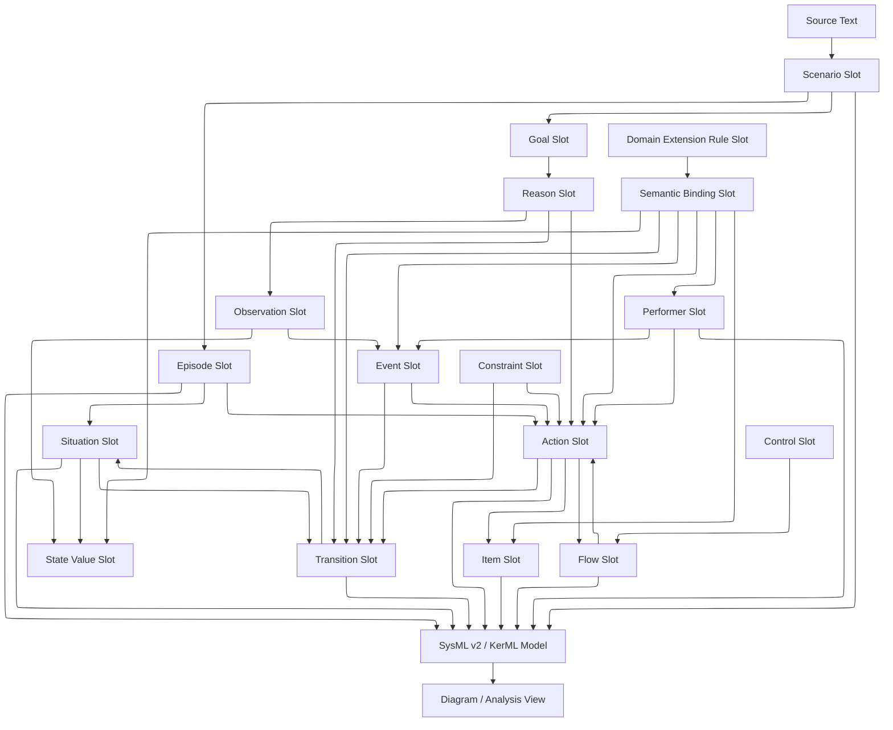
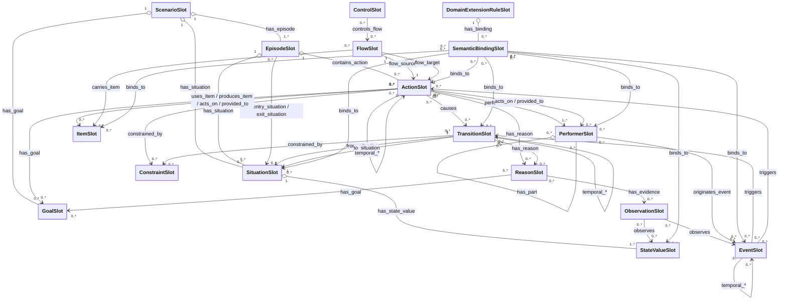

# Text2Activity Extraction Slot Schema

## Purpose

Text2Activity Extraction Slot Schema, abbreviated **T2A-ESS**, is a slot-based intermediate representation for converting natural-language operational concept/scenario text into SysML v2/KerML models and Activity Diagram/EFFBD/State View.

The core direction is as follows.

- The final semantic core is SysML v2/KerML.
- Text2Activity is not an independent upper ontology but an extraction IR and metadata/rule layer for creating SysML v2/KerML elements from natural language.
- `Action`, `Part`, `Item`, `State`, `Transition`, `FlowConnection`, `ConstraintCheck`, `RequirementCheck`, `UseCase`, `Case`, KerML `Occurrence`, and `Performance`, which already exist in SysML v2/KerML, are not redefined.
- Text2Activity slots hold the information needed for natural-language extraction, such as `source_ref`, `confidence_by_llm`, `source text label`, `decomposition candidates`, `evidence_level`, `interpretation_uncertainty`, and `semantic binding`.
- Rather than drawing Activity Diagram/EFFBD directly from Text2Activity slots, where possible first build the SysML v2/KerML model and generate them as views of that model.

Therefore, it is more accurate to view T2A-ESS not as a “Text2Activity Core Ontology” but as a **slot schema for extracting SysML v2/KerML model elements from natural-language scenarios**.

## Overall Processing Layers

The overall processing layers are the reference structure showing which intermediate representations natural-language input passes through to be converted into standard SysML v2/KerML models and views. Each layer has a different responsibility, and the boundaries are set so that there is no confusion about whether a slot is the final semantics, an extraction record, a standard model, or a view.

```text
L0 Source Text
  Source text, sentences, tables, numbered steps

L1 Text2Activity Extraction Slot
  source_ref, confidence_by_llm, label, candidate decomposition, evidence_level, interpretation_uncertainty

L2 SysML v2 / KerML Core Model
  Occurrence, Performance, Action, Part, Item,
  StateAction, StateTransitionAction, TransitionAction,
  FlowConnection, ConstraintCheck, RequirementCheck, UseCase, Case

L3 Text2Activity Rule / Metadata
  natural-language traceability, why/rationale, extraction confidence, semantic binding

L4 Views
  Activity Diagram, EFFBD, State View, Simulation, Verification
```

In this structure, an L1 slot is not the final semantics but an extraction record. The final model semantics are carried by the L2 SysML v2/KerML elements, and L3 preserves the natural-language-based explainability and traceability that are hard to put directly into the standard model.

## Slot Summary

T2A-ESS currently defines a total of **17** slots.

In natural-language document processing, `Scenario Slot` and `Episode Slot` are kept separate, because they can directly receive the representative scenario heading and the section/stage headings inside a scenario, which simplifies extraction, validation, and traceability.

| Group | Slot | Count |
| --- | --- | --- |
| Scope and structure | `Scenario Slot`, `Episode Slot` | 2 |
| World state and change | `Situation Slot`, `State Value Slot`, `Observation Slot`, `Event Slot`, `Transition Slot` | 5 |
| Execution flow | `Performer Slot`, `Action Slot`, `Item Slot`, `Flow Slot`, `Control Slot` | 5 |
| Explanation and rules | `Reason Slot`, `Goal Slot`, `Constraint Slot` | 3 |
| Semantic extension | `Domain Extension Rule Slot`, `Semantic Binding Slot` | 2 |
| **Total** |  | **17** |

These 17 slots sufficiently cover the information units that are easy to extract reliably from text. `Source Text`, sentences, table rows, and numbered steps are managed as L0 input units, and each slot's `source_ref` references them.

## Criteria for Distinguishing Easily Confused Slots

The slots below all describe a dynamic scenario, but their roles differ. The criterion is not “what it expresses” but “what role the extracted information plays in the model”.

| Slot | Discriminating question | Core role | Example |
| --- | --- | --- | --- |
| `Scenario Slot` | Is it the top-level execution scope, mission, or use case of the document/model? | root behavior scope | `MUM-T-based offensive maneuver scenario` |
| `Episode Slot` | Is it a section, stage, or phase that groups actions/transitions within the scenario? | nested behavior scope | `Communication-limited mode transition and response` |
| `Situation Slot` | Is it a bundle of states that is true during a specific time/condition, rather than something that performs a flow? | state snapshot | `Communication-limited state` |
| `State Value Slot` | Is it a single state fact normalized into subject-variable-value? | atomic state assertion | `communication_mode=limited` |
| `Observation Slot` | Who detected, measured, or judged what? | evidence, detection | `TDSS detects packet loss rate exceeding 30%` |
| `Event Slot` | Is it something that actually occurs and triggers a flow or transition? | occurrence, trigger | `Packet loss rate remains above threshold` |
| `Transition Slot` | Does a state or value change from A to B? | from-to change | `Normal communication state -> Limited communication state` |

In summary:

| Category | Meaning |
| --- | --- |
| `Scenario/Episode` | behavior scope and document structure |
| `Situation` | bundle of states true during a specific period |
| `State Value` | state fact at the subject-variable-value level |
| `Observation` | grounds for knowing |
| `Event` | what occurred |
| `Transition` | the change itself |

## Principles for Duplication and Reference Between Slots

A single source-text expression can create several slots at once. In that case, the same value is not copied independently into several slots; the value is placed in the canonical owner slot.

The T2A-ESS result model consists of a list of slot records and a slot relation graph. A slot record holds only the node's attribute values, and relations between slots are stored only in `slot_relations`.

| Information | canonical owner |
| --- | --- |
| actor, performer | `Performer Slot` |
| performed action | `Action Slot` |
| object, message, resource, payload | `Item Slot` |
| state value | `State Value Slot` |
| bundle of state values | `Situation Slot` |
| occurring event | `Event Slot` |
| state change | `Transition Slot` |
| order, transfer, dependency | `Flow Slot` |
| condition, branching, parallelism, repetition | `Control Slot` |
| constraint expression, threshold, deadline | `Constraint Slot` |
| purpose, success criteria | `Goal Slot` |
| reason, grounds, rationale | `Reason Slot` |

For example, the expression `The drone's communication state switches from normal to limited` is decomposed as follows.

```yaml
state_value_slot:
  state_value_id: SV_COMM_NORMAL
  subject_text: Drone
  variable: communication_mode
  value: normal

state_value_slot:
  state_value_id: SV_COMM_LIMITED
  subject_text: Drone
  variable: communication_mode
  value: limited

situation_slot:
  situation_id: SIT_COMM_LIMITED

transition_slot:
  transition_id: TR_NORMAL_TO_LIMITED

slot_relations:
  - relation_id: REL_001
    source_slot_id: SIT_COMM_LIMITED
    relation_type: has_state_value
    target_slot_id: SV_COMM_LIMITED
  - relation_id: REL_002
    source_slot_id: TR_NORMAL_TO_LIMITED
    relation_type: from_situation
    target_slot_id: SIT_COMM_NORMAL
  - relation_id: REL_003
    source_slot_id: TR_NORMAL_TO_LIMITED
    relation_type: to_situation
    target_slot_id: SIT_COMM_LIMITED
```

The duplication-handling principles are as follows.

- The source of a value is placed in the canonical owner slot.
- The source of relations between slots is placed in `slot_relations`.
- Slot records do not contain `*_id` or `*_ids` relation fields pointing to other slots. However, the slot's own primary id, such as `scenario_id` or `action_id`, is kept.
- `*_text` and `*_label` fields are auxiliary attributes for understanding the source text and for extraction evidence; they are not canonical relations. If a `relation_type` expressing the same information exists in the "Slot Relation Contract", the relation must be created, and if the two disagree, the relation takes precedence.
- The same source-text span can be shared by the `source_ref` of multiple slots.
- `confidence_by_llm`, `assumptions`, and `standard_mapping` can differ by slot role, so each slot holds its own.
- If the same value is repeated as strings across several slots, normalize it into the canonical owner and `slot_relations` before export.
- `slot_relations` is used as the common input for validation, SysML v2/KerML export, and Activity Diagram/EFFBD/State View generation.
- If needed, relations can be attached to slot records and shown in the user interface or export stage, but that is a derived view, not canonical data.

## Slot Big Picture

The diagram below shows how Text2Activity slots converge into a SysML v2/KerML model.



The key points are as follows.

- `Scenario/Episode` preserves the document structure as is, but converges into the behavior scope family in SysML v2/KerML export.
- `Action/Performer/Item/Flow/Control` converges into the SysML v2 action model.
- `Situation/StateValue/Event/Transition` converges into the SysML v2 state model and KerML occurrence semantics.
- `Reason/Goal/Constraint` converges into requirement, objective, constraint, and metadata.
- `Domain Extension Rule/Semantic Binding` is a domain semantic extension attached on top of the standard model.

### Slot Class Multiplicity



The edge labels in the diagram are **the same strings** as the `slot_relations.relation_type` values. Every edge in the diagram is in the relation_type enumeration, and every relation in the enumeration is in the diagram. The definition, allowed source/target, and multiplicity of each relation are defined normatively by the next section, "Slot Relation Contract".

## Slot Relation Contract

These are the `relation_type` values that can be used in `slot_relations` and the allowed source/target slot types. This table is the input to the validator (`RELATION_ENDPOINT_TYPE`, `UNKNOWN_RELATION_TYPE`), and any (relation_type, source type, target type) combination not in the table is an error.

### Scope and Structure

| relation_type | source → target | Meaning | Notes |
| --- | --- | --- | --- |
| `has_episode` | Scenario → Episode | Scenario contains episode | Document heading structure |
| `contains_action` | Episode → Action | Episode contains action | Every action belongs to exactly one episode. Basis for EFFBD nesting |
| `has_situation` | Scenario \| Episode → Situation | Owns the state bundle that is true during that scope | A Situation can be owned by both a Scenario and an Episode |
| `entry_situation` / `exit_situation` | Episode → Situation | Boundary state at the start/end of the episode | Separate from `has_situation`. Only when distinguishing boundaries |
| `has_part` | Performer → Performer | Parent/child performer | Part nesting |

### Action Axis

| relation_type | source → target | Meaning | Notes |
| --- | --- | --- | --- |
| `performed_by` | Action → Performer | Performer | At least 1 for every action (warning if missing) |
| `acts_on` | Action → Item \| Performer | Target of the action | Absorbs the former `action_target` |
| `provided_to` | Action → Performer \| Item | Recipient of the output | |
| `uses_item` | Action → Item | Used as input | |
| `produces_item` | Action → Item | Produced as output | |
| `flow_source` / `flow_target` | Flow → Action | Both ends of the flow | 1 each per Flow |
| `carries_item` | Flow → Item | Item carried by the object flow | |
| `controls_flow` | Control → Flow | Applies guard/branch/parallel/loop structure to the flow | |
| `temporal_before` / `temporal_after` / `temporal_during` / `temporal_while` / `temporal_overlaps` / `temporal_starts_with` / `temporal_ends_with` | Action \| Transition \| Event → Action \| Transition \| Event | Temporal relation (either end can be anything that is a KerML `Occurrence`; different kinds are also allowed) | KerML `HappensBefore/During/While`. The EFFBD converter reads only Action → Action `temporal_before` |

### State Axis

| relation_type | source → target | Meaning | Notes |
| --- | --- | --- | --- |
| `has_state_value` | Situation → State Value | Composition of the state bundle | At least 1 per Situation |
| `from_situation` / `to_situation` | Transition → Situation | Both ends of the transition | Exactly 1 each per Transition |
| `observes` | Observation → Event \| State Value | Event/state value confirmed by the observation | At least 1 per Observation |
| `triggers` | Event → Transition \| Action | Event triggers a transition or starts an action | Action target is for "when ~ / upon ~, respond immediately" expressions |
| `causes_event` | Event → Event | Event causation | |
| `originates_event` | Performer → Event | Agent that originated the event | Requests, commands, etc. from an external actor |
| `causes` | Action → Transition | Action causes a state transition | The "connect" in the atomic action splitting criterion "If a state change is clear, separate the action and the transition and connect them" |

### Explanation and Rules

| relation_type | source → target | Meaning | Notes |
| --- | --- | --- | --- |
| `constrained_by` | Action \| Transition → Constraint | Applies constraint | Absorbs the former diagram's `guards` (reverse direction) |
| `has_goal` | Scenario \| Action \| Reason → Goal | Goal/purpose | Reason → Goal is the former `hasPurpose` |
| `has_reason` | Action \| Transition → Reason | Reason/grounds/rationale | |
| `has_evidence` | Reason → Observation | Observation supporting the reason | **The only canonical path connecting Action and Observation** (rules below) |

### Semantic Extension

| relation_type | source → target | Meaning |
| --- | --- | --- |
| `has_binding` | Domain Extension Rule → Semantic Binding | Rule contains binding |
| `binds_to` | Semantic Binding → Action \| Performer \| Item \| Event \| State Value \| Situation \| Transition | Slot the binding points to (any slot to which a domain concept can attach) |

### `custom`

| relation_type | source → target | Meaning |
| --- | --- | --- |
| `custom` | any → any | Meaning not in the list above. `custom_relation_type` (string) required |

`custom` is used only for meanings that cannot be expressed by the contract above. If the same meaning ends up being written with `custom` more than once, the principle is to promote that meaning into this contract, and different names are not created per scenario. The validator reports `custom` without `custom_relation_type` as an error, and an unregistered `custom_relation_type` as a warning. There are currently no registered `custom_relation_type` values.

### Relation Rules

- **Observation is the boundary slot between the action axis and the state axis**. Whenever there is a detection/measurement/judgment expression, always create an Observation and connect it with `observes` to the confirmed Event/State Value. If that detection is a step in the execution flow (connected by flow to preceding/following actions), also create an Action from the same source text. No direct relation is placed between the two slots; their pairing is revealed by the same `source_ref`.
- **That an Action was based on an Observation** is written only as `Action —has_reason→ Reason —has_evidence→ Observation`. If the source text does not state a reason, create the Reason with `reason_type: [evidence]`, `rationale_text: null`, and set the `evidence_level` of both relations to `inferred`. If the source text has no dependency cue, do not connect them.
- **Immediate response to an event** ("when ~", "upon ~", "immediately ~") is `Event —triggers→ Action`. If diagram structure (accept/guard) is needed, `Control(control_type: accept)` + `controls_flow` may be placed **additionally**, and in that case the Control's `guard_texts` quotes the Event's `label`.
- **`*_text` fields are auxiliary**. Writing information that has a canonical relation (`entry_situation_text`, `exit_situation_text`, `context.causes_transition_text`, `why.reason_texts`, `evidence.observation_texts`) only in `*_text` and omitting the relation is a validator warning, and if the two disagree, the relation takes precedence. `detected_by_action_text`, `occurs_in_situation_text`, and `because_of.*_texts` are purely auxiliary fields with no corresponding canonical relation (there is no direct Action↔Observation relation, and Event→Action has only `triggers`).
- The slot type is determined by the collection the slot belongs to (`actions`, `situations`, …). If the same id appears in two collections, it is an error.

## SysML v2/KerML Conformance Criteria

The core SysML standard elements are as follows.

- KerML: `Occurrence`, `Performance`, `Object`, `HappensBefore`, `HappensDuring`, `HappensWhile`, `Clock`, `TimeOf`, `DurationOf`
- SysML v2: `Action`, `Part`, `Item`, `StateAction`, `StateTransitionAction`, `TransitionAction`, `FlowConnection`, `SuccessionFlowConnection`, `MessageConnection`, `ConstraintCheck`, `RequirementCheck`, `Case`, `UseCase`, `Allocation`

The principles of Text2Activity are as follows.

- Meanings that already exist in the standard are exported as standard elements.
- A slot is an extraction record for creating standard elements.
- Every slot has a `standard_mapping` where possible.
- Natural-language explanatory information not directly in the standard is attached as `metadata`, `doc/comment`, requirement rationale, concern, or rule annotation.
- Separate definition/usage. For example, `SDVVehicle` becomes a `part def`, and the scenario's `P3 SDV vehicle` becomes a `part p3_sdv : SDVVehicle` usage candidate.

The preferred mapping between slots and standard elements is as follows.

Note that the table below does not determine slot identity; it organizes export candidates. `Scenario Slot`, `Episode Slot`, and `Situation Slot` can all look like the `Action`/`Performance` family in SysML v2/KerML, but in T2A-ESS their extraction roles differ. First determine the slot role, then select the `standard_mapping`.

In particular, `Scenario/Episode/Situation/State Value` are distinguished along the following axes.

| Slot | Discriminating axis | Information held | Information not held |
| --- | --- | --- | --- |
| `Scenario Slot` | Is it the root of the whole scenario? | Top-level purpose, success criteria, initial/final situation references, episode order | Internal phases themselves, individual state values |
| `Episode Slot` | Is it a named sub-scope within the scenario? | Action/transition grouping, order_index, entry/exit situation references | State snapshots themselves, atomic attribute values |
| `Situation Slot` | Is it a state that is true for a certain time/condition? | State value bundle, enabled/disabled actions, from/to target of transitions | Execution order, mission purpose, document structure |
| `State Value Slot` | Is it a single subject-variable-value fact? | Attribute name, value, unit, comparison operator, valid time of the value | State bundles, transitions, behavior scope |

| Text2Activity Slot | Preferred SysML v2/KerML counterpart | Interpretation |
| --- | --- | --- |
| `Scenario Slot` | `UseCase`, `Case`, root `Action`, KerML `Performance` | Top-level behavior scope enclosing the whole scenario |
| `Episode Slot` | nested `Action`, `subUseCase`, `subperformance` | Sub-behavior scope grouping actions/transitions inside the scenario |
| `Situation Slot` | `StateAction`, state usage | State snapshot true during a specific time/condition |
| `State Value Slot` | `attribute`, feature value, constraint parameter | Atomic state assertion composing a situation |
| `Observation Slot` | KerML Observation, `Action`, `Evaluation`, metadata | Detection/measurement/judgment or its grounds |
| `Event Slot` | KerML `Occurrence`, trigger, message/accept event | Occurrence that triggers a transition |
| `Transition Slot` | `StateTransitionAction`, `TransitionAction` | Transition in the state or action model |
| `Performer Slot` | `Part`, `Item`, `Performance.performers`, `Allocation` | Performer |
| `Action Slot` | `Action`, KerML `Performance` | Behavior that is performed |
| `Item Slot` | `Item`, payload, input/output item | Object/value that flows or is used |
| `Flow Slot` | `succession`, `FlowConnection`, `SuccessionFlowConnection`, `MessageConnection` | control/object/message flow |
| `Control Slot` | `DecisionAction`, `MergeAction`, `ForkAction`, `JoinAction`, `IfThenAction`, `LoopAction` | Condition, parallelism, repetition |
| `Constraint Slot` | `ConstraintCheck` | boolean constraint/evaluation |
| `Goal Slot` | `RequirementCheck`, `Case.objective`, `UseCase.objective` | Purpose to be achieved or success criteria |
| `Reason Slot` | metadata, `doc/comment`, Requirement/Concern | why, rationale, evidence |
| `Domain Extension Rule Slot` | imported package/library, metadata definition | Domain-specific vocabulary |
| `Semantic Binding Slot` | metadata, annotation, specialization/import mapping | Connects slots to standard/domain concepts |

## Output Modes

T2A-ESS JSON is generated in `compact_canonical` mode by default. This mode is the default output that reduces the size and inference surface of LLM output and increases downstream conversion stability.

The `compact_canonical` mode principles are as follows.

- Empty slot arrays are omitted.
- Slot records contain only node attributes.
- Relations are placed only in `slot_relations`.
- Ordinary relations contain only `evidence_level`.
- Detailed `evidence.reason` is not generated by default.
- `source_text` is included only when needed for disambiguation.
- `interpretation_uncertainty` is included only when an actual interpretation choice is needed.
- Inference-based temporal relations such as `temporal_before` and control-flow `Flow Slot`s are included only when explicitly requested.

`audit_trace` mode is used when explicitly requested for review, debugging, validation, or explainable traceability.

In `audit_trace` mode, the following can be added.

- Empty arrays
- Detailed `source_ref` or `source_refs`
- Detailed `evidence.reason`
- List of candidate interpretations
- Low-confidence or inferred relation candidates
- `validation_issues`, repair hints

## Common Slot Fields

Every slot has the following common fields where possible. However, the default `compact_canonical` output includes only the necessary fields.

```yaml
common_slot_fields:
  slot_id: string
  slot_type: string
  label: string
  source_ref:
    document: string
    source_unit_id: string | null
    heading: string | null
    step_no: string | null
    sentence_id: string | null
    paragraph_id: string | null
    table_id: string | null
    row_id: string | null
    column_name: string | null
    char_start: integer | null
    char_end: integer | null
    text: string
  temporal:
    text: string | null
    anchor:
      text: string | null
      relation: before | after | during | while | at | until | since | overlaps | starts_with | ends_with | null
    absolute:
      start: datetime | null
      end: datetime | null
      timezone: string | null
    relative:
      offset_value: number | null
      offset_unit: second | minute | hour | day | null
      direction: before | after | null
    duration:
      value: number | null
      unit: second | minute | hour | day | null
      comparator: eq | lt | lte | gt | gte | range | null
    deadline:
      value: datetime | string | null
      text: string | null
    periodicity:
      every_value: number | null
      every_unit: second | minute | hour | day | null
      calendar_rule: string | null
      until_condition: string | null
    uncertainty:
      qualifier: exact | about | range | probabilistic | unknown
      confidence: 0.0
  confidence_by_llm: 0.0
  assumptions: []
  evidence_level: explicit | inferred | contextually_resolved | explicit_with_contextual_normalization | derived | assumed | null
  evidence:
    source_text: string | null
    reason: string | null
  interpretation_uncertainty:
    uncertainty_type: string | null
    uncertain_text: string | null
    selected_interpretation: string | null
    requires_human_review: boolean
    candidates: []
  standard_mapping:
    kerml_base: Occurrence | Performance | Object | null
    sysml_element: Action | Part | Item | StateAction | StateTransitionAction | FlowConnection | ConstraintCheck | RequirementCheck | UseCase | Case | null
    export_as: definition | usage | metadata | view_only
    definition_id: string | null
    usage_id: string | null
    confidence: 0.0
```

`source_ref` is the key to source-text traceability, and `standard_mapping` is the key to SysML v2/KerML convergence. However, in `compact_canonical` mode, `source_units` and slot/relation ID consistency take priority, and repetitive per-slot `source_refs` are not enforced.

`confidence_by_llm` is the LLM's self-assessed confidence, not a calibrated probability. It is used for review priority and as a repair signal.

Detailed `evidence.reason` and `interpretation_uncertainty.candidates` are not default output fields but optional fields for `audit_trace` or for cases where interpretation uncertainty actually matters.

## Target Intermediate Representation

The top-level output is not `ActivityModel` but, more precisely, `text2activity_extraction_model`.

```yaml
text2activity_extraction_model:
  model_id: string
  title: string
  target_standard:
    - KerML
    - SysML v2
  source_documents: []
  source_units:
    - source_unit_id: string
      document: string
      unit_type: heading | paragraph | sentence | table | table_row | numbered_step
      parent_unit_id: string | null
      heading_path: []
      step_no: string | null
      table_id: string | null
      row_id: string | null
      column_name: string | null
      text: string
  scenarios: []
  episodes: []
  situations: []
  state_values: []
  observations: []
  events: []
  transitions: []
  performers: []
  actions: []
  items: []
  flows: []
  controls: []
  constraints: []
  goals: []
  reasons: []
  domain_extension_rules: []
  semantic_bindings: []
  slot_relations:
    - relation_id: string
      source_slot_id: string
      relation_type: has_episode | contains_action | has_situation | entry_situation | exit_situation | has_part | performed_by | acts_on | provided_to | uses_item | produces_item | flow_source | flow_target | carries_item | controls_flow | temporal_before | temporal_after | temporal_during | temporal_while | temporal_overlaps | temporal_starts_with | temporal_ends_with | has_state_value | from_situation | to_situation | observes | triggers | causes_event | originates_event | causes | constrained_by | has_goal | has_reason | has_evidence | has_binding | binds_to | custom
      custom_relation_type: string | null   # required when relation_type is custom
      target_slot_id: string
      confidence_by_llm: 0.0
      evidence_level: explicit | inferred | contextually_resolved | explicit_with_contextual_normalization | derived | assumed | null
      evidence:
        source_text: string | null
        reason: string | null
      interpretation_uncertainty:
        uncertainty_type: string | null
        uncertain_text: string | null
        selected_interpretation: string | null
        requires_human_review: boolean
      source_ref: {}
  validation_issues:
    - issue_id: string
      issue_type: temporal_conflict | dangling_flow | missing_performer | missing_source_ref | missing_guard | mapping_gap
      severity: info | warning | error
      related_slot_ids: []
      message: string
  generated_sysml:
    packages: []
    definitions: []
    usages: []
  generated_views:
    activity_diagrams: []
    effbd_views: []
    state_views: []
  assumptions: []
```

## Scenario Slot

`Scenario Slot` represents the representative scenario or root behavior of a natural-language document.

It is kept as a separate slot in the extraction stage, because the representative scenario title, overall purpose, initial/final situation, and success criteria usually apply at the scenario level.

`Scenario Slot` is not a state itself but the overall behavior scope. `initial_situation_text` and `final_situation_text` are source-text cues pointing to `Situation Slot` candidates, and state values are owned by the `State Value Slot`.

In SysML v2/KerML export, it becomes a `UseCase`, `Case`, root `Action`, or KerML `Performance` candidate.

```yaml
scenario_slot:
  scenario_id: SDV_SCN_1
  label: Commute scenario
  temporal_scope:
    start: null
    end: null
    text: From mobility service request to destination arrival, settlement, and standby after automatic charging
  initial_situation_text: Service not requested state
  final_situation_text: Standby after automatic charging state
  success_criteria:
    - The user arrives at the destination.
    - Settlement is completed.
    - The vehicle enters the standby state for the next dispatch.
  standard_mapping:
    kerml_base: Performance
    sysml_element: UseCase | Case | Action
    export_as: usage
    definition_id: CommuteScenario
    usage_id: commuteScenario
    confidence: 0.86
  source_ref:
    heading: "SCN-1. Commute scenario"
```

## Episode Slot

`Episode Slot` represents a section, stage, phase, or step group inside a scenario.

It is kept as a separate slot in the extraction stage, because the document's `###` headings, numbered step groups, entry/exit situations, and the action list of that segment usually apply at the episode level.

`Episode Slot` is a sub-behavior scope. Even if the label contains `state`, `mode`, or `transition`, if that expression is a heading that groups several actions/transitions, treat it as an episode. Conditions that are true during that stage in the same source text are created as a separate `Situation Slot` and attached to the episode with the `has_situation` relation. If boundary states at the start/end need to be distinguished, use the `entry_situation`/`exit_situation` relations. The `entry_situation_text`/`exit_situation_text` in the example below are auxiliary fields for understanding the source text; the canonical form is the relation.

Episode is the only slot that owns both the Actions (`contains_action`) and Situations (`has_situation`) of that segment. Every Action must belong to exactly one Episode, and if even one is missing, the EFFBD nested conversion falls back to flat.

In SysML v2/KerML export, it becomes a nested `Action`, `subUseCase`, or `subperformance` candidate.

```yaml
episode_slot:
  episode_id: SDV_SCN1_EP_PICKUP
  label: User call and pickup travel
  episode_kind: normal
  order_index: 1
  temporal_scope:
    start: null
    end: null
    starts_when: The user requests the mobility service
    ends_when: The vehicle arrives at the boarding location
    text: From mobility service request to arrival at the pickup location
  entry_situation_text: Service not requested state
  exit_situation_text: Vehicle arrived at boarding location state
  standard_mapping:
    kerml_base: Performance
    sysml_element: Action | UseCase
    export_as: usage
    definition_id: CommutePickupEpisode
    usage_id: pickupEpisode
    confidence: 0.86
  source_ref:
    heading: "User call and pickup travel"
```

The recommended `episode_kind` values are as follows.

| episode_kind | Meaning | SysML v2/KerML candidate |
| --- | --- | --- |
| `normal` | Normal-flow stage | nested `Action`, `subUseCase` |
| `phase` | Time/operational phase | nested `Action`, state-related action |
| `step_group` | Numbered step group | nested `Action` |
| `alternative` | Alternative flow | branch action or conditional scope |
| `exception` | Exception flow | guarded branch or failure handling scope |

## Situation Slot

`Situation Slot` is a bundle of world states that hold at a specific time/condition.

`Situation Slot` is not an execution procedure but a state snapshot that can be judged true/false. If `Episode Slot` groups "what is done in that segment", `Situation Slot` groups "what state the world is in during that segment".

In SysML v2 export, it is converted to a `StateAction` or state usage when a state model is needed. In a simple activity view, it can be preserved as metadata or a note.

```yaml
situation_slot:
  situation_id: MUMT_SIT_COMM_LIMITED
  label: Communication-limited state
  situation_type:
    - operational_state
    - communication_state
  valid_time:
    start: null
    end: null
    text: While the packet loss rate remains above the threshold
  state_value_texts:
    - Communication state=limited
  enabled_action_labels:
    - Send summarized track data
  disabled_action_labels:
    - Send video stream
  standard_mapping:
    kerml_base: Performance
    sysml_element: StateAction
    export_as: usage
    usage_id: limitedCommunicationState
    confidence: 0.83
  source_ref:
    text: Initiates the transition from normal to limited mode.
```

## State Value Slot

`State Value Slot` is an individual state value that composes a situation.

`State Value Slot` is not an independent scope or stage but an atomic fact normalized into `subject_text`, `variable`, `value`, `unit`, and `polarity`. Several state values together form one `Situation Slot`.

In SysML v2 export, it is converted to an attribute, feature value, or constraint parameter.

```yaml
state_value_slot:
  state_value_id: MUMT_STATE_COMM_MODE_LIMITED
  label: Communication state is limited
  subject_text: MUM-T system
  variable: Communication state
  value:
    raw: Limited
    normalized: limited
    value_type: enum
  object: null
  unit: null
  polarity: positive
  valid_time:
    text: During the limited communication state
  observation_texts:
    - Detection of packet loss rate exceeding threshold
  standard_mapping:
    kerml_base: Object
    sysml_element: attribute
    export_as: usage
    usage_id: communicationMode
    confidence: 0.82
  source_ref:
    text: Initiates the transition from normal to limited mode.
```

The recommended `value_type` values are as follows.

| value_type | Example |
| --- | --- |
| `enum` | Communication state=limited, operation mode=Level 3 |
| `boolean` | Authentication success=true, pedestrian absent=true |
| `quantity` | Battery SoC=15%, speed=5km/h |
| `relation` | A owns B, P3 replaces P5 |
| `location` | Vehicle location=pick-up/drop-off zone |
| `capability` | Drone surveillance available=false |
| `probability` | Collision risk=0.7 |
| `distribution` | Arrival time probability distribution |
| `textual` | State description that must be preserved as in the source text |

## Event Slot

`Event Slot` is an occurrence that triggers a transition or starts an action flow.

From the KerML perspective, it can be viewed as an `Occurrence`, and in SysML v2 it is connected to a trigger, message/accept event, or event-detection action.

An Event has four kinds of relations. If it triggers a transition, `triggers` (→ Transition); if it immediately starts an action, `triggers` (→ Action); if it causes another event, `causes_event` (→ Event); and if there is an agent that originated the event, `originates_event` (Performer → Event). Who detected the event is handled not by the Event but by the `observes` of the `Observation Slot`. The `observed_by_text` and `detected_by_action_text` in the example below are auxiliary fields.

```yaml
event_slot:
  event_id: NGHE_EVT_FOG_OCCURRED
  label: Dense fog occurs
  event_type: environment
  trigger_type: external
  observed_by_text:
    - AI_ICP
  detected_by_action_text: Fog detection
  event_time:
    text: About 48 hours after the start of construction
  effect_labels:
    - Sensor reliability degradation
  standard_mapping:
    kerml_base: Occurrence
    sysml_element: trigger
    export_as: usage
    usage_id: fogOccurred
    confidence: 0.78
  source_ref:
    step_no: 1
    text: Dense fog occurs about 48 hours after the start of construction.
```

## Transition Slot

`Transition Slot` is a change between situations.

In state model export, it is converted to a `StateTransitionAction`; in action model export, to a `TransitionAction` or guarded `succession`.

```yaml
transition_slot:
  transition_id: MUMT_TR_NORMAL_TO_LIMITED
  label: Transition from normal communication to limited communication
  from_situation_text: Normal communication state
  to_situation_text: Limited communication state
  change_kind:
    - mode_change
    - information_change
  trigger_text: Packet loss rate remains above threshold
  caused_by_action_text: Initiate limited mode transition
  guard:
    text: The packet loss rate remains above the threshold
    expression: packet_loss_rate > threshold and duration >= configured_duration
  temporal:
    relation_to_previous: after
    text: After the packet loss rate has remained above the threshold
  effects:
    - variable: Communication state
      from: Normal
      to: Limited
  standard_mapping:
    kerml_base: Performance
    sysml_element: StateTransitionAction
    export_as: usage
    usage_id: normalToLimitedTransition
    confidence: 0.88
  source_ref:
    text: Initiates the transition to limited mode.
```

The recommended `change_kind` values are as follows.

| change_kind | Meaning | Example |
| --- | --- | --- |
| `creation` | A new entity/state comes into existence | Report generation, notification generation |
| `termination` | An entity/state ends | Meeting ends, heavy rain ends |
| `state_update` | An attribute value changes | Communication state normal -> limited |
| `quantity_change` | A quantity increases/decreases | Temperature rise, battery decrease |
| `location_change` | Location changes | Vehicle moves to charging station |
| `relation_change` | A relation is created or removed | Delegation of authority, transfer of ownership |
| `mode_change` | Operation mode changes | Level 4 -> Level 3 |
| `capability_change` | Capability/availability changes | Loss of one drone |
| `information_change` | Knowledge/situational awareness changes | Threat confirmed |
| `risk_change` | Risk/probability/reliability changes | Collision risk increases |
| `constraint_change` | The applicable constraint changes | Speed limit lifted |
| `continuous_change` | A continuous-time state changes | Temperature rise, fluid flow |
| `no_change` | State is maintained | Survivability functions maintained |

## Action Slot

`Action Slot` is an atomic action candidate performed by a single performer.

In SysML v2 export, it becomes an `action` usage, and in KerML semantics it is a `Performance`.

```yaml
action_slot:
  action_id: SDV_SCN1_PICKUP_A005
  label: Send dispatch command
  primary_actor_text: Cloud server
  verb: send
  object: Dispatch command
  target_text: SDV vehicle
  input_texts: []
  output_texts:
    - Dispatch command
  temporal:
    order_hint: before_next
    text: After request validation
  context:
    occurs_in_situation_text: Service request received state
    causes_transition_text: Transition to dispatch command sent state
  why:
    reason_texts:
      - To send the vehicle to the boarding location
  standard_mapping:
    kerml_base: Performance
    sysml_element: Action
    export_as: usage
    definition_id: SendDispatchCommand
    usage_id: sendDispatchCommand
    confidence: 0.91
  source_ref:
    text: The cloud server sends the dispatch command to the assigned SDV vehicle via MQTT.
```

The atomic action splitting criteria are as follows.

- If the performer changes, split the action.
- If there are two or more verbs, split into action candidates.
- If the input/output items differ, split the action.
- If a state change is clear, separate the action and the transition and connect them with the `causes` relation (Action → Transition). The `context.causes_transition_text`, `context.occurs_in_situation_text`, and `why.reason_texts` in the example above are auxiliary fields; the canonical forms are, respectively, the `causes` relation, the episode's `has_situation` relation, and the `has_reason` relation.
- “Receive and process” is split into a receive action and a process action.
- If “validate” has several targets, it can be split into per-target validation actions.

## Performer Slot

`Performer Slot` is a person, organization, system, software, vehicle, equipment, or team that performs actions.

The containment relation between an aggregate performer and its sub-performers is expressed with `slot_relations`. The `Performer Slot` contains only the performer's own attributes and its role in the part structure. For example, `Unmanned equipment fleet` is an aggregate performer, and `Unmanned excavator` and `Unmanned dump truck` become component performers.

If an internal software/hardware component is the performer of an action, do not create a separate `Component Slot`; reuse the `Performer Slot`. For example, `Drone No. 1's Edge AI` is treated as a performer with `performer_kind: software_component` and `performer_scope: internal`. The containment relation between the parent performer and the internal performer is expressed with the `has_part` relation.

In SysML v2 export, it is converted preferentially to a `Part` usage. An internal performer becomes a candidate nested `part` usage inside the parent `part def` or usage.

```yaml
performer_slot:
  performer_id: P3
  label: SDV vehicle
  performer_type: vehicle_system
  performer_kind: individual
  part_structure:
    role: standalone
    member_cardinality: null
    sysml_export_pattern: standalone_part_usage
    kerml_export_pattern: object_usage
  aliases:
    - Autonomous vehicle
  standard_mapping:
    kerml_base: Object
    sysml_element: Part
    export_as: usage
    definition_id: SDVVehicle
    usage_id: p3_sdv
    confidence: 0.9
```

An aggregate performer example is as follows.

```yaml
performer_slot:
  performer_id: P7
  label: Unmanned equipment fleet
  performer_type: equipment_fleet
  performer_kind: aggregate
  part_structure:
    role: whole
    member_cardinality:
      total_count: 19
      text: 19 unmanned equipment units
    sysml_export_pattern: containing_part_usage
    kerml_export_pattern: composite_feature_owner
  standard_mapping:
    kerml_base: Object
    sysml_element: Part
    export_as: usage
    definition_id: UnmannedEquipmentFleet
    usage_id: p7_equipment_fleet
    confidence: 0.88
```

A sub-performer example is as follows.

```yaml
performer_slot:
  performer_id: P7-1
  label: Unmanned excavator
  performer_type: unmanned_excavator
  performer_kind: component
  part_structure:
    role: part
    member_cardinality: null
    sysml_export_pattern: nested_part_usage
    kerml_export_pattern: composite_feature
  standard_mapping:
    kerml_base: Object
    sysml_element: Part
    export_as: usage
    definition_id: UnmannedExcavator
    usage_id: p7_1_unmanned_excavator
    confidence: 0.88
```

The recommended `performer_kind` and `part_structure.role` values are as follows. `part_structure` is Text2Activity extraction metadata and does not define a new SysML v2/KerML relation. The containment relation is stored in `slot_relations`, and is converted to a nested `part` usage in SysML v2 export and to a `composite feature` or a feature with `Feature.isComposite=true` in KerML export.

| Field | Value | Meaning |
| --- | --- | --- |
| `performer_kind` | `individual` | Single performer |
| `performer_kind` | `aggregate` | Aggregate performer containing several sub-performers |
| `performer_kind` | `component` | Component performer contained in a parent performer |
| `part_structure.role` | `standalone` | No containment relation |
| `part_structure.role` | `whole` | Parent performer containing sub-performers |
| `part_structure.role` | `part` | Sub-performer contained in a parent performer |

## Item Slot

`Item Slot` is an object/value/resource/message that flows between actions or is used by an action.

In SysML v2 export, it is converted to an `Item` usage, input/output item, or payload.

```yaml
item_slot:
  item_id: dispatch_command
  label: Dispatch command
  item_type: message
  payload:
    - Boarding location coordinates
    - Route information
  producer_action_text: Send dispatch command
  consumer_action_texts:
    - Receive dispatch command
  standard_mapping:
    kerml_base: Object
    sysml_element: Item
    export_as: usage
    definition_id: DispatchCommand
    usage_id: dispatchCommand
    confidence: 0.92
```

## Flow Slot

`Flow Slot` represents execution order, object flow, and message flow between actions.

In SysML v2 export, it is converted to `succession`, `FlowConnection`, `SuccessionFlowConnection`, or `MessageConnection`.

```yaml
flow_slot:
  flow_id: SDV_PICKUP_F001
  source_action_text: Send dispatch command
  target_action_text: Receive dispatch command
  flow_type: object
  item_text: Dispatch command
  guard:
    expression: null
    text: null
  temporal_relation: after
  standard_mapping:
    kerml_base: Occurrence
    sysml_element: FlowConnection
    export_as: usage
    usage_id: dispatchCommandFlow
    confidence: 0.88
  source_ref:
    reason: Numbered step order and shared dispatch command item
```

The main `flow_type` values are as follows.

| flow_type | Meaning | SysML v2 candidate |
| --- | --- | --- |
| `control` | Ordinary sequential flow | `succession` |
| `object` | Output becomes the input of the next action | `FlowConnection` |
| `message` | Message transfer between performers | `MessageConnection` |
| `guarded` | Conditional branch | `TransitionAction`, guarded `succession` |
| `loopback` | Repetition | `LoopAction`, back succession |
| `fork` | Parallel start | `ForkAction` |
| `join` | Parallel end | `JoinAction` |

## Control Slot

`Control Slot` is a control structure that is not an explicit action in the natural language but is needed in the diagram/model.

```yaml
control_slot:
  control_id: NGHE_CAL_FORK
  control_type: fork
  label: Start parallel calibration of equipment fleet
  related_action_texts: []
  related_flow_texts: []
  guard:
    expression: null
    text: null
  branch_conditions: []
  join_condition:
    expression: null
    text: null
    required_inputs: all | any | count | expression | null
  repeat_pattern:
    kind: none | while | until | for_each | periodic | bounded_count
    period: null
    until_condition: null
    max_count: null
  temporal:
    relation_to_parent: during | before | after | null
    text: null
  standard_mapping:
    kerml_base: Performance
    sysml_element: ForkAction
    export_as: usage
    usage_id: calibrationFork
    confidence: 0.8
```

The recommended `control_type` values are `decision`, `merge`, `fork`, `join`, `fork_join`, `loop`, `initial`, `final`, `wait`, `accept`, `timeout`, and `temporal_exclusion`.

`Control Slot` is not a slot that creates new actions but a structural slot that determines how actions/flows are executed. The following expressions must be preserved as `Control Slot`s to be converted stably into Activity Diagram/EFFBD and the SysML action model.

| Natural-language expression | control_type | Key fields |
| --- | --- | --- |
| simultaneously, in parallel | `fork`, `fork_join` | `related_action_texts`, `join_condition` |
| when all are completed | `join` | `join_condition.required_inputs=all` |
| every 5 seconds, periodically | `loop` | `repeat_pattern.kind=periodic` |
| repeat until ~ | `loop` | `repeat_pattern.kind=until` |
| branch when condition is satisfied | `decision` | `branch_conditions`, `guard` |
| heartbeat timeout | `timeout` | `guard`, `repeat_pattern`, related `Constraint Slot` |
| B prohibited during A | `temporal_exclusion` | related `Constraint Slot`, `temporal` |

## Constraint Slot

`Constraint Slot` is a constraint such as a time, performance, quantity, or safety threshold.

In SysML v2 export, it becomes a `constraint` usage or `ConstraintCheck`.

```yaml
constraint_slot:
  constraint_id: NGHE_CONS_SPEED_FOG
  label: Equipment travel speed limit in fog
  constraint_kind:
    - quantitative_limit
  parameter: Equipment travel speed
  operator: <=
  value: 5
  unit: km/h
  expression:
    text: Equipment travel speed <= 5 km/h
    normalized: speed <= 5[km/h]
  temporal_scope:
    text: During fog-response Level 3 operation
    valid_during_text: Fog-response Level 3 operation state
    deadline: null
    duration: null
    periodicity: null
  count_condition: null
  applies_to_texts:
    - Fog-response Level 3 operation state
  violation_effect:
    transition_text: null
    action_text: null
    severity: warning
  standard_mapping:
    kerml_base: Performance
    sysml_element: ConstraintCheck
    export_as: usage
    usage_id: fogSpeedConstraint
    confidence: 0.9
  source_ref:
    text: Equipment travel speed is limited to 5km/h or less, and
```

The recommended `constraint_kind` values are as follows.

| constraint_kind | Meaning | Example |
| --- | --- | --- |
| `quantitative_limit` | Upper or lower bound on quantity/performance | speed <= 5km/h |
| `deadline` | Completion within a specific time | Report within 30 seconds |
| `duration_limit` | Duration condition | If it lasts 30 seconds or more |
| `periodicity` | Periodicity condition | Report every 5 seconds |
| `count_condition` | Count condition | heartbeat lost 3 times in a row |
| `guard_condition` | Transition/branch condition | On validation success |
| `temporal_exclusion` | No temporal overlap | No OTA update during backup |
| `safety_rule` | Safety rule | keep-out zone doubled |
| `resource_limit` | Resource constraint | Fewer than 2 pieces of equipment leaving simultaneously |

## Goal Slot

`Goal Slot` is the purpose state that a scenario/scope/action/transition aims to achieve.

In SysML v2 export, it becomes a `RequirementCheck`, `Case.objective`, or `UseCase.objective` candidate.

```yaml
goal_slot:
  goal_id: SDV_GOAL_ARRIVE_ON_TIME
  label: Get the user to the destination by the desired arrival time
  goal_type: mission
  desired_situation_text: User arrived at destination state
  target_time:
    text: User's desired arrival time
    deadline_ref: desired_arrival_time
  success_criteria:
    - parameter: Arrival time
      operator: <=
      reference: User's desired arrival time
  applies_to_texts:
    - Commute scenario
  standard_mapping:
    kerml_base: Performance
    sysml_element: RequirementCheck
    export_as: usage
    usage_id: arriveOnTimeRequirement
    confidence: 0.84
```

## Reason Slot

`Reason Slot` explains why an action, transition, decision, or constraint is needed.

Reason does not replace the SysML v2/KerML execution structure. It is mainly attached as metadata, comment/doc, requirement rationale, concern, or Text2Activity annotation.

Reason is **the judgment node between actions/transitions and observations**. An Action/Transition points to a Reason with `has_reason`, and the Reason points with `has_evidence` to the `Observation Slot` that supported the judgment and with `has_goal` to the `Goal Slot` it aims to achieve. There is no direct relation from Action to Observation. If the source text does not state a reason but it is clear from context that an observation is the grounds for an action, create a Reason with `reason_type: [evidence]`, `rationale_text: null`, and set the relations' `evidence_level` to `inferred`. The `because_of.*_texts`, `evidence.observation_texts`, and `applies_to_texts` in the example below are auxiliary fields.

```yaml
reason_slot:
  reason_id: SDV_REASON_ROUTE_RECALC
  label: Route recalculation due to traffic congestion
  reason_type:
    - cause
    - purpose
    - evidence
  applies_to_texts:
    - Select alternative route action
  because_of:
    event_texts:
      - Traffic congestion detected
    situation_texts:
      - Traffic congestion state
  purpose:
    text: To shorten the estimated arrival time
  evidence:
    item_texts:
      - traffic_congestion_info
    observation_texts: []
  standard_mapping:
    kerml_base: null
    sysml_element: metadata
    export_as: metadata
    usage_id: routeRecalcReasonMetadata
    confidence: 0.77
  source_ref:
    text: Receives traffic congestion information, recalculates the route, and selects an alternative route that can shorten the trip.
```

Multiple `reason_type` values can be selected.

| reason_type | Question | Example |
| --- | --- | --- |
| `cause` | Because of what did it occur? | Recalculates the route because of traffic congestion. |
| `trigger` | What started it? | Packet loss rate exceeding the threshold starts the mode transition. |
| `purpose` | What is it trying to achieve? | Selects an alternative route to shorten the arrival time. |
| `rationale` | Why is this choice justified? | Selects the optimal charging station considering waiting time and cost. |
| `evidence` | On what grounds was it judged? | Confirms the construction zone using V2I messages and sensor data. |
| `requirement` | Which requirement/policy makes it necessary? | Keeps the doors locked for safety. |
| `goal_contribution` | Which goal does it contribute to? | Contributes to the goal of maintaining survivability-centered functions. |

## Observation Slot

`Observation Slot` is the detection/measurement/judgment grounds that support a state value, event, or transition.

If the observation itself is something performed, it is converted to an `Action` or `Evaluation`; if it is the grounds for an observation result, it is preserved as metadata/an evidence item.

Observation is **the boundary slot between the action axis and the state axis**. In KerML terms it is a `Performance` (something performed), but the role it plays in T2A-ESS is epistemic grounds, namely "who came to know what, by which method and value", so it is placed in the "World state and change" group. The rules are as follows.

- Whenever there is a detection/measurement/judgment expression, always create an Observation and connect it with `observes` to the confirmed Event/State Value.
- If that detection is a step in the execution flow (connected by flow to preceding/following actions), also create an `Action Slot` from the same source text. The Action holds only performance information (`performed_by`, flow, episode), and the Observation holds only epistemic information (observer, method, measured value, time).
- There is no direct relation between Action and Observation. Their pairing in the same sentence is revealed by the same `source_ref`, and if the observation is the grounds for another action, connect them via the `has_evidence` of a `Reason Slot`.
- When an observation immediately starts a response action, it is not the Observation but the Event it confirmed that starts the Action via `triggers`.

```yaml
observation_slot:
  observation_id: SDV_OBS_TRAFFIC_CONGESTION
  label: Receive traffic congestion information
  observed_by_text: SDV vehicle
  observes_text:
    - Traffic congestion state
  method:
    channel: V2I
    source_item: traffic_congestion_info
  observation_time:
    text: While traveling
  result:
    state_values:
      - variable: Road congestion level
        value: Congested
  standard_mapping:
    kerml_base: Performance
    sysml_element: Action
    export_as: usage
    usage_id: receiveTrafficCongestionInfo
    confidence: 0.76
  source_ref:
    text: Receives traffic congestion information and
```

## Domain Extension Rule Slot

`Domain Extension Rule Slot` is a domain-specific semantic extension attached on top of the core standard model.

Detailed concepts from physics, law, society, cognition, probability, and control theory are not made into first-class core Text2Activity slots. Such meanings are attached to SysML/KerML model elements as metadata/rule annotations.

```yaml
domain_extension_rule_slot:
  rule_id: PHYSICS_THERMAL_RULE
  label: Physical thermal change profile
  domain: physics
  imports:
    - quantity_unit_library
  applies_to:
    slot_types:
      - StateValue
      - Transition
      - Constraint
  concepts:
    - concept_id: temperature
      label: Temperature
      expected_value_type: quantity
      unit_family: temperature
    - concept_id: temperature_increase
      label: Temperature rise
      maps_to_transition_effect: true
```

## Semantic Binding Slot

`Semantic Binding Slot` connects a Text2Activity slot or SysML/KerML element to a domain extension rule concept.

```yaml
semantic_binding_slot:
  binding_id: BIND_TEMP_INC_001
  source_slot_text: Temperature rise transition
  target_extension_rule:
    rule_label: Physical thermal change profile
    concept_id: temperature_increase
  binding_role: semantic_classification
  confidence: 0.88
  evidence:
    source_text: The temperature rises
```

## Principles for Handling Time and Order

Time and order are not information that goes into only one separate slot. They are a common axis that appears together in the labels and fields of `Scenario`, `Episode`, `Situation`, `Event`, `Transition`, `Action`, `Goal`, `Constraint`, and `Flow`.

The principles are as follows.

- `label` is a human-readable name; machine interpretation goes in separate temporal fields.
- Source-text time expressions are always preserved in `text`.
- Where normalization is possible, split into `anchor`, `start`, `end`, `duration`, `deadline`, `periodicity`, `relation_to_previous`, and `uncertainty`.
- If there is no absolute time, use relative time. In that case, the relative time must have a reference anchor text or a `slot_relations` relation.
- Order is first built from `Scenario/Episode.order_index`, numbered steps, and conjunctions, and then refined with the temporal fields of events/transitions/actions.
- `before/after/during/while` are converted to KerML `HappensBefore`, `HappensDuring`, `HappensWhile` and SysML `succession`/`SuccessionFlowConnection`.
- Start/end/duration times are kept consistent with the semantics of KerML `Occurrence.startShot`, `Occurrence.endShot`, `Clock`, `TimeOf`, and `DurationOf`.
- Uncertain times such as `about`, `approximately`, `between 10 and 15 minutes`, and `if likely` are not fixed to arbitrary timestamps but preserved with `uncertainty`, `confidence`, and `assumptions`.
- Repeated times must have `periodicity` together with a termination condition. If there is no termination condition, leave a bounded scope or a low-confidence assumption.
- Temporal relations are also stored in `slot_relations`. For example, use the `temporal_before`, `temporal_during`, and `temporal_overlaps` relations.

The temporal responsibilities per slot are as follows.

| Slot | Time/order meaning | Representative fields |
| --- | --- | --- |
| `Scenario Slot` | Time range of the whole/root behavior and episode order | `temporal_scope`, `slot_relations` |
| `Episode Slot` | Time range of the sub-behavior stage and action order | `temporal_scope`, `order_index` |
| `Situation Slot` | Valid time during which the state holds | `valid_time` |
| `State Value Slot` | Time during which the individual state value is true | `valid_time` |
| `Observation Slot` | Observation/measurement/judgment time | `observation_time` |
| `Event Slot` | Time point or interval of event occurrence | `event_time` |
| `Transition Slot` | Start, end, delay, and duration of the state change | `temporal` |
| `Action Slot` | Execution order, start/end, period, duration | `temporal` |
| `Flow Slot` | Relative order and execution dependency between actions | `temporal_relation`, `temporal` |
| `Goal Slot` | Deadline or time range for achieving the goal | `target_time`, `deadline` |
| `Constraint Slot` | Time limit, period, timeout, debounce, prohibited overlap | `constraint_kind`, `temporal_scope`, `count_condition`, `expression` |

Temporal consistency validation follows these rules.

- An episode's time range must lie within the parent scenario's time range.
- If an event triggers a transition, the event time must be equal to or earlier than the transition start.
- If an action causes a transition, the action execution time must have a before/after relation to the transition occurrence.
- A situation's `valid_time` must be consistent with being after the transition entering that situation and before the transition leaving it.
- If a goal has a deadline, it must be possible to validate that the related actions/transitions/flows do not violate the deadline.
- If `Flow A -> B`, A's completion must be equal to or earlier than B's start. However, when a parallel/overlap relation is specified, it is treated as a partial order.
- Timeout/debounce events must satisfy a duration or count condition.
- A repeated action must have a termination condition, a bounded scope, or the time range of the parent episode.
- Action pairs under a `temporal_exclusion` constraint must not overlap in time.
- If the source-text time conflicts with the logical flow order, do not delete the slot; record it in `validation_issues` as `temporal_conflict`.
- If there is no explicit time, preserve only the order relation and do not estimate an absolute timestamp.

## Evidence and Interpretation Uncertainty

`evidence_level` is a field that compactly expresses the level of extraction evidence for a slot or relation.

The recommended values are as follows.

| evidence_level | Meaning |
| --- | --- |
| `explicit` | Directly stated in the source text |
| `contextually_resolved` | Normalized using surrounding source units |
| `explicit_with_contextual_normalization` | Explicit in one source unit, with normalization applied to other expressions |
| `derived` | Derived from an already accepted relation |
| `inferred` | Inferred from the source text and context |
| `assumed` | Depends on domain assumptions |

In `compact_canonical` mode, most relations contain only `evidence_level`. A detailed `evidence` object is included only in the following cases.

- When the relation is inferred
- When there is `interpretation_uncertainty`
- When `confidence_by_llm < 0.9`
- When it affects SysML structural mapping
- When the caller requests `audit_trace`

`interpretation_uncertainty` does not simply mean that confidence is low. It is a field that records that one of several interpretation candidates was selected. If it can be interpreted stably from context, set `requires_human_review: false`.

An example is as follows.

```yaml
slot_relations:
  - relation_id: REL_DRONE_1_HAS_EDGE_AI
    relation_type: has_part
    source_slot_id: PERF_DRONE_1
    target_slot_id: PERF_DRONE_1_EDGE_AI
    confidence_by_llm: 0.96
    evidence:
      evidence_level: explicit_with_contextual_normalization
      source_text: Drone No. 1's Edge AI
    interpretation_uncertainty:
      uncertainty_type: implicit_part_whole_relation
      uncertain_text: Drone No. 1 Edge AI
      selected_interpretation: has_part
      requires_human_review: false
```

## Examples of Slot Extraction Based on Natural-Language Cues

The table below shows which T2A-ESS slots natural-language cues create. A single sentence can create several slots at once.

| Natural-language cue | Generated Slot | Example extraction result | SysML v2/KerML candidate |
| --- | --- | --- | --- |
| `SCN-1. MUM-T-based offensive maneuver scenario` | `Scenario Slot` | scenario label, root scope, episode list, success criteria | `UseCase`, `Case`, root `Action`, KerML `Performance` |
| `Communication-limited mode transition and response` | `Episode Slot` | episode label, parent scenario, order_index, entry/exit situation | nested `Action`, subperformance |
| `The system is in the communication-limited state` | `Situation Slot` | situation label, valid_time, enabled/disabled action | state usage, `StateAction` |
| `The communication mode is limited and the drone data is summarized track` | `State Value Slot` | variable=communication mode, value=limited, variable=data mode, value=summarized track | attribute, feature value |
| `TDSS detects that the packet loss rate exceeds 30%` | `Observation Slot`, `Action Slot` | observed_by=TDSS, observed value, method, observation_time | evaluation `Action`, metadata evidence |
| `The heartbeat is lost 3 times in a row` | `Event Slot`, `Constraint Slot` | event label, trigger_type, count_condition=3 consecutive times | KerML `Occurrence`, trigger, `ConstraintCheck` |
| `Switches from the normal communication state to the limited communication state` | `Transition Slot`, `Situation Slot` | from_situation, to_situation, trigger, guard, effects | `StateTransitionAction`, `TransitionAction` |
| `The P7 unmanned equipment fleet consists of 19 pieces of equipment` | `Performer Slot` | performer_id=P7, performer_kind=aggregate, part_structure members | `Part` usage, nested part |
| `A performs B` | `Performer Slot`, `Action Slot` | primary_actor=A, verb=B | `Part`, `Action`, allocation |
| `The company commander sends a dispersal order to the subordinate platoons` | `Action Slot`, `Item Slot`, `Flow Slot` | primary_actor=company commander, target=subordinate platoons, output=dispersal order | `Action`, `Item`, `MessageConnection` |
| `The dispatch command includes boarding location coordinates and route information` | `Item Slot` | item label=dispatch command, payload list, producer/consumer | `Item`, payload, input/output item |
| `After the dispatch command is sent, the vehicle receives the command` | `Flow Slot`, `Action Slot`, `Item Slot` | source action, target action, flow_type=message, item=dispatch command | `MessageConnection`, `FlowConnection`, succession |
| `When calibration of all equipment is completed, excavation work starts` | `Control Slot`, `Flow Slot` | control_type=join, join_condition=all complete, guarded next flow | `JoinAction`, guarded succession |
| `simultaneously`, `in parallel` | `Control Slot` | control_type=fork or fork_join | `ForkAction`, `JoinAction` |
| `periodically`, `every 5 seconds`, `until completed` | `Control Slot`, `Constraint Slot` | repeat_pattern, periodicity, until_condition | `LoopAction`, constraint usage |
| `if successful`, `if failed`, `if ~` | `Control Slot`, `Constraint Slot` | decision branch, guard condition | `DecisionAction`, guarded succession |
| `Switches to limited mode because the packet loss rate is high` | `Reason Slot`, `Transition Slot` | reason_type=cause, evidence, related transition | rationale metadata, doc comment |
| `The goal is to complete construction within 72 hours` | `Goal Slot`, `Constraint Slot` | goal_type=mission, target_time, success criteria | requirement, `RequirementCheck`, objective |
| `In fog, equipment speed must be 5km/h or less` | `Constraint Slot`, `Situation Slot` | constraint_kind=quantitative_limit, parameter, operator, value, unit | constraint usage, `ConstraintCheck` |
| `after`, `following`, `when completed`, `during` | common `temporal`, optional `Flow Slot` | temporal relation, order, valid_time | `HappensBefore`, `HappensDuring`, succession |
| `by ~`, `within ~`, `~ or more` | `Constraint Slot`, `Goal Slot` | deadline, duration limit, threshold | `ConstraintCheck`, requirement |
| `in order to ~`, `for the purpose of ~` | `Goal Slot`, `Reason Slot` | purpose, objective, goal contribution | `RequirementCheck`, objective, rationale |
| `based on ~`, `on the grounds of ~` | `Observation Slot`, `Reason Slot` | evidence, rationale, source item | evaluation action, evidence metadata |
| `FPV drones, ATGMs, and electronic warfare are threat domain concepts` | `Domain Extension Rule Slot` | domain=military_threat, concepts, applies_to slot types | imported package, metadata definition |
| `The FPV drone approach event corresponds to threat.fpv_drone_approach` | `Semantic Binding Slot` | source_slot, target concept, binding_role, confidence | annotation, specialization mapping |

Temporal order cues are preserved by default in the `temporal` helper field or an explicit `Flow Slot`. `temporal_before` and control-flow `Flow Slot`s are generated only when the source text clearly expresses the order or the caller requests temporal/control-flow extraction.

### Compound Sentence Decomposition Example

Source text:

```text
When TDSS detects that the packet loss rate exceeds 30% for 10 seconds, it switches from the normal communication state to the limited communication state to maintain survivability-centered functions and replaces the drone video stream with summarized track data.
```

Decomposition:

| Slot | Example extraction |
| --- | --- |
| `Performer Slot` | TDSS |
| `Observation Slot` | Detection of packet loss rate exceeding 30% for 10 seconds |
| `Event Slot` | Packet loss rate remains above threshold |
| `Constraint Slot` | packet_loss_rate > 30%, duration >= 10 s |
| `Reason Slot` | Communication mode switch based on the observation result |
| `Goal Slot` | Maintain survivability-centered functions |
| `Situation Slot` | Normal communication state, limited communication state |
| `State Value Slot` | communication_mode=normal, communication_mode=limited, data_mode=video_stream, data_mode=summarized_track |
| `Transition Slot` | Normal communication state -> limited communication state |
| `Action Slot` | Switch to limited communication mode, replace video stream |
| `Item Slot` | Video stream, summarized track data |
| `Flow Slot` | Detection -> switch -> data mode replacement |
| `Control Slot` | if packet loss rate condition satisfied then switch |

## SysML v2/KerML Conversion Rules

Where possible, the Text2Activity extraction model is first converted into a SysML v2 textual model.

The basic rules are as follows.

- `text2activity_extraction_model` becomes a `package`.
- Reusable performer/item/action/state concepts are treated as `part def`, `item def`, `action def`, and `state def` candidates.
- Instances that actually appear in the scenario are treated as `part`, `item`, `action`, and `state` usages.
- `Scenario Slot` becomes a `use case` if it has a use-case character, or a root `action` if it has an execution-procedure character.
- `Episode Slot` becomes a nested `action`, `subUseCase`, or `subperformance` inside the scenario.
- `Performer Slot` becomes a `part` usage, and the action-performing relation is exported as an allocation or from the `performedActions` perspective.
- `Action Slot` becomes an `action` usage.
- `Item Slot` becomes an `item` usage, action input/output, or flow payload.
- `Flow Slot.flow_type = control` becomes `succession first A then B`.
- `Flow Slot.flow_type = object/message` is converted to `FlowConnection`, `MessageConnection`, payload, or input/output item.
- `Control Slot` is converted to the `DecisionAction`, `MergeAction`, `ForkAction`, `JoinAction`, `IfThenAction`, `LoopAction` family.
- `Situation Slot` becomes a `state` usage if a state model is needed.
- `Transition Slot` becomes a `StateTransitionAction` if it is a change between states, or a `TransitionAction` or guarded `succession` if it is an action control change.
- `Constraint Slot` becomes a `constraint` usage or `ConstraintCheck`.
- `Goal Slot` becomes a `requirement` or `UseCase/Case.objective`.
- `Reason Slot` is attached as metadata, comment, or rationale annotation without polluting the standard execution structure.
- `Observation Slot` is treated as `action/evaluation` if the observation is something performed, or as metadata or an evidence item if it is the grounds for an observation result.

The minimal SysML v2 textual skeleton targets the following form.

```sysml
package Text2ActivityExample {
    part def User;
    part def CloudServer;
    part def SDVVehicle;

    item def DispatchCommand;

    action def CommuteScenario {
        part user : User;
        part cloud : CloudServer;
        part sdv : SDVVehicle;

        action requestService;
        action validateRequest;
        action sendDispatchCommand {
            out item dispatchCommand : DispatchCommand;
        }
        action receiveDispatchCommand {
            in item dispatchCommand : DispatchCommand;
        }

        succession first requestService then validateRequest;
        succession first validateRequest then sendDispatchCommand;
        succession first sendDispatchCommand then receiveDispatchCommand;
    }
}
```

This skeleton is an example showing the shape of the export target. The actual generator must validate keywords, definition/usage, imports, and name escaping against the BNF and library of `SysML-v2-Release`.

## View Conversion Rules

Activity Diagram/EFFBD are views of the SysML v2/KerML model.

The Activity Diagram generation rules are as follows.

- Create action nodes from `Action Slot` or SysML `action` usages.
- Create swimlanes/partitions from `Performer Slot` or SysML `part` usages.
- `Flow Slot.flow_type = control` becomes a ControlFlow.
- If the item producer/consumer is clear, create an ObjectNode and ObjectFlow.
- A guarded flow becomes a DecisionNode outgoing guard edge.
- A parallel group becomes fork/join.
- A loopback flow becomes a loop structure.
- `source_ref` is preserved as a node note or metadata.

The EFFBD generation rules are as follows.

| Text2Activity / SysML meaning | EFFBD representation |
| --- | --- |
| action usage | function/action |
| part usage | performer allocation |
| control flow | succession |
| guarded flow | conditional succession |
| fork/join | concurrency |
| item input/output | item flow |
| constraint/guard | attribute or condition |
| state/situation | annotation or state view |

## SDV Example

Source text:

```text
P2-2. The cloud server sends the dispatch command, including boarding location coordinates and route information, to the assigned P3. SDV vehicle via MQTT.
P3. The SDV vehicle, while waiting at the charging station, receives the dispatch command, automatically disconnects the charging connector, and then starts departure preparation.
```

Decomposition result:

```yaml
scenarios:
  - scenario_id: SDV_SCN_1
    label: Commute scenario
    standard_mapping: { sysml_element: UseCase, export_as: usage, usage_id: commuteScenario }

episodes:
  - episode_id: SDV_SCN1_EP_PICKUP
    label: User call and pickup travel
    order_index: 1
    standard_mapping: { sysml_element: Action, export_as: usage, usage_id: pickupEpisode }

performers:
  - performer_id: P2-2
    label: Cloud server
    standard_mapping: { sysml_element: Part, export_as: usage, definition_id: CloudServer, usage_id: cloud }
  - performer_id: P3
    label: SDV vehicle
    standard_mapping: { sysml_element: Part, export_as: usage, definition_id: SDVVehicle, usage_id: sdv }

items:
  - item_id: dispatch_command
    label: Dispatch command
    payload: [Boarding location coordinates, Route information]
    standard_mapping: { sysml_element: Item, export_as: usage, definition_id: DispatchCommand, usage_id: dispatchCommand }

actions:
  - action_id: SDV_A005
    label: Send dispatch command
    primary_actor_text: Cloud server
    output_texts: [Dispatch command]
    target_text: SDV vehicle
    standard_mapping: { sysml_element: Action, export_as: usage, usage_id: sendDispatchCommand }
  - action_id: SDV_A006
    label: Receive dispatch command
    primary_actor_text: SDV vehicle
    input_texts: [Dispatch command]
    standard_mapping: { sysml_element: Action, export_as: usage, usage_id: receiveDispatchCommand }
  - action_id: SDV_A007
    label: Automatically disconnect charging connector
    primary_actor_text: SDV vehicle
    standard_mapping: { sysml_element: Action, export_as: usage, usage_id: disconnectChargingConnector }
  - action_id: SDV_A008
    label: Start departure preparation
    primary_actor_text: SDV vehicle
    standard_mapping: { sysml_element: Action, export_as: usage, usage_id: startDeparturePreparation }

flows:
  - flow_id: SDV_F001
    flow_type: object
    item_text: Dispatch command
    standard_mapping: { sysml_element: FlowConnection, export_as: usage }
  - flow_id: SDV_F002
    flow_type: control
    standard_mapping: { sysml_element: succession, export_as: usage }
  - flow_id: SDV_F003
    flow_type: control
    standard_mapping: { sysml_element: succession, export_as: usage }

slot_relations:
  - relation_id: SDV_REL_001
    source_slot_id: SDV_SCN_1
    relation_type: has_episode
    target_slot_id: SDV_SCN1_EP_PICKUP
  - relation_id: SDV_REL_002
    source_slot_id: SDV_A005
    relation_type: performed_by
    target_slot_id: P2-2
  - relation_id: SDV_REL_003
    source_slot_id: SDV_A005
    relation_type: acts_on
    target_slot_id: P3
  - relation_id: SDV_REL_004
    source_slot_id: SDV_A005
    relation_type: produces_item
    target_slot_id: dispatch_command
  - relation_id: SDV_REL_005
    source_slot_id: SDV_A006
    relation_type: performed_by
    target_slot_id: P3
  - relation_id: SDV_REL_006
    source_slot_id: SDV_A006
    relation_type: uses_item
    target_slot_id: dispatch_command
  - relation_id: SDV_REL_007
    source_slot_id: SDV_F001
    relation_type: flow_source
    target_slot_id: SDV_A005
  - relation_id: SDV_REL_008
    source_slot_id: SDV_F001
    relation_type: flow_target
    target_slot_id: SDV_A006
  - relation_id: SDV_REL_009
    source_slot_id: SDV_F001
    relation_type: carries_item
    target_slot_id: dispatch_command
  - relation_id: SDV_REL_010
    source_slot_id: SDV_F002
    relation_type: flow_source
    target_slot_id: SDV_A006
  - relation_id: SDV_REL_011
    source_slot_id: SDV_F002
    relation_type: flow_target
    target_slot_id: SDV_A007
  - relation_id: SDV_REL_012
    source_slot_id: SDV_F003
    relation_type: flow_source
    target_slot_id: SDV_A007
  - relation_id: SDV_REL_013
    source_slot_id: SDV_F003
    relation_type: flow_target
    target_slot_id: SDV_A008
```

## Extraction Pipeline

1. Document structure parsing
   - Separate the title, performer definitions, scenarios, sections, and numbered steps.
   - Create `source_units` from sentences, paragraphs, tables, table rows/columns, and numbered steps.
   - Assign a stable `source_unit_id` to every source unit.

2. Scenario/Episode Slot generation
   - Make the representative scenario heading into a `Scenario Slot`.
   - Make internal section/stage headings into `Episode Slot`s.
   - Assign scenario-episode parent/child relations and episode `order_index`.

3. Performer dictionary generation
   - Map IDs such as `P1` and `P2-1` to their names.
   - Register abbreviations and synonyms as aliases.
   - Create SysML `Part` definition/usage candidates.

4. Sentence and action phrase separation
   - Split action candidates based on conjunctions, commas, and “and/while/after/when completed”, etc.

5. Situation/StateValue/Event/Transition candidate extraction
   - Extract state expressions, environment expressions, threat expressions, and mode switch expressions.
   - Normalize StateValue into a subject-variable-value-object-unit structure.
   - Assign change_kind and SysML state/transition mapping candidates to Transition.

6. Observation candidate extraction
   - Make detection, measurement, judgment, and reporting expressions into observations.
   - Connect observations to state values, events, and reason evidence.

7. Reason/Goal candidate extraction
   - Extract cause, trigger, purpose, judgment grounds, requirement/policy, and goal contribution expressions.
   - Treat goals as RequirementCheck/objective candidates.
   - Treat reasons as metadata/rationale candidates.

8. Action/Item/Flow/Control generation
   - Fill in who, what, verb, target, input, output, guard, and temporal.
   - Action has SysML Action candidates, Item has SysML Item candidates, and Flow has succession/FlowConnection candidates.
   - Separate parallelism, repetition, join, timeout, and temporal exclusion into a `Control Slot` and related `Constraint Slot`.

9. Temporal relation and validation auxiliary record generation
   - Extract temporal relations from each slot's temporal fields and store them in `slot_relations`.
   - Connect relative times to anchor text or source units via `slot_relations`.
   - Uncertain times are not fixed as timestamps but preserved with uncertainty and confidence.

10. SysML v2/KerML standard mapping generation
   - Assign a possible `standard_mapping` to every slot.
   - Separate definition/usage.
   - Create name escaping and import candidates.

11. Domain Extension Rule and Semantic Binding generation
   - Connect expressions that need domain meaning to extension rule concepts.
   - If hard to determine, preserve candidate bindings with low confidence.

12. SysML v2 textual model generation
   - Generate package, definitions, usages, successions, flows, constraints, and requirements.

13. View backend conversion
   - Activity Diagram
   - EFFBD
   - State View

14. Validation
   - Whether `relation_type` is in the "Slot Relation Contract" and whether the source/target slot types are an allowed combination (`UNKNOWN_RELATION_TYPE`, `RELATION_ENDPOINT_TYPE`)
   - Whether `custom` has a `custom_relation_type` and whether it is a registered value (`CUSTOM_TYPE_MISSING`, `CUSTOM_TYPE_NOT_REGISTERED`)
   - State axis consistency: exactly 1 each of `from_situation`/`to_situation` per Transition, at least 1 `has_state_value` per Situation, at least 1 `observes` per Observation, isolated Events that are not in any relation
   - Cases where only the `*_text` auxiliary field exists without the corresponding canonical relation (`AUX_TEXT_WITHOUT_RELATION`, warning): Episode `entry/exit_situation_text` ↔ `entry/exit_situation`, Action `context.causes_transition_text` ↔ `causes`, Action `why.reason_texts` ↔ `has_reason`, Reason `evidence.observation_texts` ↔ `has_evidence`
   - Presence of SysML v2/KerML `standard_mapping`
   - Whether definition/usage are separated
   - Scenario/Episode parent/child consistency
   - Whether every action has a performer assigned
   - Whether every item's producer/consumer is traced
   - Whether flows are disconnected
   - Whether guards are missing
   - Temporal consistency
   - Source traceability
   - Whether relative time anchors are missing
   - Whether termination conditions of repeated controls are missing
   - Whether duration/count conditions of timeout/debounce are missing
   - Deadline violations
   - Temporal exclusion violations
   - Conflicts between source-text time and logical flow order
   - Validation results are recorded in `validation_issues` without deleting slots.

## MVP Scope

The initial implementation scope is set as follows.

1. Document structure and performer definition extraction
2. Preserve sentences, table rows, and numbered steps as `source_units`
3. `Scenario Slot` and `Episode Slot` generation
4. Single-actor single-action slot generation
5. Item input/output candidate extraction
6. Flow generation based on numbered order
7. Preserve basic temporal relations and deadline candidates
8. `Performer -> Part`, `Action -> Action`, `Item -> Item`, `Flow -> succession/FlowConnection` mapping generation
9. Preserve source traceability, confidence, and validation issues
10. Minimal SysML v2 textual sketch generation
11. Activity Diagram or EFFBD view generation

The following are added in the next phase.

- Multiple action decomposition
- Precise Situation/Event/Transition extraction
- StateAction/StateTransitionAction export
- Observation/Reason/Goal metadata export
- RequirementCheck/objective export
- Conditional branching, repetition, parallelism, timeout/debounce
- Advanced temporal relation edges and temporal contradiction validator
- Domain Extension Rule/Semantic Binding

## Generality Check

The current structure is not “an ontology in which the Text2Activity core directly explains every meaning of change in the world”.

More precisely, it is “an extraction slot schema for sending natural-language dynamic change expressions to the SysML v2/KerML standard model”.

| Change type | Text2Activity handling | Standard convergence |
| --- | --- | --- |
| Procedural action change | Action, Flow, Control | Action, succession, FlowConnection |
| System/operation mode change | Situation, StateValue, Transition | StateAction, StateTransitionAction |
| Environment/threat change | Event, Situation, Transition | Occurrence, StateAction, TransitionAction |
| Quantity change | StateValue, Constraint, Transition effect | attribute, ConstraintCheck |
| Relation change | StateValue `relation`, Transition effect | feature/link/metadata |
| Location change | StateValue `location`, Transition effect | attribute, spatial extension rule |
| Capability/availability change | StateValue `capability`, Transition | attribute/state |
| Information/cognition change | Observation, StateValue, Reason | evaluation/metadata/rule annotation |
| Risk/probability change | StateValue `probability`, Reason evidence | metadata/risk extension rule |
| Continuous-time change | StateValue sequence, Transition temporal | Occurrence, Clock, DurationOf, domain extension rule |
| Complex causality | Transition causal, Reason | metadata/causal extension rule |

## Design Principles

- Concepts that already exist in SysML v2/KerML are exported as standard elements.
- Text2Activity slots are an extraction IR for creating standard elements, not a replacement metamodel.
- Every slot has a `standard_mapping` where possible.
- `Scenario Slot` and `Episode Slot` are kept as separate slots in T2A-ESS, but converge into the common behavior scope family in SysML v2/KerML export.
- Keep the definition/usage distinction.
- Do not lose the source text. `source_units` are always preserved, and in `compact_canonical` mode repetitive per-slot `source_ref` is not enforced.
- Ambiguous information is not discarded but preserved in an appropriate form among `interpretation_uncertainty`, `assumptions`, and a low `confidence_by_llm`.
- Time is a common axis of all slots. Time cues contained in labels are also structured into temporal fields.
- Time/order semantics are aligned with KerML `Occurrence`, `HappensBefore`, `HappensDuring`, `HappensWhile`, and `Clock` semantics.
- A new semantic slot is added only when it is hard to express with SysML v2/KerML standard elements, existing slot fields, domain extensions, or validation records.
- Temporal contradictions, disconnected flows, missing performers, and missing guards are not reasons to delete slot extraction results but items to report as `validation_issues`.
- Why is attached as metadata/rule annotations without polluting the standard execution structure.
- Domain meaning is attached on top of the standard model with `Domain Extension Rule Slot` and `Semantic Binding Slot`.
- Activity Diagram/EFFBD/State View are generated as views of the SysML v2/KerML model.
