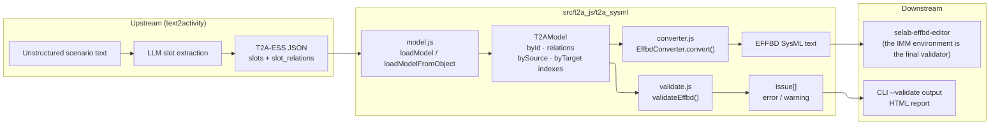
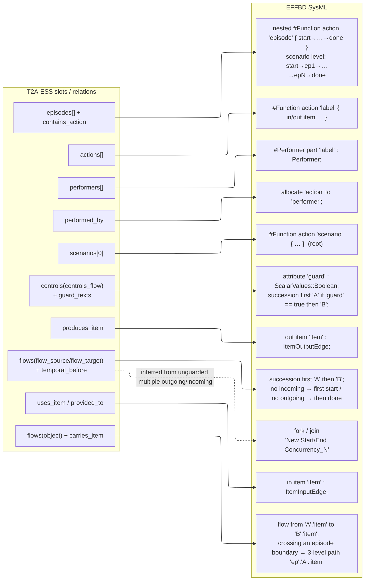
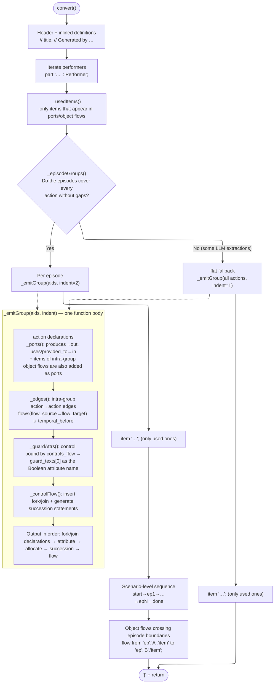
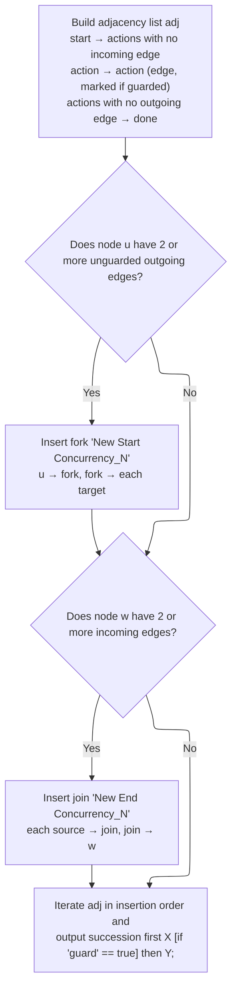
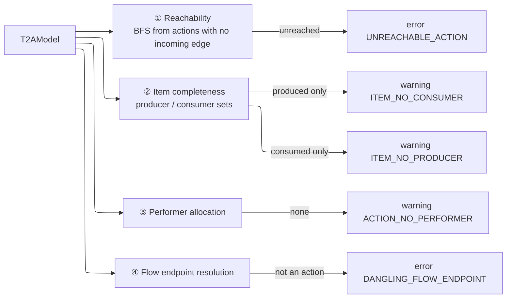

# src/t2a_js — T2A-ESS → EFFBD SysML converter (JavaScript)

This converter ports `src/t2a_sysml` (Python) to **Node.js ESM with zero external dependencies**. It takes the **T2A-ESS slot JSON** that text2activity
extracts as input and emits **EFFBD-dialect SysML v2
text that selab-effbd-editor reads**. Given the same input, it produces **byte-for-byte identical output** to the Python converter,
and `test/parity.test.js` checks this on every run.

It also runs unchanged in the browser (file I/O lives in only one function, `loadModel`). The report page's
"Live Conversion" panel is an example.

> Mermaid diagrams use the ELK layout. They render in GitHub, VS Code (Markdown Preview Mermaid Support),
> Obsidian, and other viewers that support Mermaid 10.x or later.

---

## 1. Quick start

```powershell
# Convert (default: IMM tags on, output is <input>.sysml)
node src/t2a_js/convert_t2a_to_sysml.js data/ground-truth/mumt/mumt.gold.json -o mumt.sysml

# Including structural validation (`--validate`: schema (Slot Relation contract: relation types/endpoints,
# custom relations, state-axis completeness) + effbd: structural checks; exit 4 if there is even one error)
node src/t2a_js/convert_t2a_to_sysml.js <T2A-ESS.json> -o out.sysml --validate

# Validate only (does not write the output .sysml)
node src/t2a_js/convert_t2a_to_sysml.js <T2A-ESS.json> --validate-only

# Also output the State View (standard SysML v2 state def) (default <output>.state.sysml)
node src/t2a_js/convert_t2a_to_sysml.js <T2A-ESS.json> --state
node src/t2a_js/convert_t2a_to_sysml.js <T2A-ESS.json> --state-output out.state.sysml

# State View as an HTML state diagram (JS only)
node src/t2a_js/convert_t2a_to_sysml.js <T2A-ESS.json> --state-html out.state.html
node src/t2a_js/tools/state_diagram.js <T2A-ESS.json> -o out.state.html

# Plain form (no IMM tags, no IMMBaseSchema import)
node src/t2a_js/convert_t2a_to_sysml.js <T2A-ESS.json> --no-imm-tags

# Tests / HTML report
cd src/t2a_js
npm test
npm run report        # -> report/index.html
```

As a library:

```js
import { loadModel, loadModelFromObject, convertModel, convertFile, convertStateModel, convertStateFile, validateSchema, validateEffbd, summarize }
  from "./src/t2a_js/t2a_sysml/index.js";

// From a file
const sysml = convertFile("x_T2A-ESS.json", { immTags: true });

// From an already parsed object (browser, API server, etc.)
const model = loadModelFromObject(jsonObject);
const sysml2 = convertModel(model, { immTags: false });

// State View (standard SysML v2 state def)
const stateSysml = convertStateModel(model);

// Structural validation
const schemaIssues = validateSchema(model);   // Slot Relation contract check
const issues = validateEffbd(model);          // [{severity, code, message}]
const { ok, errors, warnings } = summarize(issues);
```

CLI exit codes: `0` success, `2` input file missing/argument error, `4` a schema or effbd error
occurred under `--validate`/`--validate-only`.

---

## 2. Overall flow



- **model.js** only reads the JSON and indexes it into a `T2AModel`. It does no semantic interpretation.
- **converter.js** is the only "core". It turns the slot graph into EFFBD text.
- **validate.js** checks the structure of the slot graph independently of the converter. It does not look at the converted text.
- The files map 1:1 to the Python version (`model.py`, `converter.py`, `validate.py`).

---

## 3. Input: what is actually read from the T2A-ESS JSON

The full schema is in `docs/Text2Activity-Extraction-Slot-Schema.md`. Summarizing **only the fields the converter actually
references** gives the following. The minimal example is `src/examples/coffee_order_T2A-ESS.json`.

```jsonc
{
  "text2activity_extraction_model": {        // if this wrapper is absent, the top-level object is treated as the model
    "model_id": "EX_COFFEE_001",
    "title": "Cafe order processing example",             // header comment · scenario label fallback
    "scenarios":  [{ "scenario_id": "...", "label": "..." }],           // only [0] used → root function
    "episodes":   [{ "episode_id": "...",  "label": "...", "order_index": 1 }],
    "performers": [{ "performer_id": "...", "label": "..." }],
    "actions":    [{ "action_id": "...",   "label": "..." }],
    "items":      [{ "item_id": "...",     "label": "..." }],
    "flows":      [{ "flow_id": "...",     "label": "...", "flow_kind": "control_flow | object_flow" }],
    "controls":   [{ "control_id": "...",  "label": "...", "control_type": "decision", "guard_texts": ["..."] }],
    "slot_relations": [
      { "source_slot_id": "...", "relation_type": "...", "target_slot_id": "..." }
    ]
  }
}
```

**Inter-slot semantics live entirely in `slot_relations`, not in slot fields.** The converter
reads the graph only through `model.targets(sourceId, relationType)` queries. Relation types used:

| relation_type | source → target | Meaning in the converter |
|---|---|---|
| `contains_action` | episode → action | Action contained by the episode (canonical; legacy `custom`/`has_action`/`contains` are still accepted) |
| `performed_by` | action → performer | `allocate` |
| `produces_item` | action → item | `out item` port |
| `uses_item`, `provided_to` | action → item | `in item` port |
| `flow_source` / `flow_target` | flow → action | The actions at the two ends of the flow |
| `carries_item` | flow → item | The item an object flow carries |
| `controls_flow` | control → flow | Attaches a guard to that flow |
| `temporal_before` | action → action | Creates a succession even without a flow |

Slot id fields are auto-detected by their `*_id` names (`scenario_id`, `episode_id`, `performer_id`,
`action_id`, `item_id`, `flow_id`, `control_id`, …). If the same id appears in two collections, the one registered first wins.

---

## 4. Mapping rules: slot → EFFBD SysML



Naming rule: the slot `label` (else `title`, then legacy `name`, and if none of these exist, a fallback such as `Function_3`) is used verbatim as a **quoted label**.
The EFFBD editor uses these quoted labels as keys. If labels collide within the same collection, from the second one on
a ` #2`, ` #3` suffix is appended, and `'`, newlines, and backslashes are removed.

The output file inlines at the top the definitions the editor injects (`ItemInputEdge`, `ItemOutputEdge`, `TriggeringItemInputEdge`,
`Performer`), so it is **self-contained**. With `immTags: true`,
`private import IMMBaseSchema::*;` and the `#Performer`/`#Function` tags are added (the editor's canonical form).

---

## 5. converter.js internal flow



### 5.1 fork / join inference (`_controlFlow`)

T2A-ESS has no explicit concurrency nodes. The converter infers them **from the shape of the graph**.



- **Guarded edges are not grouped into a fork.** They remain as guarded successions and act as decisions.
- fork/join names use the same format as the default names the EFFBD editor creates (`New Start Concurrency_1`), and the numbers are
  **unique across the entire file** (converter instance counter). Because the editor uses quoted labels as global keys, if sibling
  episodes contain the same name, the render error "node is outside the parent region envelope" occurs.
- `adj` is an insertion-order-preserving `Map`. It has the same ordering semantics as a Python `dict`, so the output order matches.

Example: in the coffee example's "Prepare Beverage" episode, `Brew Beverage` and `Preheat Cup` both start with no incoming edge and both
flow into `Serve`, so one fork and one join are created.

```text
fork 'New Start Concurrency_1';
join 'New End Concurrency_1';
succession first start then 'New Start Concurrency_1';
succession first 'Brew Beverage' then 'New End Concurrency_1';
succession first 'Preheat Cup' then 'New End Concurrency_1';
succession first 'Serve' then done;
succession first 'New Start Concurrency_1' then 'Brew Beverage';
succession first 'New Start Concurrency_1' then 'Preheat Cup';
succession first 'New End Concurrency_1' then 'Serve';
```

### 5.2 Episode nesting vs flat fallback

`_episodeGroups()` scans the episodes in ascending `order_index` (stable sort), reading canonical
`contains_action` first, and also accepts legacy `custom`(`contains_action`)/`has_action`/`contains`. If an action belongs to several episodes, the episode that comes
first takes it. Nested mode is used only **if every action is assigned to some episode**. If even one
is missing, everything is emitted as a single flat root function. Whether the output is nested can be told from the `    action 'episode' {`
indentation in the output.

---

## 6. validate.js: structural validation

The parser for the EFFBD SysML dialect exists only inside the EFFBD editor (the standard SysML v2 Pilot parser rejects this dialect).
So instead of the text, the **slot graph** is checked.



The `ok` of `summarize()` means **0 errors**. Warnings do not block a pass. The current 3 gold files
are all `ok=true, errors=0`.

---

## 7. File layout and public API

```text
src/t2a_js/
  convert_t2a_to_sysml.js   CLI (json -> .sysml)
  package.json              npm test / npm run report (no dependencies, Node >= 20)
  t2a_sysml/
    index.js                public API re-exports
    model.js                T2AModel, loadModel, loadModelFromObject, slotId       (= model.py)
    converter.js            convertModel, convertFile, CONVERTER_VERSION           (= converter.py)
    state_converter.js      convertStateModel, convertStateFile, stateSummary, stateGraph (= state_converter.py)
    state_diagram.js        renderStateSvg, renderStateHtml — HTML state diagram (JS only)
    validate.js             validateSchema, validateEffbd, summarize               (= validate.py)
  test/
    fixtures.js             gold/example fixture paths, balanced(), skipUnless()
    cases.js                20 synthetic T2A-ESS cases + expected values (fork/join·guard·flow·nesting·special characters·legacy name…)
    cases.test.js           structural validation of synthetic cases + per-case Python parity
    t2a_sysml.test.js       gold-based structural tests (1:1 with tests/test_t2a_sysml.py)
    state.test.js           state view structural tests (1:1 with tests/test_t2a_state.py)
    state_diagram.test.js   state diagram SVG/HTML tests + IR·determinism·example sync
    parity.test.js          byte-identical output with the Python converter (skip if python is absent)
    lsp.test.js             selab-rust-lsp round-trip validation (skip if the binary is absent)
  tools/
    lsp_check.js            Rust LSP client + graph/diagnostics checker (npm run lsp)
    state_diagram.js        T2A-ESS -> state diagram HTML CLI (state_diagram.js wrapper)
    build_report.js         run tests + convert + LSP validation + browser bundle -> report/index.html
  report/                   generated output (npm run report)
```

| Function | Signature | Description |
|---|---|---|
| `loadModel(path)` | `string → T2AModel` | Reads and indexes a UTF-8 (BOM allowed) JSON file. Node only |
| `loadModelFromObject(obj)` | `object → T2AModel` | Indexes a parsed object. Also usable in the browser |
| `convertModel(model, {immTags})` | `→ string` | EFFBD SysML text. `immTags` defaults to `true` |
| `convertFile(path, {immTags})` | `→ string` | `loadModel` + `convertModel` |
| `convertStateModel(model)` | `→ string` | State axis → standard SysML v2 `state def` text (State View) |
| `convertStateFile(path)` | `→ string` | `loadModel` + `convertStateModel` |
| `stateGraph(model)` | `→ object` | State view IR (regions/states/transitions/events/guards) — consumed by the diagram renderer |
| `renderStateSvg(graph)` | `→ string` | stateGraph IR → `<svg>` state diagram (deterministic, dependency-free) |
| `renderStateHtml(model)` | `→ string` | Self-contained HTML page (SVG + transition table + SysML text) |
| `stateSummary(model)` | `→ {regions, states, transitions}` | State view summary counts (CLI `--state` line) |
| `validateSchema(model)` | `→ Issue[]` | Slot Relation contract check (canonical relation types/endpoints, custom, state-axis completeness) |
| `validateEffbd(model)` | `→ Issue[]` | `{severity: "error"\|"warning", code, message}` |
| `summarize(issues)` | `→ {ok, errors, warnings}` | `ok: true` if there are 0 errors |
| `T2AModel` | | `collection(name)`, `slotId(slot)`, `targets(id, rel)`, `sources(id, rel)`, `byId`, `relations`, `title` |

The `byId` of `T2AModel` is a `Map<id, [collectionName, slot]>`.

---

## 8. Using it from other projects

**What to copy**: only the three files in the `t2a_sysml/` folder (+ `index.js`) are needed. There are no external packages.

**Browser/bundler**: only the `readFileSync` import in `model.js` depends on Node. If the bundler cannot resolve `node:fs`,
drop `loadModel` and use only `loadModelFromObject`, or, as in `tools/build_report.js`'s
`browserBundle()`, remove the import lines, replace `readFileSync` with a stub, and concatenate everything into one file.

```js
// In the browser (after bundling)
const model = loadModelFromObject(JSON.parse(text));
const sysml = convertModel(model, { immTags: true });
```

**CommonJS projects**: the files are ESM, so load them with `await import("./t2a_sysml/index.js")`.

**Output line endings**: the string the converter returns always uses LF. The CLI also writes LF to files (the Python CLI on Windows
writes CRLF). If the editor requires CRLF, add the single line `replace(/\n/g, "\r\n")` right before `writeFileSync`.

---

## 9. Extending

General procedure for adding a new mapping:

1. Add output lines to `_emitGroup()` (function body) or `convert()` (scenario level) in `converter.js`.
   Always use `this.m.targets(id, relationType)` for relation lookups.
2. If a corresponding check is needed in `validate.js`, add an item to `validateEffbd()`. The `_edges` computation
   exists in the same form in both converter and validate, so if you change the edge definition, fix both.
3. **Apply the same change to the Python version (`src/t2a_sysml/*.py`) as well.** The parity test in `npm test` then
   confirms that the two implementations still produce the same output. If only one side is changed, parity fails.
4. Add assertions that check the new rule to `test/t2a_sysml.test.js`, and add the same case to the Python
   `tests/test_t2a_sysml.py` as well.
5. Rebuild the report with `npm run report` and check it visually.

Currently outside the conversion scope (future candidates): `transitions`/`situations`/`state_values` (state view),
`constraints` (attribute/condition), `goals` (requirement), preservation of action→action
guards across episode boundaries (currently absorbed into the `epX → epY` sequence), explicit `decide`/`merge` nodes.

---

## 10. Tests and report

```powershell
cd src/t2a_js
npm test              # node --test "test/**/*.test.js"  (structure + parity + synthetic cases + LSP)
npm run lsp           # Rust LSP validation only, table output (--verbose for full diagnostics, --only id,id)
npm run report        # -> report/index.html (tests + parity + LSP + per-fixture JSON→SysML + live converter)
```

### 10.1 Synthetic test cases (`test/cases.js`)

20 programmatically generated T2A-ESS cases that cover edge conditions the gold fixtures alone do not reach. Each case
carries in `expect` the counts of fork/join/guard/flow/allocate, whether it is nested, the validator error count, and expected/forbidden text,
so both `cases.test.js` (structure) and `tools/lsp_check.js` (LSP) use the same expected values.

| Case | What it checks |
|---|---|
| `flat_linear`, `nested_two_episodes`, `episode_ordering` | Flat/nested basic forms, `order_index` reordering |
| `fork_join_multi_episode`, `wide_fork`, `guarded_fork_mix` | fork/join inference, **globally unique names** across sibling episodes, guarded edges excluded from forks |
| `decision_guard`, `loop_control` | Guarded succession, loop back-edge (known limitation, below) |
| `object_flow_intra`, `object_flow_cross_episode` | Port declarations + `flow` statements, 3-level cross-boundary paths and **ports at both ends** |
| `duplicate_labels`, `special_chars`, `legacy_name_fields`, `no_scenario_no_title` | ` #2` suffix, removal of `'`·newline·`\`, `name` fallback, `model_id` fallback |
| `multi_performer`, `temporal_before_only`, `partial_episode_coverage`, `dangling_relations` | Multiple allocates, ordering without flows, flat fallback, ignoring unresolved references |
| `isolated_cycle`, `empty_model` | Validator errors, model with no actions |

### 10.2 Rust LSP validation (`tools/lsp_check.js`)

The `sysml-lsp` server in `selab-ex-system-modeler/packages/selab-rust-lsp` is the parser the EFFBD editor uses.
The conversion result is opened via `textDocument/didOpen`, `selab.diagnostics.filter` (diagnostics) and
`selab.diagram.getGraphEx` (diagram graph) are received, and the following is checked.

1. **0 ERROR diagnostics.** `Unresolved reference: 'start'/'done'` hints appear identically in the editor's own examples (`business_example`, etc.) and are dialect-specific, so they are ignored.
2. **Node counts match.** `ActionUsage` = 1 scenario + actions + (when nested) episodes, `PartUsage` = performers, `ForkNode`/`JoinNode` = expected values.
3. **Succession endpoints resolve.** The source/target of every succession edge exists among the graph node ids, and the edge count equals the number of `succession` lines in the output.
4. **Flow endpoints are fully qualified.** `flow` edge endpoints must start from the root name. If an endpoint action has no `in/out item` port, the LSP resolves only half of the path (this check caught the missing-port bug in flows crossing episode boundaries).
5. **Allocation edge count** = number of `allocate` statements.

The binary path can be changed with `SELAB_LSP_BIN`. The default is `target/release/sysml-lsp.exe` in the sibling repository;
if it is absent, `lsp.test.js` is skipped and `npm run report` marks the LSP section as "Not run".

**Known limitation (`loop_control`).** When a guarded back-edge returns to the first action, that action gets an incoming edge, so
no `start →` succession is generated and the validator reports everything as unreached. The EFFBD editor represents loops with
`decide`/`merge` (`New Start Loop`/`New End Loop`), but the converter does not emit these yet. The case
pins the current behavior, so its expected values must be deliberately updated when decide/merge is implemented.

- `t2a_sysml.test.js`: EFFBD structure of the MUM-T gold, bracket balance·performer·start/done for all gold files, plain form,
  guarded succession, episode nesting·fork, structural validation, coffee example, flat fallback for unstructured extractions.
- `parity.test.js`: 5 fixtures × `immTags` on/off = 10 cases, string-compared against the Python output. If `python` is
  not on PATH, they are marked as skip.
- If a fixture file is missing, the corresponding test is skipped rather than failed.

## 11. Differences from the Python version (summary)

- Only the API names are camelCase (`convert_file` → `convertFile`, `imm_tags=` → `{ immTags }`).
- CLI file output line endings are fixed to LF (see §8 above). The converter strings are identical on both sides.
- When an action receives additional item ports from several object flows, Python iterates a `set`, so the order is nondeterministic, while
  JS uses insertion order. The current fixtures contain no such case, so parity holds.
